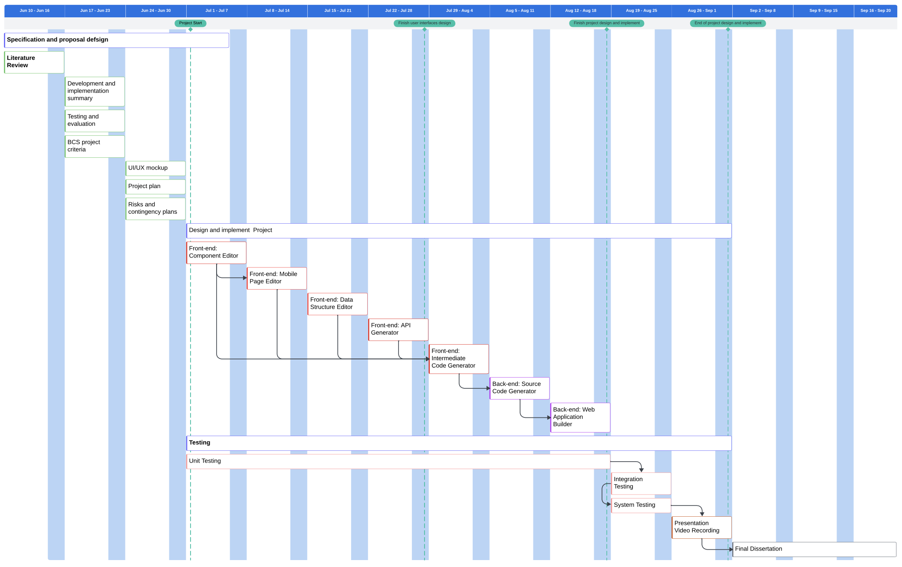

## Scheduling of COMP702

#### Project Name: Advancing Web Development with Low-Code: An Integrated Platform for Rapid Application Creation

## The Gantt Diagram

## Tasks

- [x] Spefication and design proposal

## Requirement Tracking Matrix

### Front-end

#### Basic Development

| ID  | Requirement             | Priority | Type    | Status | Date |
| --- | ----------------------- | -------- | ------- | ------ | ---- |
| 1   | Header Component Update | P4       | Feature | - []   |      |
| 2   | Preview Page            | P1       | Feature | []     |      |
| 3   | Build Page              | P1       | Feature | []     |      |
| 4   | Source Code Generation  | P1       | Feature | []     |      |

#### File System Development

| ID  | Requirement               | Priority | Type    | Status | Date       |
| --- | ------------------------- | -------- | ------- | ------ | ---------- |
| 1   | Basic UI Design           | P1       | Feature | ☑️     | 12/07/2024 |
| 2   | File Tree Design          | P1       | Feature | ☑️     | 12/07/2024 |
| 3   | File Type Component       | P1       | Feature | ☑️     | 12/07/2024 |
| 4   | Add File/Folder Component | P2       | Feature | ☑️     | 12/07/2024 |
| 5   | Add File/Folder Logic     | P2       | Feature | []     |            |
| 6   | Delete File/Folder        | P2       | Feature | []     |            |
| 7   | Current File Tracking     | P3       | Feature | []     |            |

#### Design Container Development

| ID  | Requirement                               | Priority | Type    | Status | Date       |
| --- | ----------------------------------------- | -------- | ------- | ------ | ---------- |
| 1   | Basic UI Design                           | P1       | Feature | ☑️     | 12/07/2024 |
| 2   | Switch File Bar                           | P1       | Feature | ☑️     | 12/07/2024 |
| 3   | Container Size Control                    | P1       | Feature | []     |            |
| 4   | Undo/Redo                                 | P1       | Feature | []     |            |
| 5   | Drag & Drop Class                         | P0       | Feature | ☑️     | 12/07/2024 |
| 6   | Element Selector Class                    | P0       | Feature | ☑️     | 12/07/2024 |
| 7   | Selector Bounding Control                 | P1       | Feature | []     |            |
| 8   | Page Layout Control                       | P1       | Feature | []     |            |
| 9   | Keyboard Shortcuts                        | P3       | Feature | []     |            |
| 10  | Element Interpreter                       | P0       | Feature | ☑️     | 12/07/2024 |
| 11  | Element Interpreter Continues Integration | P1       | Feature | []     |            |
| 12  | Component Interpreter                     | P0       | Feature | []     |            |
| 13  | Element Style Control                     | P0       | Feature | []     |            |
| 14  | Scale Bug Fix                             | P4       | Bug     | []     |            |
| 15  | Data Table Container                      | P0       | Feature | []     |            |
| 16  | Create/Edit/Delete Table                  | P0       | Feature | []     |            |
| 17  | Add/Edit/Delete Table Row                 | P0       | Feature | []     |            |
| 18  | Import Table Row By Excel                 | P2       | Feature | []     |            |
| 19  | API Canvas Logic Design                   | P0       | Feature | []     |            |
| 20  | API Execuse Sandbox Design                | P0       | Feature | []     |            |

#### Control Panel Development

| ID  | Requirement                          | Priority | Type    | Status | Date       |
| --- | ------------------------------------ | -------- | ------- | ------ | ---------- |
| 1   | Basic UI Design                      | P1       | Feature | ☑️     | 12/07/2024 |
| 2   | Design \| Tree Switch Bar            | P1       | Feature | ☑️     | 12/07/2024 |
| 3   | Public Properties Form Component     | P1       | Feature | ☑️     | 12/07/2024 |
| 4   | Page Layout Control                  | P1       | Feature | []     |            |
| 5   | Public Drag Element Logic            | P0       | Feature | ☑️     | 12/07/2024 |
| 6   | Element Item Design                  | P0       | Feature | []     |            |
| 7   | Save Component                       | P0       | Feature | []     |            |
| 8   | Drag Component To Design Container   | P0       | Feature | []     |            |
| 9   | Element/Component Properties Control | P0       | Feature | []     |            |
| 10  | Page Element Tree                    | P0       | Feature | []     |            |
| 11  | Data Table Design Panel              | P0       | Feature | []     |            |
| 12  | API Generation Design Panel          | P0       | Feature | []     |            |

### Back-end

| ID  | Requirement                        | Priority | Type    | Status | Date |
| --- | ---------------------------------- | -------- | ------- | ------ | ---- |
| 1   | Service Architect Design           | P0       | Feature | []     |      |
| 2   | Get/Add/Edit/Delete Component List | P1       | Feature | []     |      |
| 3   | Build Page                         | P1       | Feature | []     |      |
| 4   | Source Code Generation             | P1       | Feature | []     |      |

## Weekly Report

### 2024/06/10 - 2024/06/16

1. Confirmed the direction of the final project.

2. Literature reivew.

### 2024/06/17 - 2024/06/23

1. Working on the draft of the spefication and design proposal (The first assignment).

### 2024/06/24 - 2024/07/05

1. Working on the Spefication And Design Proposal.

### 2024/07/08 - 2024/07/12

1. To Developed the Front-End Basic UI Design
2. To Developed the File Tree Design development
3. To Developed the File Type Component development
4. To Developed the add File/Folder Component development
5. Working on the add File/Folder Logic design
6. Design a Drag & Drop Class for Design Container
7. Design a Selector Class for Design Container
8. Design a Basic Interpreter for Design Container
9. To Developed the Page/Element Properties Control Panel
10. To adjusted the project file structure
