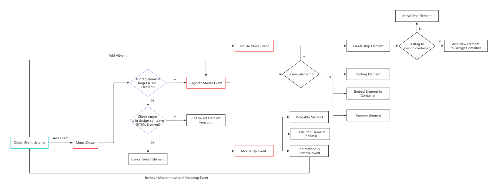

### How does the Drag and Drop Editor works

The following flowchar presents the principle of the drag and drop editor.

1. Firstly, the program will listen to the global \`mousedown\` event to identify the current target element. If the target element is a draggable element, the program will listen to the \`mousemove\` and \`mouseup\` events. The \`mousemove\` event is responsible for the functionalities of adding elements, sorting elements, moving elements, and deleting elements. Additionally, the \`mouseup\` event will confirm the final draggable event and subsequently remove the \`mousemove\` and \`mouseup\` event listeners, which means that it can reduce performance costs.

2. Secondly, if the current target element is not a dragable element, the program will perform additional checks to determine whether the current target element is within the design container. If the current target element is within the design container, the element selector will be active. The element selector is used to mark the currently selected element and allow for resizing of its width and height.
