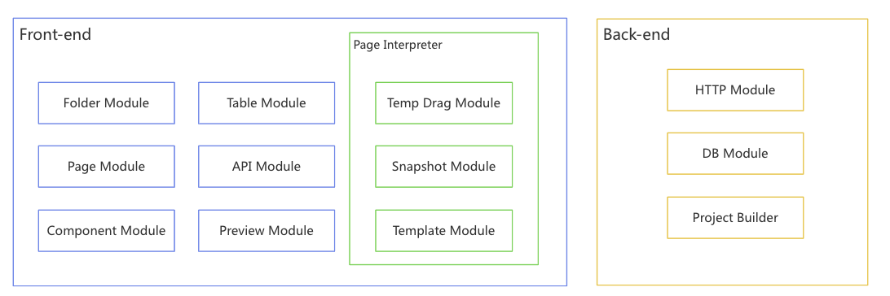
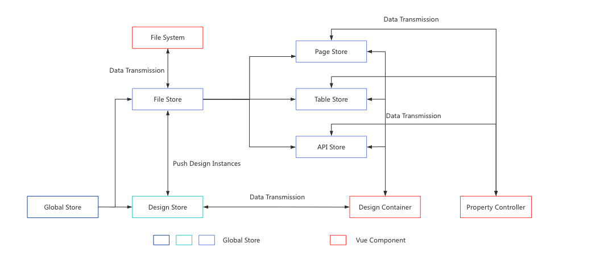
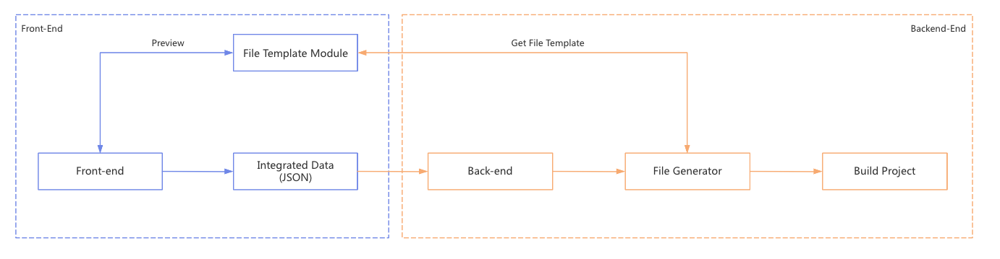

### Project Modules

The following chart presents modules of the Low-code development project. The Low-code development project are divided into three parts: Front-end, Page Interpreter, and Back-end

1. The Front-end is includes modules for managing folders, tables, pages, APIs, components, and previewing content, which handle user interactions and display.

2. The Page Interpreter system is responsible for previewing web pages and generating web page files. It includes the Temporary Drag Module, Snapshot Module, and Template Module.

3. The Back-end is responsible for data storage and business logic, featuring modules for HTTP requests, database operations, and project building.

### How does the Drag and Drop Editor works

The following flowchart presents the principle of the drag and drop editor.

1. Firstly, the program will listen to the global \`mousedown\` event to identify the current target element. If the target element is a draggable element, the program will listen to the \`mousemove\` and \`mouseup\` events. The \`mousemove\` event is responsible for the functionalities of adding elements, sorting elements, moving elements, and deleting elements. Additionally, the \`mouseup\` event will confirm the final draggable event and subsequently remove the \`mousemove\` and \`mouseup\` event listeners, which means that it can reduce performance costs.

2. Secondly, if the current target element is not a dragable element, the program will perform additional checks to determine whether the current target element is within the design container. If the current target element is within the design container, the element selector will be active. The element selector is used to mark the currently selected element and allow for resizing of its width and height.

3. Specially, the following flowchart presents the rendering element process.

The program will push new element data to the global page store when the user drags a new element to the design container, and then the pager store will update element data dynamically in the page parser. Finally, the page parser will render element components.

### Front-end Data Flow

The following flowchart illustrates the front-end data flow:

1. The data store management has mainly split into three parts: the global store, the file store, and the design store.

2. The global store is responsible for managing project data, such as project id, project name, project type and so on.

3. The file store is responsible for managing project files, and the file store has three substores: page store, table store, and api store. They are responsible for the data management of different types of files.

4. And the design store is responsible for managing current editing files.

5. Each project file data transmission should be through these global data stores.

### Generating Workflow

The following flowchart illustrates the building file worlflow:

1. Firstly, the front-end project will integrate the web project data into JSON data and then send it to the back-end.

2. Secondly, the file generator will obtain file templates from the independent template module.

3. Finally, the project will create a sandbox to build the project according to the generated files.
