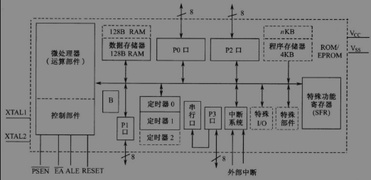
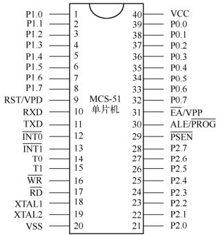
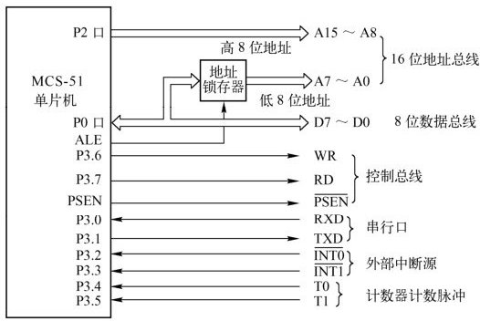
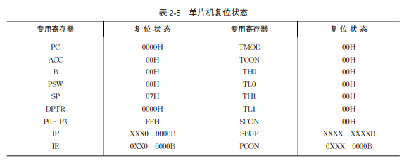

## 8051 单片机主要组成

- CPU，RAM，ROM，定时器/计数器和多种 I/O 功能部件。

- 主要包括下列部件。1 个 8 位的 CPU、1 个布尔处理机、1 个片内振荡器、128 字节的片内数据存储器、4K 字节的片内程序存储器（8031 无）​、寻址范围为 64K 字节的外部数据存储器和程序存储器、21 字节的专用寄存器、4 个 8 位并行 I/O 口、1 个全双工的串行口、2 个 16 位的定时器/计数器、5 个中断源、2 个中断优先级和 111 条指令，片内采用单总线结构。

## 外部引脚说明

1. 主电源引脚主电源引脚接入单片机的工作电源。

   - VCC（40 脚）​：接+5 V 电源（直流电源正端）​。

   - VSS（20 脚）​：接地（直流电源负端）​。

2. 时钟引脚

   - 时钟引脚（18，19 脚）​：外接晶体时与片内的反相放大器构成一个振荡器，它提供单片机的时钟控制信号。时钟引脚也可以外接晶体振荡器。

   - XTAL1（18 脚）​：接外部晶体的一个引脚。在单片机内部，它是一个反相放大器的输入端，这个放大器构成了片内振荡器。当采用外部时钟时，对于 HMOS 单片机，此引脚接地；对于 CHOMS 单片机，此引脚作为外部振荡器信号的输入端。

   - XTAL2（19 脚）​：接外部晶体的另一端，在单片机内部接至反相放大器的输出端。采用外部时钟时，对于 HMOS 单片机，该引脚作为外部振荡信号的输入端；对于 CHMOS 单片机，该引脚悬空不接。

3. 输入/输出引脚输入/输出（I/O）口引脚包括 P0 口、P1 口、P2 口和 P3 口。

   - P0 口（P0.0 ～ P0.7）​：为双向 8 位三态 I/O 口。在不接片外存储器或不扩展 I/O 口时，可作为准双向输入/输出口；在接有片外存储器或扩展 I/O 口时，P0 口是地址总线低 8 位及数据总线分时复用口，可驱动 8 个 TTL 负载。一般作为扩展时地址/数据总线口使用。

   - P1 口（P1.0 ～ P1.7）​：为 8 位准双向 I/O 口，它的每一位都可以分别定义为输入线或输出线（作为输入时，口锁存器必须置“1”​）​，可启动 4 个 TTL 负载。对于 52 系列单片机，P1.0 与 P1.1 还有第二功能：P1.0 可用做定时器/计数器 2 的计数脉冲输入端 T2，P1.1 可用做定时器/计数器 2 的外部控制端 T2EX。

   - P2 口（P2.0 ～ P2.7）​：为 8 位准双向 I/O 口，当作为 I/O 口使用时，可直接连接外部 I/O 设备；在接有片外存储器或扩展 I/O 口且寻址范围超过 256 字节时，P2 口用做高 8 位地址总线。一般作为扩展时地址总线的高 8 位使用。

   - P3 口（P3.0 ～ P3.7）​：为 8 位准双向 I/O 口，还可以将每一位用于第二功能，而且 P3 口的每一条引脚均可以独立定义为第一功能的输入/输出或第二功能。P3 口的第二功能定义如表 2-2 所示。

   

4. 控制引脚它包括 RESET（即 RST）​，ALE， PSEN， EA 等，此类引脚提供控制信号，有些引脚具有复用功能。

   - RST/VPD（9 脚）​：RST 即为 RESET，VPD 为备用电源。该引脚为单片机的上电复位或掉电保护端。当单片机振荡器工作时，该引脚上只要出现持续两个机器周期的高电平，就可实现复位操作，使单片机回到初始状态。复位后应使此引脚电平为小于等于 0.5 V 的低电平，以保证单片机正常工作。上电时，考虑到振荡器有一定的起振时间，该引脚上高电平必须持续 10 ms 以上才能保证有效复位。当 VCC 发生故障时，降低到低电平规定值或掉电时，该引脚可接上备用电源 VPD，为内部 RAM 供电，以保证 RAM 中的数据不丢失。

   - ALE（30 脚）​：地址锁存有效输出端。ALE 在每个机器周期内输出两个脉冲。在访问外部存储器时，ALE 输出脉冲的下降沿用于锁存 16 位地址的低 8 位。即使不访问外部存储器，ALE 端仍有周期性正脉冲输出，其频率为振荡频率的 1/6。但是，每当访问外部数据存储器时，在两个机器周期中 ALE 只出现一次，即丢失一个 ALE 脉冲。ALE 端可以驱动 8 个 TTL 负载。对于片内具有 EPROM 型单片机 8751，在 EPROM 编程期间，此引脚用于输入编程脉冲 PROG。

   - PSEN（29 脚）​：片外程序存储器读选通信号输出端，低电平有效。在从外部程序存储器取指令（或常数）期间，每个机器周期 PSEN 两次有效。但在此期间，每当访问外部数据存储器时，这两次有效的 PSEN 信号将不出现。PSEN 同样可以驱动 8 个 TTL 负载。

   - EA/VPP（31 脚）​：EA 为片外程序存储器选用端。当 EA 端保持高电平时，单片机访问的是内部程序存储器（对 8051，8751 来说）​，但当 PC（程序计数器）值超过某值（如 8751 内部含有 4K 字节 EPROM，值为 0FFFH）时，将自动转向执行外部程序存储器内的内容。当 EA 端保持低电平时，则不管是否有内部程序存储器而只访问外部程序存储器。对 8031 来说，因其无内部程序存储器，所以该引脚必须接地，即此时只能访问外部程序存储器。

5. 综上所述，MCS-51 系列单片机的引脚可归纳为以下两点：

   - 单片机功能多，引脚数少，因而许多引脚都具有第二功能。

   - 单片机对外呈现总线形式，由 P2，P0 口组成 16 位地址总线；由 P0 口分时复用为数据总线；由 PSEN 与 P3 口中的 WR，RD 构成对外部存储器及 I/O 的读/写控制，由 P3 口的其他引脚构成串行口、外部中断输入、计数器的计数脉冲输入。MCS-51 单片机的总线结构如图所示。

   

6. 单片机的三总线结构

单片机的引脚除了电源、复位、时钟接入用户Ｉ／Ｏ口外，其余引脚都是为了实现系统扩展
而设置的。这些引脚构成了三总线形式。
（

1. 地址总线（ＡＢ）。地址总线宽度为１６位，因此外部存储器直接寻址范围为６４ＫＢ。１６
   位地址总线由 Ｐ０口经地址锁存器提供低８位地址（Ａ０～Ａ７）；Ｐ２口直接提供高８位地址
   （Ａ８～Ａ１５）。

2. 数据总线（ＤＢ）。数据总线宽度为８位，由Ｐ０口提供。

3. 控制总线（ＣＢ）。由 Ｐ３口的第二功能状态和４根独立控制线 ＲＥＳＥＴ，ＥＡ，ＰＳＥＮ、
   ＡＬＥ组成。

## MCS－51 单片机存储器配置

1. MCS－51 系列单片机在物理上有四个存储空间：

   - 片内程序存储器，片外程序存储器，片内数据存储器和片外数据存储器

   - 片内有 128B 数据存储器和 4KB 程序存储器，还可以在片外扩展 64KB 数据存储器和 64KB 程序存储器。其中，64KB 程序存储器中，有 4KB 地址对于片内程序存储器和片外程序存储器是公共的，这 4KB 的地址为 0000H ～ 0FFFH；从 1000H ～ FFFFH 是外部程序存储器的地址。

   

2. 程序存储器

在程序存储器中，有６个单元具有特殊功能。

    - ００００Ｈ～０００２Ｈ：是所有执行程序的入口地址，８０５１复位后，ＣＰＵ 总是从００００Ｈ单元开始执行程序。

    - ０００３Ｈ：外部中断０入口。

    - ０００ＢＨ：定时器０溢出中断入口。

    - ００１３Ｈ：外部中断１入口。

    - ００１ＢＨ：定时器１溢出中断入口。

    - ００２３Ｈ：串行口中断入口。

3. 数据存储器

   - 工作寄存器区。从００Ｈ～１ＦＨ 安排了４组工作寄存器，每组占用 ＲＡＭ８字节，记为Ｒ０～Ｒ７。在某一时刻，ＣＰＵ只能使用其中的一组工作寄存器，工作寄存器组的选择由程序状态字寄存器ＰＳＷ 中两位来确定。工作寄存器的作用相当于一般微处理器中的通用寄存器。

   - 位寻址区。占用地址２０Ｈ～２ＦＨ，共１６字节，１２８位。这个区域除了可以作为一般ＲＡＭ 单元进行读写之外，还可以对每个字节中的每一位单独进行操作，并且对这些位都规定了固定的位地址，从２０Ｈ单元的第０位到２ＦＨ单元的第７位共１２８位，用位地址００Ｈ～７ＦＨ分别与之对应。对于需要进行按位操作的数据，可以存放到这个区域。

   - 用户ＲＡＭ 区。地址为３０Ｈ～７ＦＨ，共字节。这是真正给用户使用的一般 ＲＡＭ 区，用户对该区域的访问是按字节寻址的方式进行的。该区域主要用来存放随机数据及运算的中间结果，另外，也常把堆栈开辟在该区域中。

4. 特殊功能存储器

## 并行 I/O 端口结构

8051 中有四个 8 位并行 I/O 端口，分别记做Ｐ０、Ｐ１、Ｐ２和Ｐ３，共３２根线。实际上它们是特殊功能寄存器中的四个。每个并行 I/O 口都能用作输入和输出，所以称之为双向 I/O 口。但这四个通道的功能不完全相同，所以其结构设计也不同。

1. P0 口的结构

Ｐ０口有两个用途：第一是作为普通Ｉ／Ｏ口使用；第二是作为地址／数据总线使用。当用作第二个用途时，在这个口上分时送出低８位地址和传送数据，这种地址与数据同用一个Ｉ／Ｏ口的方式，称为地址／数据总线复用。

2. P1 口的结构

Ｐ１口只用作普通Ｉ／Ｏ口，所以它没有转换开关 ＭＵＸ。

3. P2 口的结构

Ｐ２口也有两种用途：一是作为普通Ｉ／Ｏ口；二是作为高８位地址线。

4. P3 口的结构

与Ｐ１口相比，Ｐ３口增加了与非门和缓冲器，它们使Ｐ３口除了有准双向Ｉ／Ｏ功能外，还具有第二功能。

## 单片机的时钟电路与时序

计算机工作时，是在统一的时钟脉冲控制下逐拍地进行的。这个脉冲是由单片机控制器中的时序电路发出的。

1. 时钟电路

时钟电路用于产生单片机工作所需的时钟信号。时钟信号可以由`内部时钟`和`外部时钟`两种方式产生。

2. 时序定时单位

时序是表达指令执行中各控制信号在时间上的相互关系。

    - 拍（Ｐ）：把振荡脉冲的周期称为拍，用Ｐ表示。它就是晶体的振荡周期，或是外部振荡脉冲的周期。拍是 ＭＣＳ－５１单片机中最小的时序单位。

    - 状态或时钟周期（Ｓ）：振荡脉冲经过二分频后，就得到单片机的时钟信号，把时钟信号的周期称为状态，用Ｓ表示。一个状态包含两个拍，分别称做Ｐ１和Ｐ２，或者称前拍和后拍。时钟周期是单片机中最基本的时间单位，在一个时钟周期内，ＣＰＵ仅完成一个最基本的动作。

    - 机器周期：通常把ＣＰＵ完成一个基本操作所需要的时间称为机器周期。一个机器周期由６个状态（或１２拍）组成，可依次表示为Ｓ１Ｐ１，Ｓ１Ｐ２，Ｓ２Ｐ１，Ｓ２Ｐ２，…，Ｓ６Ｐ１，Ｓ６Ｐ２。

    - 指令周期：指令周期就是执行一条指令所需要的时间。指令周期是 ＭＣＳ－５１单片机中最大的时序单位，一般由若干个机器周期组成。指令不同，所需要的机器周期数也不同，但一条指令的周期应在１～４个机器周期范围内。

## 单片机的复位状态与复位电路

1. 单片机的复位状态

计算机在启动时，系统进入复位状态。在复位状态，ＣＰＵ 和系统都处于一个确定的初始状态（也称为原始状态）。在这种状态下，所有的专用寄存器都被赋予默认值。

2. 单片机的复位电路

复位操作可以使单片机初始化，也可以使死机状态下的单片机重新启动。
