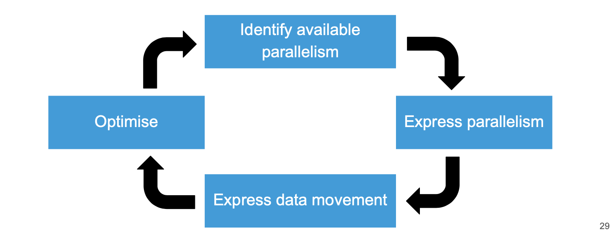

## What is an accelerator?

Accelerators - Any non-CPU piece of hardware that can carry out work

There are two major examples of this:

- Graphics Processing Unit (GPU) - A specialised processor designed to accelerate graphics processing
- Field Programmable Gate Array (FPGA) - A piece of silicone with programmable logic gates

### How do we use an accelerator?

Kernel - The name for a portion of code is sent to an accelerator
Offloading - The term for sending work intended for the CPU to an accelerator

## What frameworks will we cover?

### Types of framework

- OpenMP
- OpenCL
- OpenACC
- CUDA

Programmatic

- Uses specific function calls to give a high amount of control over the behaviour
- This is typically non-portable
- Prescriptive - User explicitly specifies actions to be taken by the compiler

Directive

- Uses compiler flags to describe how the parallelism should be done
- Portable
- Descriptive - User 'describes', guides, the compiler but the compiler itself makes the final decision

## OpenACC

To address it's issues OpenACC had 3 major design pillars

1. Simplicity - OpenCL can be quite tricky to learn
   OpenCL requires several steps to get a kernel to run on an accelerator

   - Declare variables for the input
   - Declare variables for the GPU buffer
   - Create a reference to the accelerator
   - Create a command queue for that accelerator
   - Initialise the buffer
   - Carry out the work
   - Free the memory

2. Power - OpenCL has poor support for crypto and machine learning

   - Applications developed using OpenACC have significant speed increases, especially considering the amount of code required

3. Portability - There was no dominant manufacturer so supporting a variety of accelerators was important

   A directive is just giving the compiler general instructions
   Compiler developers have much more freedom to figure out exactly how best to program that

   - Nvidia has pledged support for all of it's boards
   - AMD has provided support so far, but refuses to guarantee this will continue
   - Intel has said it will in the future



`#pragma acc kernels` - Automatically distribute loops across accelerator threads

Example for express parallelism

```c

#pragma acc kernels {
  for (int i = 0; i < N; i++) {
    x[i] = i;
    y[i] = i * i;
  }

  for (int i = 0; i < N; i++) {
    z[i] = x[i] * y[i];
  }
}

```

`#pragma acc parallel` - Explicitly state that this portion of code should be parallelised. Works for loops or segments of code

Example

```c

#pragma acc parallel {
  for (int i = 0 ; i < N; i++) {
    x[i] = i;
    y[i] = i * i;
  }
}

```

`#pragma acc loop` - Explicitly state that this portion of code should be workload shared in a similar way to OpenMP

Example

```c


#pragma acc loop {
  for (int i = 0 ; i < N; i++) {
    x[i] = i;
    y[i] = i * i;
  }
}

```

`#pragma acc data` - This sets up data permanence on the accelerator, this is regardless of threads being created and destroyed

```c

#pragma acc data {
  #pragma acc parallel {
    for (int i = 0 ; i < N; i++) {
      x[i] = i;
      y[i] = i * i;
    }
  }
}

```

`copy` - Specify what data must go to the accelerator, this then returns

```c

#pragma acc data copy (x, y)
#pragma acc parallel {
  for (int i = 0 ; i < N; i++) {
    x[i] = i;
    y[i] = i * i;
  }
}

```

`copyout` - This tells the compiler the data should be returned, if it isn't specified as copied in then it creates a variable on the accelerator
`create` - This creates a local variable on the accelerator, this is good for temporary variables

## OpenCL

Omputational intensity - The proportion of mathematical operations to unique memory operations.

Maths isquite fast, floating point muktiplication takes about clock cycles
Memory is quite slow, loading from RAM takes arounds.

| Mathematical operations    | Unique memory operations |
| -------------------------- | ------------------------ |
| a[i] = b[i] + c[i]         | 1: 3 3:300               |
| a[i] = b[i] + c[i] \_ d[i] | 2: 4 6:400               |
| a[i]++                     | 1: 2 3:200               |
| a[i] += a[i] \_ a[i]       | 2: 1 6:100               |

### OpenCL structure

1. Complication

- Create a program
- Compile
- Create the kernels

2. Setup

- Get the devices and platform
- Create a context
- Create a command queue

3. Runtime

- Create memory objects
- Copy data to the GPT
- Set the kernel arguments
- Execute the kernels
- Copu the data bakc from the GPU
- Wait for the commands to finish

## How do we use GPUs

### Use of dimensions

Work item - A thread associated with a particular elements of the computer

Global dimensions - How many dimensions does the data have

Local dimensions - A smallerworkable chunk of the global dimension
