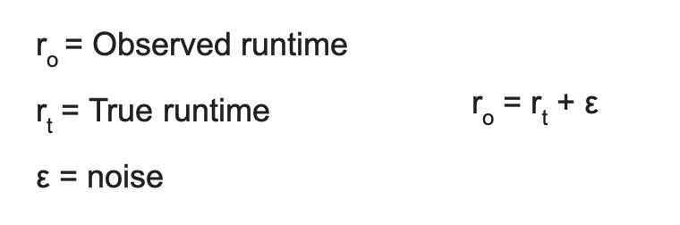
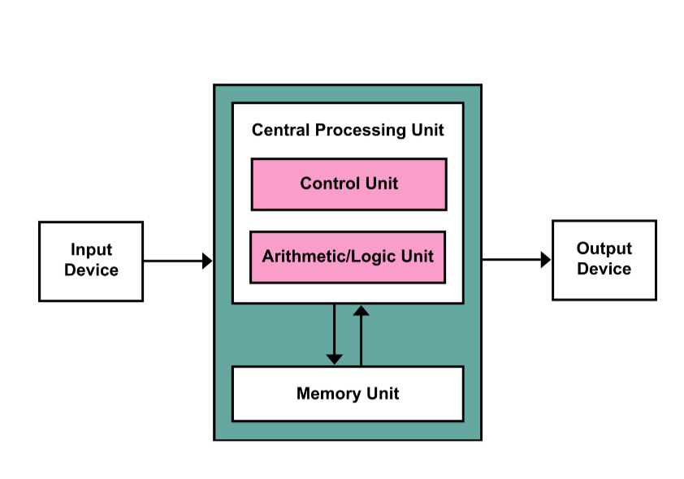

# COMP528 Multi-Core And Multi-Processor Programming

## Terminology

- Parallelism:: Two or more processes that execute simultaneously and

- Concurrency: Two or more processes that excute simultaneously and share at least one resource

- Core: A processor that is built into a larger unit that can independently perform or process computational tasks

- Thread: A software concept, a single sequential flow or control in a program.

Node: What is normally thought of as 'one computer', one motherboard OpenMP to program within a node

- Cluster: 100 or 1000s or nodes connected throgh high-speed interconnections, low latency and high bandwidth

### Objectives for HPC (High Performance Computing)

- Minimise the total time to solution
- Maximise throughput
- Maximise some resource
- Ability to solve problems considered too big for available memory

## Reading List

- Parallel programming in OpenMP By Rohit Chandra

- Parallel programming with MPI By Peter Pacheco

- Using MPI – Portable Parallel Programming with the Message–Passing Interface

## Using a HPC cluster

### Structure of a cluster

- There are one or more login nodes.
- There are multiple compute node.
- There may be speciality nodes for specific tasks.
- There are one or more shared disks.

## Why is my code slow?

### Workload balance

Work should be distributed as evenly as possible

- Load imbalance - If one process is working for longer than the others, then the others will have to wait

- Too much communication - Network is the bottleneck while computation waits

- Resource contention - Two or more processes are asking for the same resource

## The parallel design process -- What is the ideal?


## Why is my code slow?

### Parallelism

- Load imbalance - If one process is working for longer than the others, then the others will have to wait

- Too much communication - Network is the bottleneck while computation waits

- Resource contention - Two or more processes are asking for the same resource

- Overheads - There is a computational cost for starting or stopping threads

- Granularity - The size of chunks assigned to each processing element can be either too small

  - Too small: A combination of the synchronisation and overhead issues can occur
  - Too big: A workload imbalance can occur

- Changing thread tasks - Changing what a thread should be doing changes it's presence in the scheduler, context switching is possible

- Number of threads - If there is too much of a wait between actions, it becomes inefficient

  - The OS will give each thread a time slice, if there are too many threads it will take too long until the thread is next given a slice
  - If there is no more memory, the thread will be pushed to the storage

### Memory hierarchy

Your code is likely not exploiting spatio-temporal locality

- Cache - A temporary storage location for a processor, larger than a register but slower

These are part of the die, and therefore are specifically designed for speed

- Non-uniform memory access - Some memory is quicker than others, typically anything not shared has a dedicated bus

- L1 - Level 1 cache is small but very fast, the smaller the cache, the quicker the access. Specific to the CPU.

- L2 - Level 2 cache is larger than L1, but slightly slower. Specific to the CPU.

- L3 - Level 3 cache is shared between two or more caches, and is significantly larger than L2 cache. It is also therefore slower.

- Spatial locality (空间局部性) - if memory is accessed then it's neighbours are likely to be accessed next (move data as a block, not as it's needed)

- Temporal locality (时间局部性) - if a variable is used, it is likely to be needed again soon (keep it in the cache)

// Bitonic sort

## What is cluster topology?

- Topology - The physical and logical connection of of nodes and connections within a system
- A cluster is organised into racks
- Racks contain a collection of computers
- Each node within a rack is connected, and typically each rack is connected

## Measuring runtime

```c++
#include <iostream>
#include <time>

using namaspace std;

void main() {
  clock_t begin = clock();
  // some code
  clock_t end = clock();

  double time_slot = (double)(end - begin)  CLOCKS_PER_SEC;

  cout << timeslot;
}

```

### The way to figuring out the runtime

1. Run it multiple times and take the average performance
2. Report the minimum of all your runs (seems unfair)
3. Report the maximum time of all of your runs (also kind of unfair)
   

## Terminology

- Single-precision floating-point - This represents floating-point numbers in computers using a total of 32 bits. Can also be called FP32. In C this is float.

- Double-precision floating-point - This represents floating-point numbers using 64 bits. Can be called FP62. In C this is double.

- Flop - Abbreviation for floating-point operation. A common unit of measurement of processor speed is flops/s. You usually have to specify single or double precision.

## R_peak

- R_peak is a metric for the upper bound performance of a system

- R_peak = 2 \* w_rec \* r_clock \* n_core \* n_sock

- Addition/Multiplier - For most boards, they typically do both in 1 cycle. Hence 2.
- W_rec - Vector width (how many FP32)
- r_clock - Clock speed (the @2.00 GHz bit)
- N_core - Cores per socket
- N_sock - Number of sockets per node

- FP32 width = Bit width / 32
- FP64 width = Bit width / 64

- R_peak unit: Gfloat/s | float/s

// benchmark

## The parallelisation breakdown

- Decomposition(分解\<程序\>) How do you break a problem down into parts that can be executed in parallel?
  | keywork | explain |
  | ------- | ------- |
  | Data parallelism | Splitting the data into discrete chunks and parallelising processing |
  | Task parallelism | Giving various tasks to be carried out to different threads etc if they are independent |
  | Domain decomposition | Split the problem into equal pieces |
  | Pipelining | A factory like approach where each process is different |
  | Mixed solution | A combination of different approaches |

  - Von Neuman Machine
    

## Scalability

- Speedup - The ratio between the sequential running time of a program, and the time it runs in parallel.

| factors | explain         |
| ------- | --------------- |
| t_1     | Time on 1 core  |
| t_p     | Time on p cores |
| s_p     |                 |

### Why is important

- This measures how efficiently you are using your resources.

### Scaling

- Strong scaling - Keep the problem size fixed, vary the number of cores and nodes. Ideally there should be a linear reduction in time.

- Weak scaling - Vary the problem size, vary the number of cores and nodes proportionally with the problem size. Ideally there should be a flat line.

## Ahmdal's law

- t_p - The estimated runtime with p processors
- s_p - The estimated speedup given the serial fraction
- If processor approach infinity, s_p will become 1/a

## Gustafson's law

- Speedup = a + p(1 - a) = p - a(p -1)
- a: Fraction of the program

## Correctness

- Deadlock
- Livelock
- Race conditions
