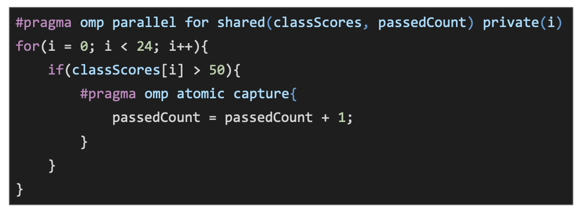

## What is the TSP(Traveling Salesman Problem)?

### Cheapest Insertion (最少代价插入)(DP ｜ Greedy Approach)

### Farthest Insertion (最远插入法)(DP ｜ Greedy Approach)

## Why should I use OpenMp

- We can achieve some pretty good speed up with normal hardware

- Thread based parallelism
- Targeted at share memory
- Uses work sharing and tasks

| Process                                               | Thread                                                            |
| ----------------------------------------------------- | ----------------------------------------------------------------- |
| A basic unit of work for the operating system         | Part of a program that can be run independently to other portions |
| Big overheads in creating/detention/context switching | Small overheads in comparison                                     |
| isolate from other processes                          | Shared memory with other threads in the same process egfiles      |
|                                                       | Share heap                                                        |

## How do I use OpenMP

### The fork-join model

- Expressions

| expression                                                  | description                                             |
| ----------------------------------------------------------- | ------------------------------------------------------- |
| #pragma omp parallel                                        |                                                         |
| #pragma omp for                                             | if the data is independent you can use data parallelism |
| #pragma omp parallel shared(i)                              | shared access acriss akk threads                        |
| #pragma omp parallel private(i)                             | Each thread gets it own copy of the variable            |
| #pragma omp parallel firstprivate(i)                        |                                                         |
| #pragma omp parallel lastprivate(i)                         |                                                         |
| #pragma omp parallel for default(shared)                    |                                                         |
| #pragma omp parallel for reduction(+, sum)                  | performs some operation with the results                |
| #pragma omp parallel schedule<sraruc/dynamic, <chunk size>> |                                                         |
| collapse                                                    |                                                         |
| reduction                                                   |                                                         |

｜ schuduleing ｜ ｜
| locking | |

- To define how threads to use our program
  - export OMP_NUM_THREADS = 8; ./a.out
  - #pragma omp parallel num_threads(x)
  - omp_set_num_threads(x)

## Scheduleing parallel for static/dynamic/guided

- If we have four threads and use static scheduling we get this, notice it isn't even

- If we use dynamic then once a thread has finished its work it will take another job

- schedule(guided, <chunk size>) - Chunks of decreasing size are handed out, it's a dynamic variant

- schedule(runtime) - You can pass the schedule as an environment variable using OMP_SCHEDULE

- schedule(auto) - The scheduler learns the problem after a few runs, don't use this one

## Locking Manual locks

### Low level lock

- omp_lock_t - This is the data type of a variable lock

- omp_init_lock - This initialises the lock variable and sets it's value to 'unlocked', meaning any thread reaching that point doesn't have to stop

- omp_set_lock - Once a thread passes this point, all other threads reaching this point have to wait until it unlocks

- omp_unset_lock - Unlocks the variable lock

### High level lock

- We can use `#pragma omp critical`, this creates a lock for that portion of the code
- Only one thread at a time can run that portion of code

- The solution is `#pragma omp atomic`
- It has hardware support, but it's far less flexible than #pragma omp critical

- `#pragma omp atomic write` - This allows for a statement to receive exclusive write access, still allows for the variables to be read

- `#pragma omp atomic read` - This temporarily locks a variable so it can only be read to, avoids reading intermediate values

- `#pragma omp atomic update` - This creates a lock for writing when another thread is writing, and a lock for reading when another thread is reading

- `#pragma omp atomic capture` - This is a complete lock, similar to a critical region, however this requires hardware support for this feature. If the support doesn't exist then it default to a critical region, which has some additional overhead

## Sections

`#pragma omp section` - Defines some work that only needs to be carried out by a single thread

- Makes the code more readable
- You're not keeping track of the thread number
- Number of usable threads is limited by the number of sections

Expect:

Partical:

### If clause

- Sometimes you'll want something to execute if a particular condition is met
- if(x) - Allows you to put a condition on the execution of some parallel code
- This is only an if, not an if else
- I think it's kinda cool, but i've never found a good use for it

## Timing

> I've mentioned before that there are multiple ways to time things in C The best method while using OpenMP is to use omp_get_wtime() You don't have to worry about clock cycles etc

