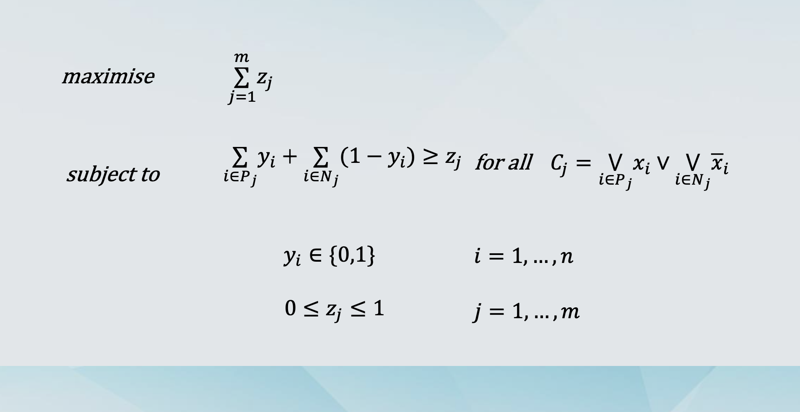
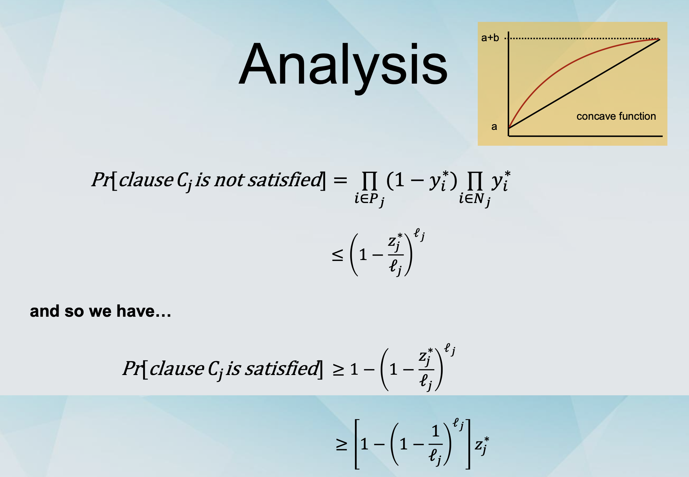
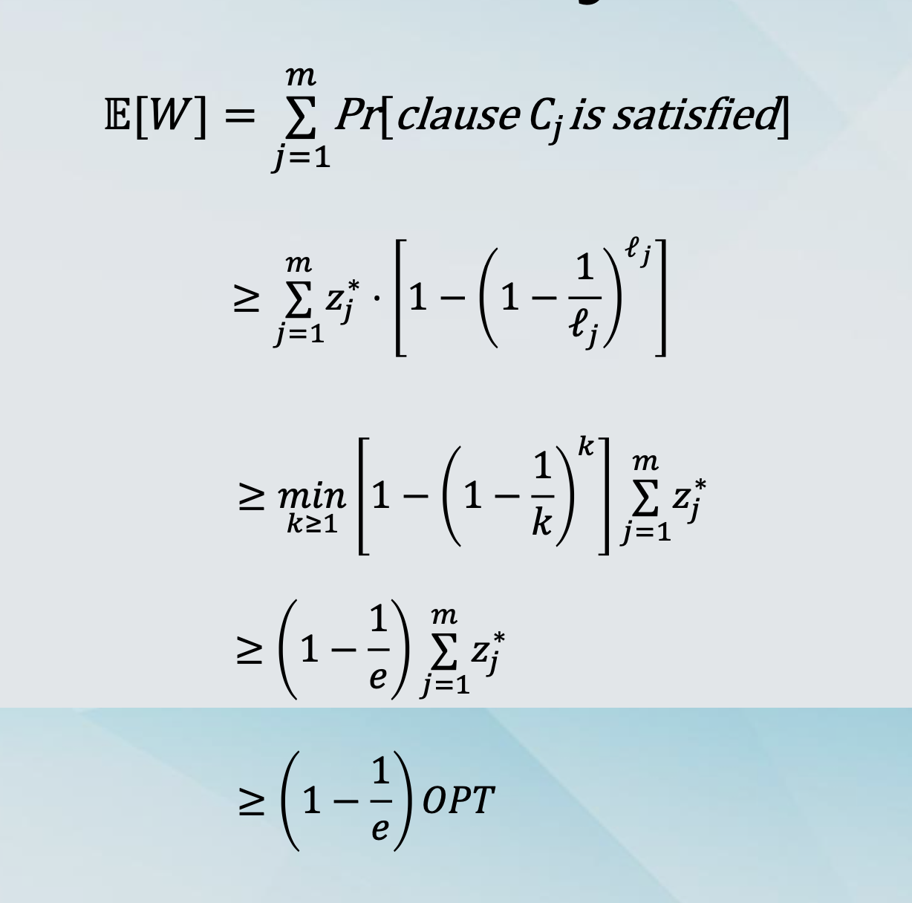
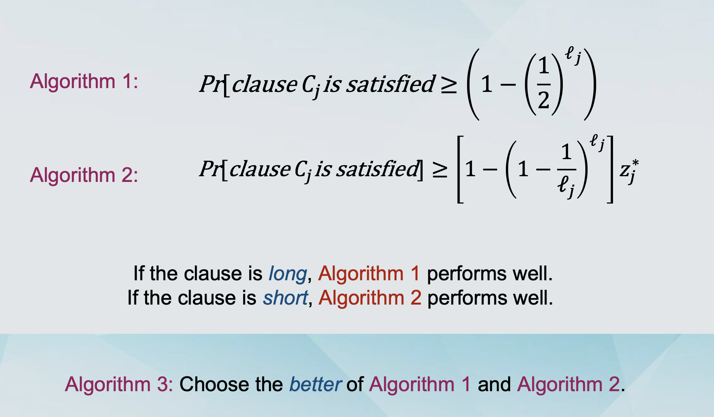
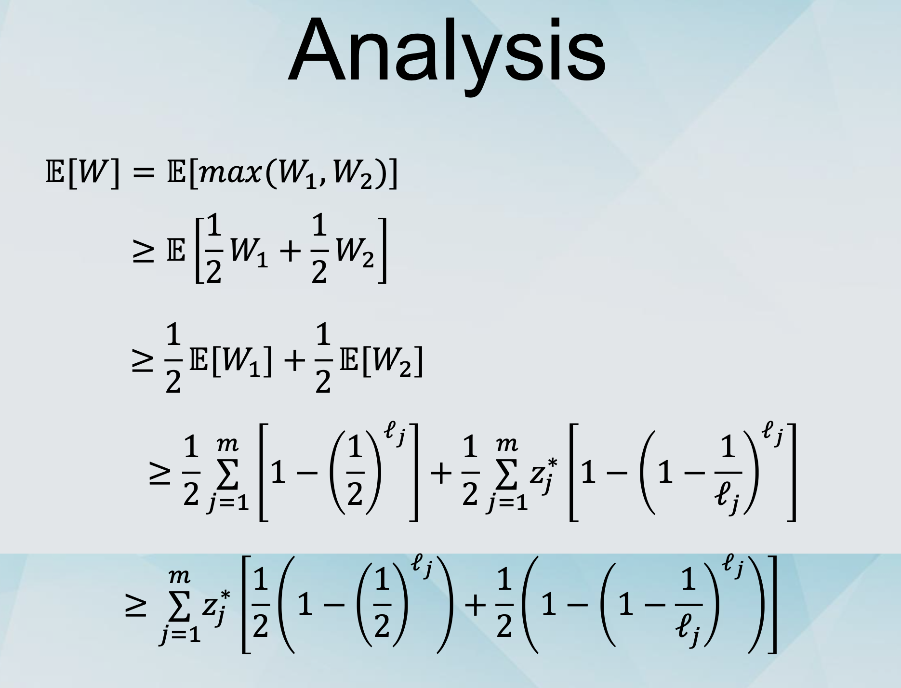
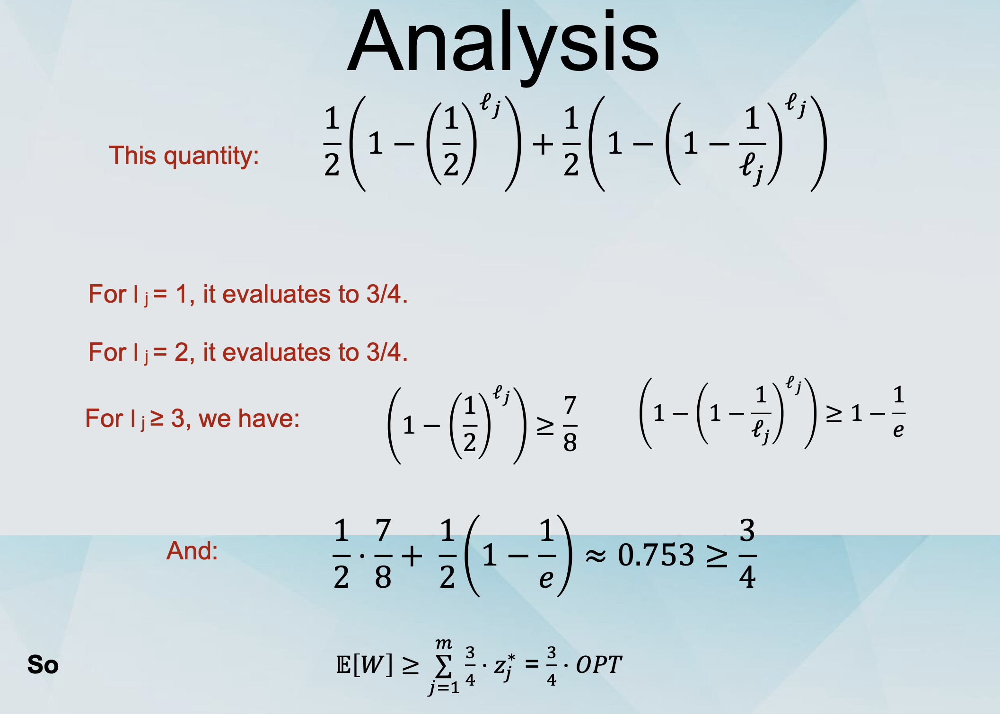
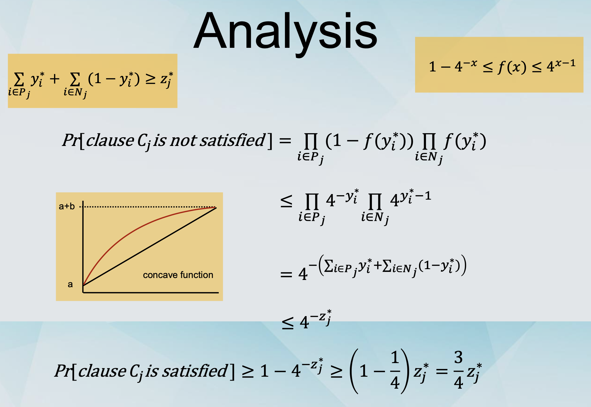
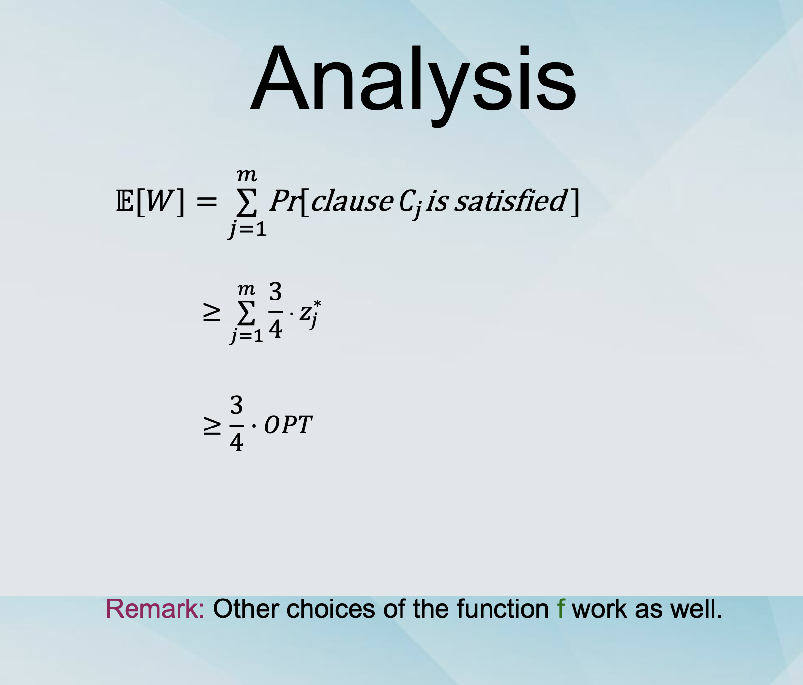

## Derandomisation and Randomised Rounding

### Derandomisation

- Sometimes it is possible to “derandomise” a randomised algorithm `Arand` and obtain a deterministic algorithm `Adet`.

- The performance of Adet is the same as the expected performance of Arand.

- When successful, we can use randomisation at no extra cost!

(except a polynomial running time overhead).

- Different methods for derandomisation.

  - Can be very complicated (pseudo-random generators).

  - Can be relatively simple (conditional expectations).

- Algorithm: For each variable xi, set xi to 1 with probability 1/2 and to 0 with probability 1/2.

- Algorithm: Set variable xi to 1 or 0 deterministically, and the remaining variables to 1 with probability 1/2 and to 0 with probability 1/2, as before.

- To maximise the expected value W of the algorithm.

- If 𝑊 is the number of clauses satisfied then we have:

  𝔼[𝑊] = 𝔼[𝑊|𝑥 ←1]⋅Pr[𝑥 ←1]+𝔼[𝑊|𝑥 ←0]⋅Pr[𝑥 ←0]
  = 1/2 (𝔼[𝑊|𝑥 ←1] \* +𝔼[𝑊|𝑥 ←0])

- We set x1 to 1 if 𝔼[𝑊|𝑥1 ← 1] ≥ 𝔼[𝑊|𝑥1 ← 0] and to 0 otherwise.

- Generally, if b1 is picked to maximise the conditional expectation, it holds that: 𝔼[𝑊|𝑥 ←𝑏 ]≥𝔼[𝑊]

### Applying this to all variables

- Assume that we have set variables x1, ..., xi to b1, ... bi this way.

- We set xi+1 to 1 if this holds and to 0 otherwise.

𝔼[𝑊|𝑥1 ← 𝑏1,𝑥2 ← 𝑏2,...,𝑥i ← 𝑏i,𝑥i+1 ← 1]≥ 𝔼[𝑊|𝑥1 ← 𝑏1,𝑥2 ← 𝑏2,...,𝑥i ← 𝑏i, 𝑥i+1 ← 0]

- Again, if bi+1 is picked to maximise the conditional expectation, it holds that:

  𝔼[𝑊|𝑥1 ← 𝑏1,𝑥2 ← 𝑏2,...,𝑥i ← 𝑏i,𝑥i+1 ← 𝑏i+1] ≥ 𝔼[𝑊]

### In the end

- In the end we have set all variables deterministically (去随机化).

- We have 𝔼[𝑊|𝑥1 ← 𝑏1,𝑥2 ← 𝑏2,...,𝑥i ← 𝑏i,𝑥i+1 ← 𝑏i+1] ≥ 𝔼[𝑊]

- We know that E[W] ≥ 1/2 \* OPT

- We have devised a deterministic 2-approximation algorithm.

- Is it polynomial-time? Yes

### Computing the expectations

- We have to be able to compute the conditional expectations in polynomial time.

𝔼[𝑊|𝑥1 ← 𝑏1 ,...,𝑥i ←𝑏i]= ∑𝔼[𝑌|𝑥1 ←𝑏1 ,...,𝑥i ←𝑏i]

= ∑ i=1^m Pr[clause𝐶issatisfied|𝑥 ←𝑏 ,...,𝑥 ←𝑏]

- The probability is

  - 1 if the variables already set satisfy the clause.

  - 1-(1/2)k otherwise, where k is the set of unset variables.

### Method of conditional expectations

- Derandomisation using conditional expectations.

- Works for a wide variety of applications as long as

  - The variables are set independently.

  - The conditional expectations can be calculated in polynomial time.

### Recall: Deterministic Rounding

- For the case of vertex cover we can solve the LP-relaxation in polynomial time, to find an optimal solution.

- The optimal solution is a “fractional” vertex cover, where variables can take values between 0 and 1.

- We round the fractional solution to an integer solution.

  - We pick a variable xi and we set it to 1 or 0.

  - If we set everything to 0, it is not a vertex cover.

  - If we set everything to 1, we “pay” too much.

  - We set variable xi to 1 if xi ≥ 1/2 and to 0 otherwise.

### Randomised Rounding

- We formulate the problem as an ILP.

- We write the LP-relaxation.

- We solve the LP-relaxation.

- We round the variables with probabilities that can depend on their values.

- Let (y*, z*) be a solution to the LP-relaxation.

- Rounding: Set xi to true independently with probability yi\*.

  - e.g., if y\* = (1/3, 1/4, 5/6, 1/2, ...) we will set variables x1, x2, x3, x4, ... to true with probabilities 1/3, 1/4, 5/6, 1/2, ... respectively.

### MAX SAT as an ILP

Variables: yi = 1 if xi is true and 0 otherwise.

We denote clause Cj by ⋁ 𝑥𝑖 ∨ ⋁ 𝑥𝑖 𝑖∈𝑃𝑗 𝑖∈𝑁𝑗

Variables: zj = 1 if clause Cj is satisfied and 0 otherwise.

We have the inequality: ∑ 𝑦i + ∑ (1 − 𝑦i ) ≥ 𝑧j

### Randomised Rounding for MAX-SAT

- Our randomised algorithm gives an approximation ratio of 1/(1-1/e) ≈ 1.59.

- This is better than 2.

- This is better than 1.618. (why this?)

- Sidenote: 1.618 = φ.

### The better of the two

### Algorithms for MAX-SAT

- Our Randomised Rounding algorithm gives an approximation ratio of 1/(1-1/e) ≈ 1.59.

- This is better than 2. (unbiased coin flip for each variable)

- This is better than 1.618. (why this?)

  - Sidenote: 1.618 = φ.

- The “better of the two” algorithm has approximation ratio 4/3 ≈ 1.33.

### Back to Randomised Rounding

- Is our RR algorithm the best possible?

- How do we (attempt to) show that?

  - Integrality gap.

### Integrality Gap of MAX-SAT

- Consider the formula: (x1 ⌵x2)⌃(┐x1 ⌵x2)⌃(x1 ⌵┐x2)⌃(┐x1 ⌵┐x2)

- The optimal integral solution satisfied 3 clauses.

- The optimal fractional solution sets

  y1= y2 = 1/2 and zj = 1 for all j and satisfies 4 clauses.

- The integrality gap is at least 4/3.

### What does this mean?

- We can not hope to design an LP-relaxation and rounding-based algorithm (for this ILP formulation) that outperforms our “better of the two” algorithm.

- Can we design one that matches the 4/3 approximation ratio?

- Yes we can!

  - Instead of “Set xi to true independently with probability yi\*”,

  - We use “Set xi to true independently with probability f(yi\*), for some function f.

  - Which function f?

    - Any function such that 1 - 4-x ≤ f(x) ≤ 4x-1

### Algorithms for MAX-SAT

- Our first RR algorithm gives an approximation ratio of 1/(1-1/e) ≈ 1.59.

- This is better than 2. (fair coin flip for all variables)

- This is better than 1.618. (optimal coin flip for all variables)

- The “better of the two” algorithm has approximation ratio 4/3 ≈ 1.33.

- The more sophisticated RR algorithm has an approximation ratio of 4/3 ≈ 1.33.
