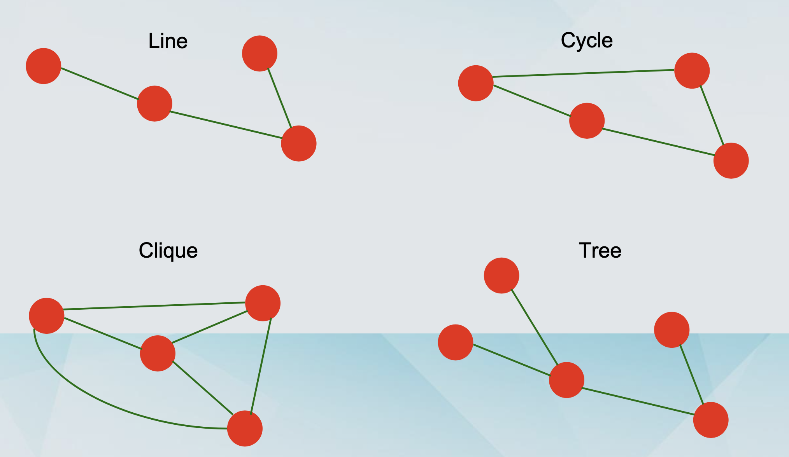
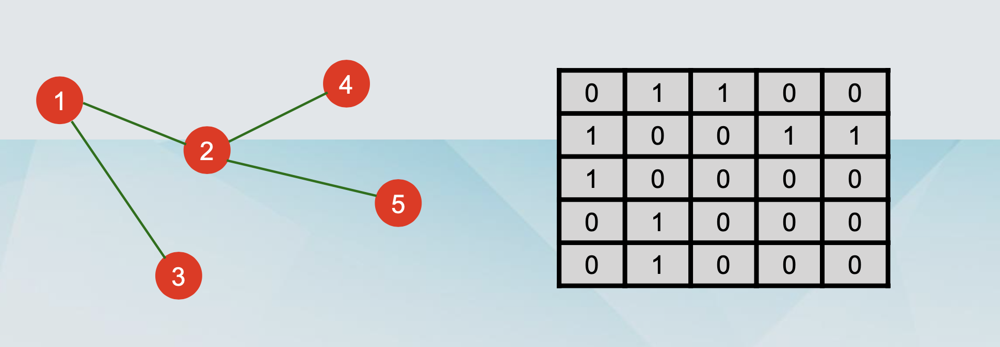
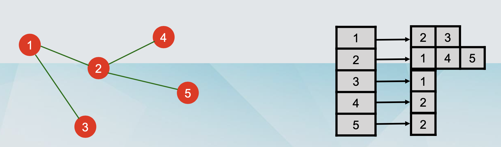

## Graph Definitions

- Graph G=(V,E)
- Set of vertices (or nodes) V, with |V| = n Set of edges E, with |E| = m
- Undirected: edge e = {v,w} (or just vw) Directed: edge e = (v,w)

- Neighbours of a vertex v : Set of nodes connected by an edge with v Degree of a vertex v : number of neighbours of v, denoted deg(v)

- Directed graphs: in-degree and out-degree

- Path: A sequence of (non-repeating) nodes with consecutive nodes being connected by an edge.

  - Length: # nodes – 1 = # edges

- Distance between u and v : length of the shortest path u and v

- Graph diameter: The longest distance in the graph



### Adjacency Matrix （邻接矩阵）

- The ith node corresponds to the ith row and the ith column.
- If there is an edge between i and j in the graph, then we have A[i,j] = 1, otherwise A[i,j] = 0.
- For undirected graphs, necessarily A[i,j] = A[j,i]. For directed graphs, it could be that A[i,j] ≠ A[j,i].



### Adjacency List （邻接链表）

- Nodes are arranged as a list, each node points to the neighbours.

- For undirected graphs, the node points only in one direction.

- For directed graphs, the node points in two directions, for in- degree and for out-degree



|                                      | Adjacency Matrix | Adjacency List        |
| ------------------------------------ | ---------------- | --------------------- |
| Memory                               | O(n^2)           | O(m+n)                |
| Checking adjacency of u and v Time   | O(1)             | O(min(deg(u),deg(b))) |
| Finding all adjacent nodes of u Time | O(n)             | O(deg(u))             |

## Depth-First Search （深度优先搜索）

### Definition

- A connected component of a graph G is subgraph such that any two vertices are connected via some path.

### Description in words

- We wander through a labyrinth with a string and a can of red paint.

- We start at a node s and we tie the end of our string to s. We paint node s as visited.

- We will let u denote our current vertex. We initialise u = s

- We travel along an arbitrary edge (u,v).

- If the (u,v) leads to a visited vertex, we return to u. • Otherwise, we paint v as visited, and we set u = v • Then, we return to the beginning of the step.

- Once we get to a dead end (all neighbours have been visited), we backtrack to the previously visited vertex p. We set u = p and repeat the previous steps.

- When we backtrack back to s, we terminate the process.

### Visualising Depth-First Search

- Orient the edges along the direction in which they are visited during the traversal.

  - Some edges are discovery edges, because they lead to unvisited vertices.

  - Some edges are back edges, because they lead to visited vertices.

- The discovery edges form a spanning tree of the connected component of the starting vertex s.

### Example

```javascript
/**
 * Definition for a binary tree node.
 * function TreeNode(val, left, right) {
 *     this.val = (val===undefined ? 0 : val)
 *     this.left = (left===undefined ? null : left)
 *     this.right = (right===undefined ? null : right)
 * }
 */
var hasPathSum = function (root, targetSum) {
  if (!root) return false;
  let res = false;
  const dfs = (n, s) => {
    if (!n.left && !n.right && s === targetSum) {
      res = true;
    }
    if (n.left) dfs(n.left, s + n.left.val);
    if (n.right) dfs(n.right, s + n.right.val);
  };
  dfs(root, root.val);
  return res;
};
```
