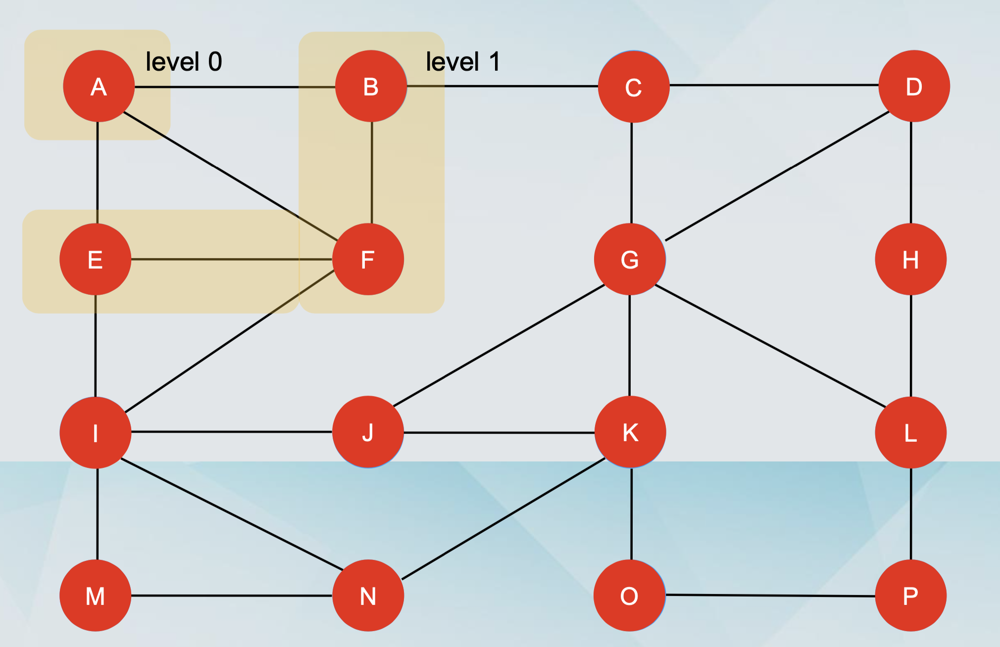
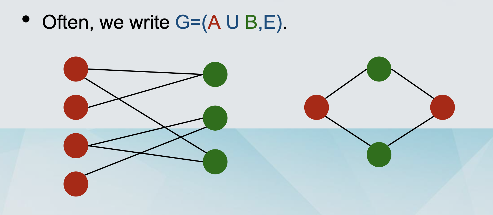

## Graph Definitions

- Graph G=(V,E)
- Set of vertices (or nodes) V, with |V| = n Set of edges E, with |E| = m
- Undirected: edge e = {v,w} (or just vw) Directed: edge e = (v,w)

- Neighbours of a vertex v : Set of nodes connected by an edge with v Degree of a vertex v : number of neighbours of v, denoted deg(v)

- Directed graphs: in-degree and out-degree

- Path: A sequence of (non-repeating) nodes with consecutive nodes being connected by an edge.

  - Length: # nodes – 1 = # edges

- Distance between u and v : length of the shortest path u and v

- Graph diameter: The longest distance in the graph


### Adjacency Matrix （邻接矩阵）

- The ith node corresponds to the ith row and the ith column.
- If there is an edge between i and j in the graph, then we have A[i,j] = 1, otherwise A[i,j] = 0.
- For undirected graphs, necessarily A[i,j] = A[j,i]. For directed graphs, it could be that A[i,j] ≠ A[j,i].


### Adjacency List （邻接链表）

- Nodes are arranged as a list, each node points to the neighbours.

- For undirected graphs, the node points only in one direction.

- For directed graphs, the node points in two directions, for in- degree and for out-degree


|                                      | Adjacency Matrix | Adjacency List        |
| ------------------------------------ | ---------------- | --------------------- |
| Memory                               | O(n^2)           | O(m+n)                |
| Checking adjacency of u and v Time   | O(1)             | O(min(deg(u),deg(b))) |
| Finding all adjacent nodes of u Time | O(n)             | O(deg(u))             |

## Depth-First Search （深度优先搜索）

### Definition

- A connected component of a graph G is subgraph such that any two vertices are connected via some path.

### Description in words

- We wander through a labyrinth with a string and a can of red paint.

- We start at a node s and we tie the end of our string to s. We paint node s as visited.

- We will let u denote our current vertex. We initialise u = s

- We travel along an arbitrary edge (u,v).

- If the (u,v) leads to a visited vertex, we return to u. • Otherwise, we paint v as visited, and we set u = v • Then, we return to the beginning of the step.

- Once we get to a dead end (all neighbours have been visited), we backtrack to the previously visited vertex p. We set u = p and repeat the previous steps.

- When we backtrack back to s, we terminate the process.

### Visualising Depth-First Search

- Orient the edges along the direction in which they are visited during the traversal.

  - Some edges are discovery edges, because they lead to unvisited vertices.

  - Some edges are back edges, because they lead to visited vertices.

- The discovery edges form a spanning tree of the connected component of the starting vertex s.

### Example

```javascript
/**
 * Definition for a binary tree node.
 * function TreeNode(val, left, right) {
 *     this.val = (val===undefined ? 0 : val)
 *     this.left = (left===undefined ? null : left)
 *     this.right = (right===undefined ? null : right)
 * }
 */
var hasPathSum = function (root, targetSum) {
  if (!root) return false;
  let res = false;
  const dfs = (n, s) => {
    if (!n.left && !n.right && s === targetSum) {
      res = true;
    }
    if (n.left) dfs(n.left, s + n.left.val);
    if (n.right) dfs(n.right, s + n.right.val);
  };
  dfs(root, root.val);
  return res;
};
```

## Breadth-First Search 广度优先

- Simple description

  - Start from the starting vertex `s` which is at `level 0` and consider it `explored`.

  - For any node at `level i`, put all of its `unexplored` neighbours in level i+1 and consider them explored.

  - Terminate at `level j`, when none of the nodes of the level has any neighbours which are `unexplored`.



### Visualising Breadth-First Search

- Orient the edges along the direction in which they are visited during the traversal.

  - Some edges are discovery edges, because they lead to unvisited vertices.

  - Some edges are cross edges, because they lead to visited vertices.

- The discovery edges form a spanning tree of the connected component of the starting vertex s.

### Properties of BFS

- For simplicity, assume that the graph is connected.

- The traversal visits all vertices of the graph.

- The discovery edges form a spanning tree.

- The path of the spanning tree from s to a node v at level i has i edges, and this is the shortest path.

- If e=(u,v) is a cross edge, then the u and v differ by at most one level.

### Running time of BFS

- O(m + n)

## Testing for bipartiteness

### Bipartite graphs （二分图）

- A graph G=(V,E) is bipartite if any only if it can be partitioned into sets A and B such that each edge has one endpoint in A and one endpoint in B.
  // 一个图仅仅可以被划分为 A，B 两个 set，且每个 set 有一个 endpoint

- Often, we write G=(A U(union) B,E).



- Alternative definitions

  - A graph G=(V,E) is bipartite if any only if its nodes can be coloured with 2 colours (say red and green), such that every vertex has one red endpoint and one green endpoint.

  - A graph G=(V,E) is bipartite if any only if it does not contain any cycles of odd length.

### No odd cycles 无奇数环

- A graph G=(V,E) is bipartite if any only if it does not contain any cycles of odd length.
- => Assume that G is bipartite
- Suppose that G does contain an odd cycle (proof by contradiction), C = u1 u2 u3 ... un u for some u in A (wlog), or alternatively, for some u that is red.
- Because G is bipartite, u2 must be green, and then u3 must be red, and so on.
- Generally, we observe that for all k in {1,2, ... ,n}, uk is red if k is odd and green if k is even.
- By assumption, n is odd, so it must be red. But then u cannot be red, because G is bipartite.

- Alternative definitions

- A graph G=(V,E) is bipartite if any only if its nodes can be coloured with 2 colours (say red and green), such that every vertex has one red endpoint and one green endpoint.

- A graph G=(V,E) is bipartite if any only if it does not contain any cycles of odd length.

- Sometimes, these alternatives definitions are also called “characterisations”.

### Testing bipartiteness

- Given a graph G=(V,E), decide if it is bipartite or not.

- Given a graph G=(V,E) decide if it is 2-colourable or not.

- Given a graph G=(V,E) decide if it is contains cycles of odd length or not.

### Colouring the nodes

- Does this remind you of something?

  - It is essentially BFS!

  - We label the nodes of level 1 red, the nodes of level 2 green, and so on.

- Implementation:

  - Add a check for odd/even and assign a colour accordingly.

  - In the end, check all edges to see if they have endpoints of the same colour.

### Correctness

- Suppose that G is bipartite. Then, all cycles must be of even length.

- Suppose to the contrary that the algorithm returns “not bipartite”.

  - This means that it has found an edge e=(x,y) with endpoints of the same colour.

  - Since the endpoints of any edge can not differ by more than one layer and layers have alternating colours, x and y must be in the same layer.

## Strong Connectivity (强连通性)

### Directed graphs

- Nodes are arranged as a list, each node points to the neighbours.

- For directed graphs, the node points in two directions, for in-degree and for out-degree.

- DFS and BFS on directed graphs

  1. Very similar to their version on undirected graphs.
  2. When we are at a node and we examine its neighbours, a neighbour is now only a node that we can reach with a directed edge.
  3. The running time is still O(n+m).

### Connectivity

- What BFS is computing is the set of nodes t such that there is a path from s to t.

- A path from s to t does not mean that there is path from t to s.

- (Weak) connectivity: If we ignored the directions for all edges, there would a path from any node to any node.

- Strong connectivity: For every two nodes u and v, there is a path from u to v and a path from v to u.

### Mutual reachability (互相可达性)

- Two nodes u and v are mutually reachable, if there is path from u to v and a path from v to u in G.

- Strong connectivity: For every pair of nodes u and v, these nodes are mutually reachable.

- Transitivity: If u and v are mutually reachable and v and w are mutually reachable, then u and w are mutually reachable.

### Testing strong connectivity

- Define the reverse graph Grev, in which the nodes are the same and the edges are the same with reversed directions.

- Pick any node s in V and run BFS(G,s) and BFS(Grev,s).

- If one of the two searches does not reach every node, then the graph is definitely not strongly connected.

- Assume that both searches reach every node. This means that there is a path from s to any node u and a path from any node u to s.

  - For any node u, s and u are mutually reachable.

- Pick any other node v. Since s and v are also mutually reachable, by transitivity, v and u are mutually reachable and the graph is strongly connected.
