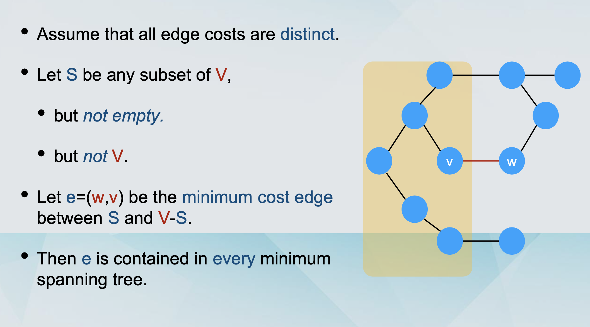
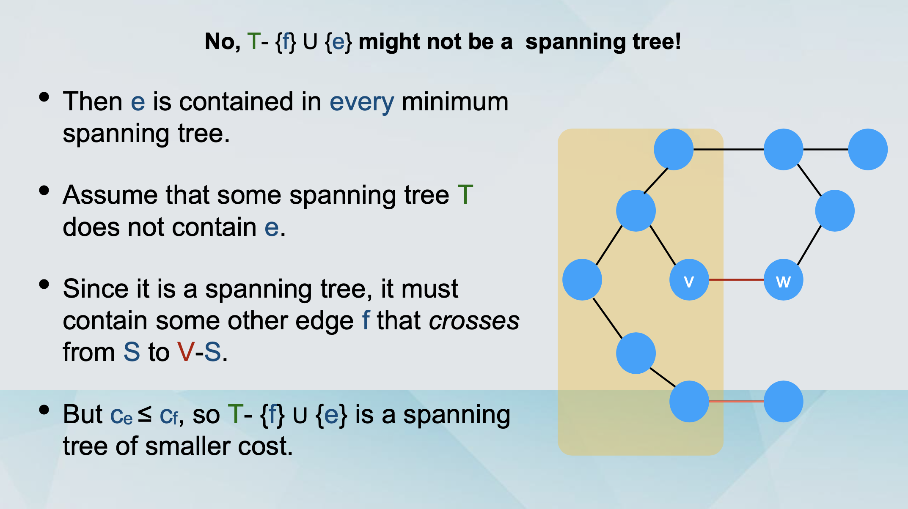
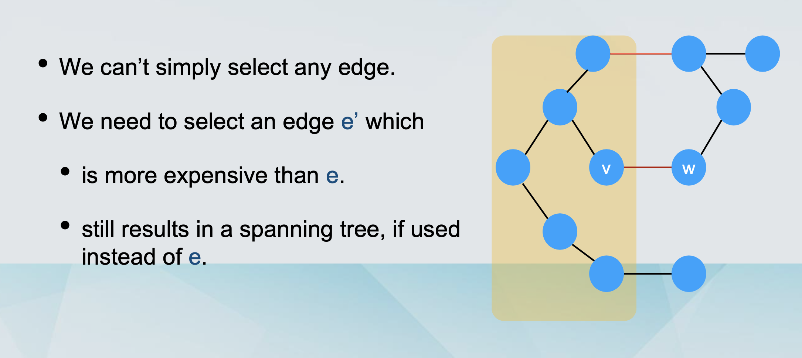
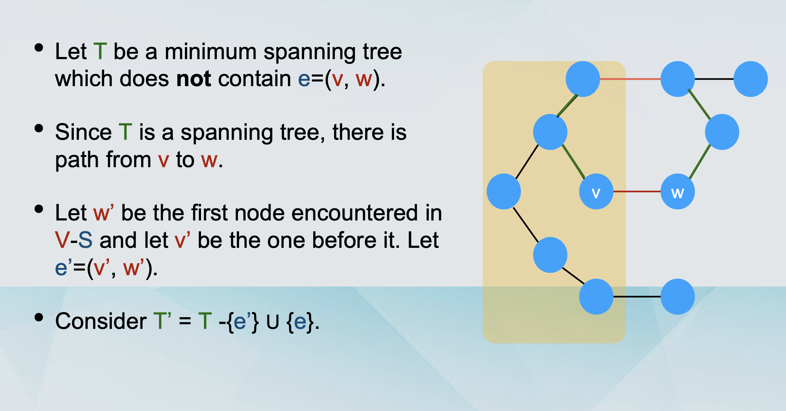

## Interval Scheduling

### The Greedy approach 贪心算法

- The goal is to come up with a global solution. 提出一个全局的解法

- The solution will be built up in small consecutive steps. 会构建连续小步

- For each step, the solution will be the best possible `myopically（目光短浅地）`, according to some criterion （通过一些准则）.

- Definition:

  - We start by selecting an interval [s(i), f(i)] for some request i.

  - We include this interval in the schedule.

  - This necessarily means that we can not include any other interval that is not compatible with [s(i), f(i)].

  - We will continue with some compatible interval [s(j), f(j)] and repeat the same process.

  - We terminate when there are no more compatible intervals to consider.

- The Greedy Approach

  - Option 1: Choose the available interval that starts earliest.

  - Option 2: Choose the smallest available interval.

  - Option 3: Something more clever.

### Interval Scheduling

- A set of requests {1, 2, ... , n}.

  - Each request has a starting time s(i) and a finishing time f(i).

  - Alternative view: Every request is an interval [s(i), f(i)].

- Two requests i and j are compatible if their respective intervals do not overlap.

- Goal: Output a schedule which maximises the number of compatible intervals.

### Greedy Algorithm for interval scheduling

```javascript
/**
IntervalScheduling([s(i), f(i)]i=1 to n)
  Let R be the set of requests, let A be empty
  While R is not empty
    Choose a request i with the smallest f(i).
    Add i to A
    Delete all requests from R that are not compatible with request i.
  Return the set A of accepted requests
*/
```

### Arguing for optimality

- Some notation:

  - O is the optimal schedule. Recall, that A is the schedule of the Greedy algorithm.

  - Let i1, i2, ... , ik be the order in which the intervals were added to A by the algorithm.

  - Note that |A| = k.

  - Let j1, j2, ... , jm be the set of requests in O.

  - Note that |O| = m.

  - We will prove that m=k. (Why is that enough?)

- Let j1, j2, ... , jm be the set of requests in O.

  - Assume wlog that this is in order of increasing s(jh).

  - Since O is feasible, this is also in order of increasing f(jh).

- Claim: f(i1) ≤ f(j1)

  - This holds because i1 is chosen to be the interval with the smallest f(ih).

- Claim: f(i1) ≤ f(j1)

  - As i1 is chosen to be the interval with the smallest f(ih).

- Lemma: For all indices r ≤ k, it holds that f(ir) ≤ f(jr)

  - Proof by induction:

    - Base Case (r=1), by Claim.

    - Induction Step. Assume it is true for r-1 i.e. (IH): f(ir-1) ≤ f(jr-1)

    - we will prove it for r.

### Induction step proof


### Completing the proof

- By contradiction: To the contrary, assume that m > k

- For r=k, the Lemma gives us that f(ik) ≤ f(jk).

- Since m > k , there is an extra request jk+1 in O.

- s(jk+1) > f(jk) ≥ f(ik).

- The greedy algorithm would have continued with jk+1.

### Running Time

The running time is O(n log n).

## Minimum Spanning Tree 最小生成树

- Consider a connected graph G=(V, E), such that for every edge e=(v,w) of E, there is an associated positive cost ce.

- Goal: Find a subset T of E so that the graph G’=(V, T) is connected and the total cost `sum ce` is minimised.

### Claim: T is a tree

- By definition, (V, T) is connected.

- Suppose that it contained a cycle.

- Let e be an edge on that cycle.

- Take (V, T-{e}).

- This is still connected.

  - All paths that used e can be rerouted through the other direction.

- (V, T-{e}) is a valid solution, and it is cheaper. Contradiction!

### Greedy Approach 1 (Kruskal’s Algorithm)

- Start with an empty set of edges T.

- Add one edge to T.

  - Which one?

  - The one with the minimum cost `ce`.

- We continue like this.

- Do we always add the new edge e to T?

  - Only if we don’t introduce any cycles.

### Greedy Approach 2 (Prim’s Algorithm)

- Start with an empty set of edges T.

- Start with a node s.

- Add an edge e=(s,w) to T.

  - Which one?

  - The one with the minimum cost ce.

- We continue like this – growing a set of connected vertices.

  - We only consider edges to neighbours that are not in the spanning tree.

### The cut property









### Kruskal’s algorithm is optimal

- Consider any edge e=(u, w) that Kruskal’s algorithm adds to the output on some step.

- Let S be the set of nodes reachable from u just before e is added to the output.

- It holds that u is in S and w is in V-S.(Why?)

  - Because otherwise adding e would create a cycle.

- The algorithm has not found any edge crossing S and V-S. (Why?)

  - Such an edge would have been added to the output by the algorithm.

- The edge e must be the cheapest edge crossing S and V-S.

- By the cut property, it belongs to every minimum spanning tree.

### Prim’s algorithm is optimal

- In each iteration of the algorithm, there is a set S of nodes which are the nodes of a partial spanning tree.

- An edge is added to “expand” the partial spanning tree, which has the minimum cost.

- This edge has one endpoint in S and one in V-S and has minimum cost.

- So it must be part of every minimum spanning tree.

### Greedy Approach 3 (Reverse-Delete Algorithm)

- Start with the full graph G=(V, E).

- Delete an edge from G.

  - Which one?

  - The one with the maximum cost ce.

- We continue like this.

  - Do we always remove the considered edge e from G?

  - As long as we don’t disconnect the graph.

### The cycle property

- Assume that all edge costs are distinct.

- Let C be any cycle of G.

- Let e=(w,v) be the maximum cost edge of C.

- Then e is not contained in any minimum spanning tree of G.

- Let T be a spanning tree that contains e.

- We will show that it does not have minimum cost.

- We will substitute e with another edge e’, resulting in a cheaper spanning tree.

- How to find this edge e’?

- We delete e from T.

- This partitions the nodes into

  - S (containing u).

  - V - S (containing w).

- We follow the other path the cycle from u to w.

- At some point we cross from S to V - S, following edge e’.

- The resulting graph is a tree with smaller cost.

### Reverse-Delete is optimal

- Consider any edge e=(v, w) which is removed by Reverse- Delete.

- Just before deleting, it lies on some cycle C.

- It has the maximum cost among edges, so it cannot be part of any minimum spanning tree.

### Non-distinct costs

- Take the original instance with non-distinct costs.

- Make the costs distinct by adding small numbers ε to the costs to break ties.

- Obtain a perturbed instance.

- Run the algorithm on the perturbed instance.

- Output the minimum spanning tree T.

- T is a minimum spanning tree on the original instance.

### T in the original instance

- Suppose that there was a cheaper spanning tree `T*` on the original instance.

- If `T*` contains different edges to T but with the same costs, it is not cheaper than T on the original instance.

- If `T` contains different edges with different costs, we can make ε small enough to make sure the ones we selected are still cheapest.

### Prim’s algorithm running time

- We add nodes to the expanding spanning tree S.

- We need to figure out which node to add next.

- We need to know the attachment cost of each node: a(v) = mine=(u,v):u is in S ce

- Naive solution: For every step run over all candidates.

- O(n2).

### Priority Queue

- Maintains

  - A set of elements S.

  - A key key(v) for each element v in S.

- The key denotes the priority of v.

- Operations:

  - Add(v) - with priority key. • Delete(v)

  - Extract_Min(v)

  - Change_key(v)

- The Priority Queue is an abstract data type.

- In reality, we have to implement it with known data structures.

- Many implementations exists, the usual one is with heaps.

- For now:

  - PQ operations can be implemented in O(log n) time.

- PQ solution: Insert the nodes in a PQ, with minus the attachment cost as the keys.

## Clustering

### Definition of Clustering

- Definition: Given a set U of n elements, a k-clustering of U is a partition of U into non-empty sets C1, ..., Ck.

- Definition: The spacing of a k-clustering is the minimum distance between any pair of points in different clusters. // 不同集合之间的最小距离

- Goal: Among all possible k-clusterings, find one with the maximum possible spacing.

### In greedy algorithm

- Pick two objects pi and pj with the smallest distance d(pi,pj).

- Connect them with an edge e=(pi,pj).

- Continue like this until we obtain k clusters.

- If the edge e under consideration connects two objects pi and pj already in the same component, skip it.

### Kruskal’s algorithm

- Pick an edge (pi, pj) with the smallest cost d(pi,pj).

- Include the edge in the output.

- Stop before including the last k-1 edges.

  - i.e., in the end, remove the k-1 most expensive edges.

- If the edge e under consideration introduces a cycle, then skip it.

- Lemma: Let C1, C2, ... , Ck be the k connected components formed by deleting the k-1 most expensive edges from a minimum spanning tree T. // 生成一个最小生成树需要删除 k - 1 条最 expensive 的边

- Proof of the Lemma

  - Let C’ = {C’1, C’2, ... , C’k} be any other k-clustering.

  - By other, there exists a cluster Cr of C which is not contained in any cluster C's of C’.

  - This means that there exist points pi, pj in Cr that belong to different clusters in C’.

  - Let C’i and C’j denote these clusters respectively.
