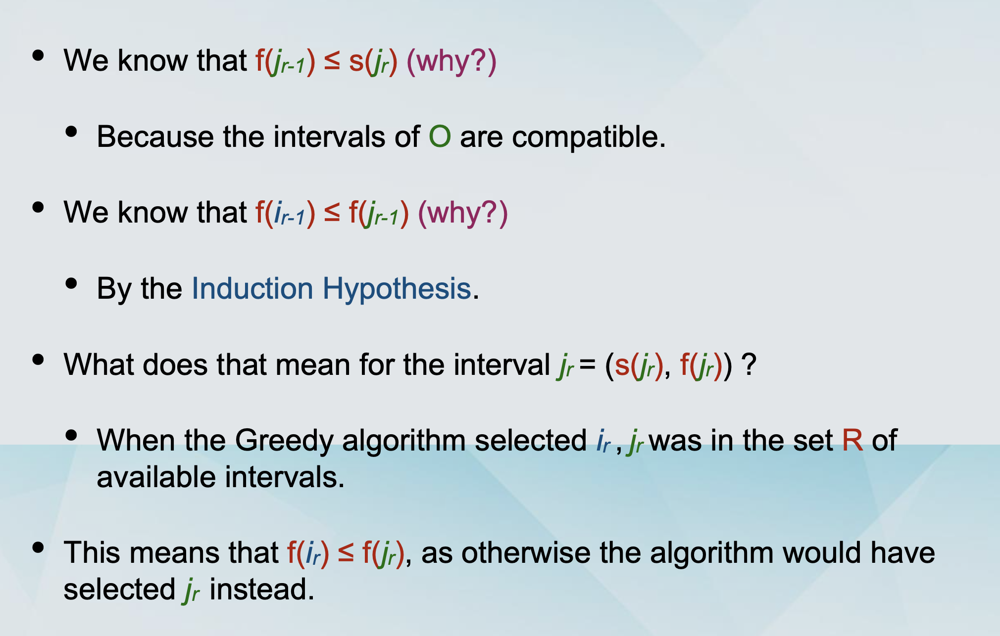

## Interval Scheduling

### The Greedy approach 贪心算法

- The goal is to come up with a global solution. 提出一个全局的解法

- The solution will be built up in small consecutive steps. 会构建连续小步

- For each step, the solution will be the best possible `myopically（目光短浅地）`, according to some criterion （通过一些准则）.

- Definition:

  - We start by selecting an interval [s(i), f(i)] for some request i.

  - We include this interval in the schedule.

  - This necessarily means that we can not include any other interval that is not compatible with [s(i), f(i)].

  - We will continue with some compatible interval [s(j), f(j)] and repeat the same process.

  - We terminate when there are no more compatible intervals to consider.

- The Greedy Approach

  - Option 1: Choose the available interval that starts earliest.

  - Option 2: Choose the smallest available interval.

  - Option 3: Something more clever.

### Interval Scheduling

- A set of requests {1, 2, ... , n}.

  - Each request has a starting time s(i) and a finishing time f(i).

  - Alternative view: Every request is an interval [s(i), f(i)].

- Two requests i and j are compatible if their respective intervals do not overlap.

- Goal: Output a schedule which maximises the number of compatible intervals.

### Greedy Algorithm for interval scheduling

```javascript
/**
IntervalScheduling([s(i), f(i)]i=1 to n)
  Let R be the set of requests, let A be empty
  While R is not empty
    Choose a request i with the smallest f(i).
    Add i to A
    Delete all requests from R that are not compatible with request i.
  Return the set A of accepted requests
*/
```

### Arguing for optimality

- Some notation:

  - O is the optimal schedule. Recall, that A is the schedule of the Greedy algorithm.

  - Let i1, i2, ... , ik be the order in which the intervals were added to A by the algorithm.

  - Note that |A| = k.

  - Let j1, j2, ... , jm be the set of requests in O.

  - Note that |O| = m.

  - We will prove that m=k. (Why is that enough?)

- Let j1, j2, ... , jm be the set of requests in O.

  - Assume wlog that this is in order of increasing s(jh).

  - Since O is feasible, this is also in order of increasing f(jh).

- Claim: f(i1) ≤ f(j1)

  - This holds because i1 is chosen to be the interval with the smallest f(ih).

- Claim: f(i1) ≤ f(j1)

  - As i1 is chosen to be the interval with the smallest f(ih).

- Lemma: For all indices r ≤ k, it holds that f(ir) ≤ f(jr)

  - Proof by induction:

    - Base Case (r=1), by Claim.

    - Induction Step. Assume it is true for r-1 i.e. (IH): f(ir-1) ≤ f(jr-1)

    - we will prove it for r.

### Induction step proof



### Completing the proof

- By contradiction: To the contrary, assume that m > k

- For r=k, the Lemma gives us that f(ik) ≤ f(jk).

- Since m > k , there is an extra request jk+1 in O.

- s(jk+1) > f(jk) ≥ f(ik).

- The greedy algorithm would have continued with jk+1.

### Running Time

The running time is O(n log n).
