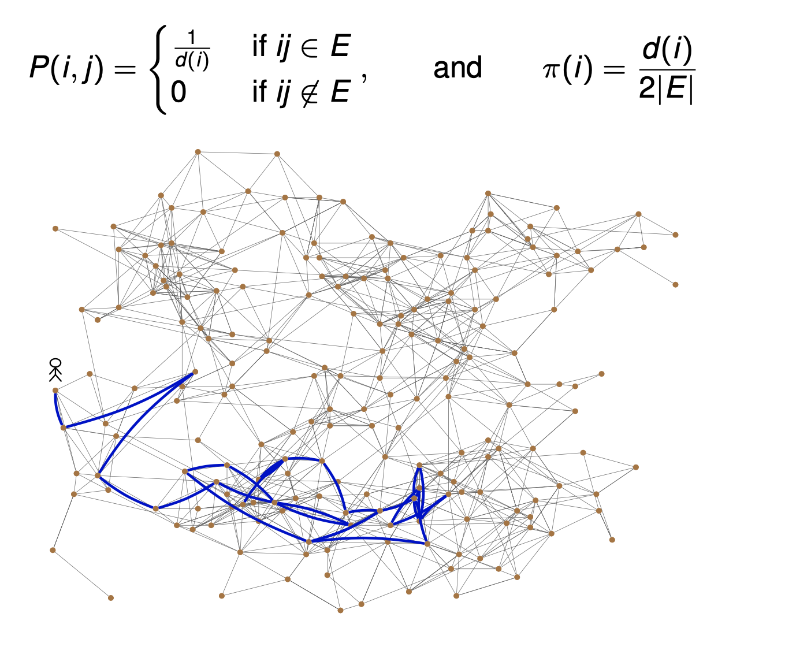
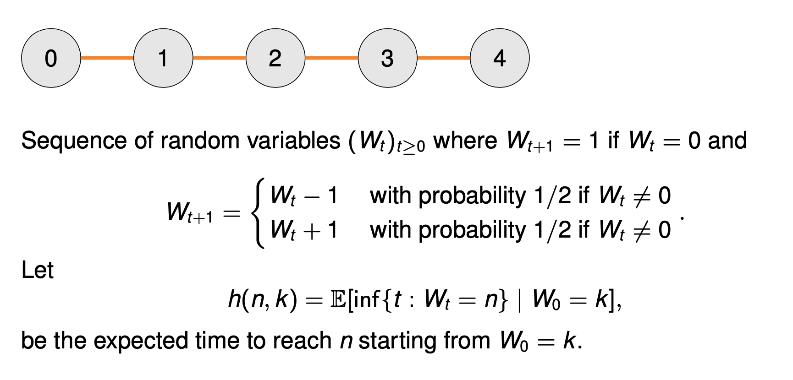
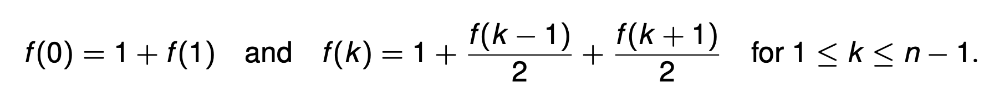
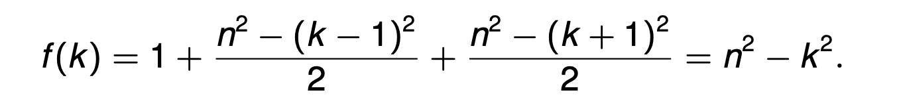
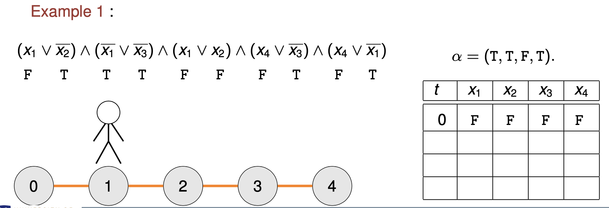
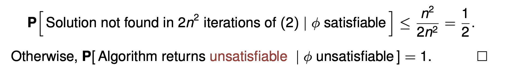
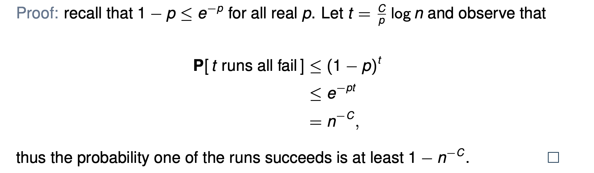
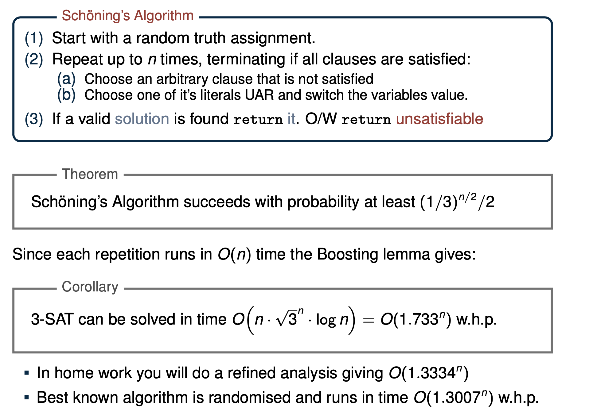
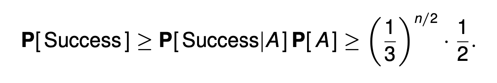

## Random Walks & SAT

### Random Walks on Graphs

A Simple Random Walk (SRW) on a graph G is a Markov chain on V (G) with

- Then n-path Pn has V(Pn) = {1,...,n} and E(Pn) = {ij :j =i+1,1 ≤ i < n }.

- Lemma: For the SRW on Pn we have h(k,n) = n2 −k2,for any 0 ≤ k ≤ n.

- Proof: Let f(k) = h(k,n) and observe that f(n) = 0, as we have already reached the ‘target’ vertex n.

- Since one step takes time one and moves us ‘up’ or ‘down’ with probability 1/2 if we are in the middle of the path, we have

- System of n independent linear equations in n variables has a unique solution.

- Thus it suffices to check that f (k ) = n2 − k 2 satisfies the above. Indeed

f(n)= n2 − n2 = 0, f(0) = 1 + f(1) = 1 + n2 −12 = n2,

and for any 1 ≤ k ≤ n−1 we have,

### SAT Problems

- A Satisfiability (SAT) formula is a logical expression that’s the conjunction (AND) of a set of Clauses, where a clause is the disjunction (OR) of Literals.

- A Solution to a SAT formula is an assignment of the variables to the values True and False so that all the clauses are satisfied.

Example:

- SAT: (x1 ∨x2 ∨x3)∧(x1 ∨x3)∧(x1 ∨x2 ∨x4)∧(x4 ∨x3)∧(x4 ∨x1)

- Solution: x1 = True, x2 = False, x3 = False and x4 = True.

- If each clause has k literals we call the problem k-SAT.

- In general, determining if a SAT formula has a solution is NP-hard

- In practice solvers are fast and used to great effect A huge amount of problems can be posed as a SAT:

  → Model Checking and hardware/software verification → Design of experiments

  → Classical planning

  → ...

### 2-SAT

- RAND 2-SAT Algorithm

  1. Start with an arbitrary truth assignment.

  2. Repeat up to 2n2 times, terminating if all clauses are satisfied:

  - Choose an arbitrary clause that is not satisfied

  - Choose one of it’s literals UAR and switch the variables value.

  3. If a valid solution is found return it. O/W return unsatisfiable

- Call each loop of (2) a Step. Let Ai be the variable assignment at step i.
- Let α be any solution and Xi = |variable values shared by Ai and α|.

### The Coupling Method

- Two coins A and B get heads with probabilities 1/2 and 2/3 respectively.

- We want to show that the probability of k heads from n throws of coin B is at least that of coin A.

- Let X1,X2,...,Xn be in dicator variables for heads in a sequence of flips A.

- For coin B,define a new sequence Y1,Y2,...,Yn such that if

  - Xi = 1,then Yi = 1,

  - if Xi = 0,then Yi = 1 with probability (q−p)/(1−p).

- The sequence (Yi ) has the probability distribution of tosses made with B.

- However, Yi depends on Xi , so we can compare them ‘toss by toss’.

- That is,for any k ≤ n

  - P[X1 +···+Xn >k]≤P[Y1 +···+Yn >k].

### Coupling 2-SAT with a SRW on a path

- Lemma (Expected iterations of (2) in RAND 2-SAT): If a satisfying assignment exists then the expected number of iterations of loop (2) needed to find a satisfying assignment is at most n2.

- Proof: Fix any solution α, and let Xi be the number of bits that match α at the start of the i-th iteration. Thus if Xi = n then Ai = α.

- For any i ≥ 0 and 1 ≤ k ≤ n−1,

  (i) P[Xi+1 =1|Xi =0]=1

  (ii) P[Xi+1 =k+1|Xi =k]≥1/2

  (iii) P[Xi+1 =k−1|Xi =k]≤1/2.

- Item (i) holds since if no bits match then any change increases Xi .

- For Item’s (ii) and (iii): If a clause is unsatisfied (and picked) then at least one variable setting does not match α. If exactly one of the variables differs then the change of picking this (and correcting it) is exactly 1/2. Otherwise both differ from α and picking either increases the overlap with α.

- Lemma (Expected iterations of (2) in RAND 2-SAT): If a satisfying assignment exists then the expected number of iterations of loop (2) needed to find a satisfying assignment is at most n2.

- Proof(continued): If Xi = n we have found a satisfying assignment. Thus when Xn = n the algorithm has succeeded (but it may succeed sooner).

- Assume (pessimistically) that X0 = 0 (none of our initial guesses are right).

- We can couple a the simple random walk Wi on the n vertex path (started from 0) with Xi, so that for all steps we have Wi ≤ Xi.

This works since (from the previous slide) for any i ≥ 0 and 1 ≤ k ≤ n−1,

(i) P[Xi+1 =1 | Xi =0] = 1

(ii) P[Xi+1 =k+1 | Xi =k] ≥ 1/2

(iii) P[Xi+1 =k−1|Xi =k] ≤ 1/2.

- Putting this together

  - E[timetofindα]≤E0[inf{t :Xt =n}] ≤ E0[inf{t :Yt =n}] = h0,n = n2.

- The result follows as the time for loop (2) to find a satisfying assignment is at most the time to find α.

- Lemma: The RAND 2-SAT Algorithm is correct with probability at least 1/2.

- Proof: If there exists a solution then the expected time to find it is at most n2. So by Markov’s inequality and the Lemma above we have

### Boosting Success Probabilities

- Boosting Lemma: Suppose a randomized algorithm succeeds with probability p and let C ≥ 1 be any integer.Then C / p ·log n repetitions of the algorithm are sufficient to succeed (in at least one repetition) with probability at least 1 − n^−C .

- RAND2-SAT

  - There is a O(log n^2) - time algorithm for 2-SAT which succeeds with probability 1 − n^−100.

### 3-SAT

### Schöning’s Algorithm: Basic Analysis

- Theorem: Schöning’s Algorithm succeeds with probability at least (1/3)^n/2 / 2

- Proof: Consider some arbitrary correct satisfying assignment α.

- Let A be the event that the initial truth assignment x agrees with α on at least n/2 variables. Note that P[ A ] ≥ 1/2 by symmetry.

- Now, every iteration of Step (2) has at least a 1/3 chance of increasing the agreement with α by 1. Why?

- Recall each clause has three literals and α satisfies all clauses. Thus, if a clause is unsatisfied one of its literals is not in agreement with α. You then pick and flip one of these three literals uniformly.

- Thus

