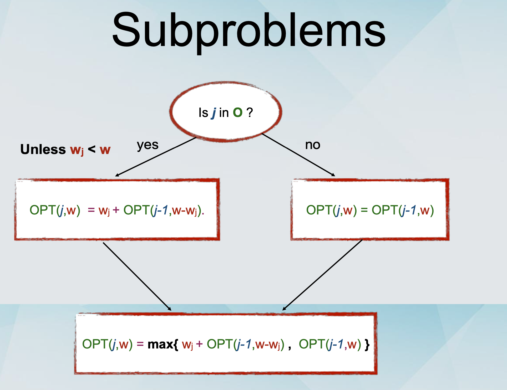
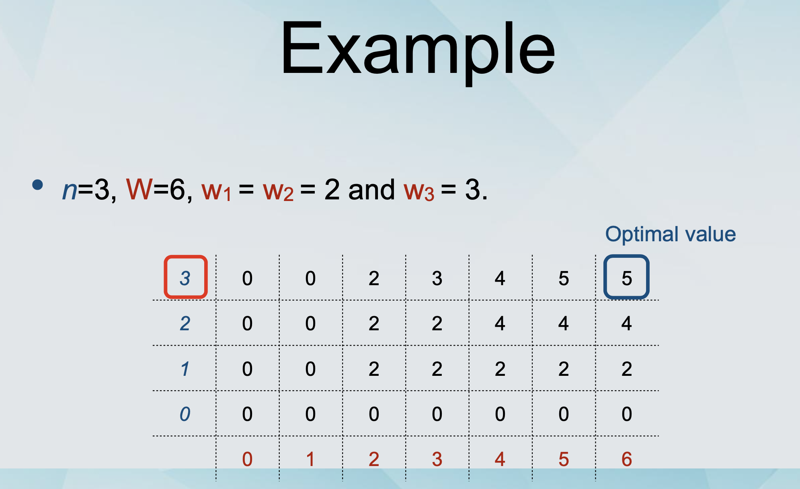

## Weighted Interval Scheduling 加权区间调度

### Definition of Dynamic programming

- A technique for solving optimisation problems.

- The paradigm of dynamic programming:

- Given a problem P, define a sequence of subproblems, with the following properties: (定义一系列的子问题)

  - The subproblems are ordered from the smallest to the largest. 从小问题到大问题

  - The largest problem is our original problem P. 最大的问题是 P

  - The optimal solution of a subproblem can be constructed from the optimal solutions of sub-sub-problems. (Optimal Substructure). 子问题的最优解可以被更小的子子问题最优解解决

- Solve the subproblems from the smallest to the largest. When you solve a subproblem, store the solution (e.g., in an array) and use it to solve the larger subproblems.

### Definition of Weighted Interval Scheduling

- A set of requests {1, 2, ... , n}.

  - Request i has a starting time s(i), a finishing time f(i), and a value v(i).

  - Alternative view: Every request is an interval [s(i), f(i)] associated with a value v(i).

- Two requests i and j are compatible if their respective intervals do not overlap.

- Goal: Output a schedule which maximises the total value of compatible intervals.

## Subset Sum

### The subset sum problem

- We are given a set of n items {1, 2, ... , n}.

- Each item i has a non-negative weight wi.

- We are given a bound W.

- Goal: Select a subset S of the items such that sum_i wi <= W and sum_i 𝑤i is maximised.

  

### Dynamic Programming

- We need to identify the appropriate subproblems to use in order to solve the main problem.

- Recall the weighted interval scheduling problem. Similar approach.

- Let OPT(i) be the optimal solution to the subset sum problem, using a subset of {1, 2, ... , i}.

  - Let Oi be its value and hence O is On.

- Should item n be in the optimal solution O or not?

  - If no, then OPT(n-1) = OPT(n)

  - If yes, ?

- Subproblems

  - Using this notation, what are we looking for?

  - OPT(n,W)

  - Should item n be in the optimal solution O or not?

  - If no, then OPT(n,W) = OPT(n-1,W).

  - If yes, then OPT(n,W) = wn + OPT(n-1,W-wn).



- Example

```javascript
function subsetSum(arr, maxSum) {
  let res = [[]];
  for (let i = 0; i <= maxSum; i++) {
    res[0].push(0);
  }
  for (let i = 1; i <= arr.length; i++) {
    res[i] = [0];
    for (let j = 0; j <= maxSum; j++) {
      if (arr[i - 1] > j) {
        res[i][j] = res[i - 1][j];
      } else {
        res[i][j] = Math.max(
          res[i - 1][j],
          arr[i - 1] + res[i - 1][j - arr[i - 1]]
        );
      }
    }
  }
  console.log(res);
}

/**
 * 
0: [0, 0, 0, 0, 0, 0, 0]
1: [0, 0, 2, 2, 2, 2, 2]
2: [0, 0, 2, 2, 4, 4, 4]
3: [0, 0, 2, 3, 4, 5, 5]
 */
```



- Running Time O(nW)

## Knapsack
