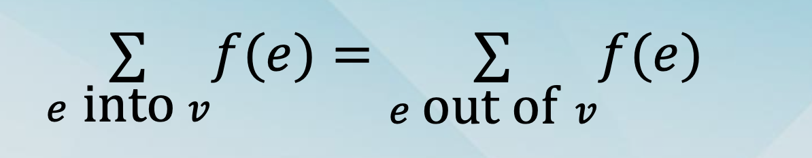
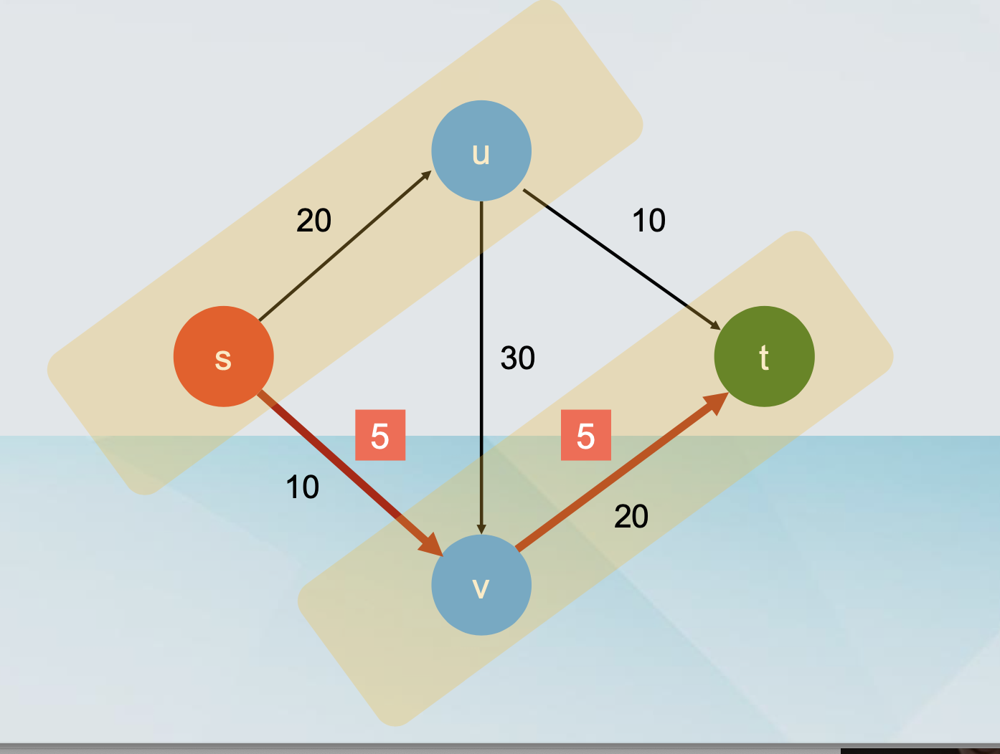
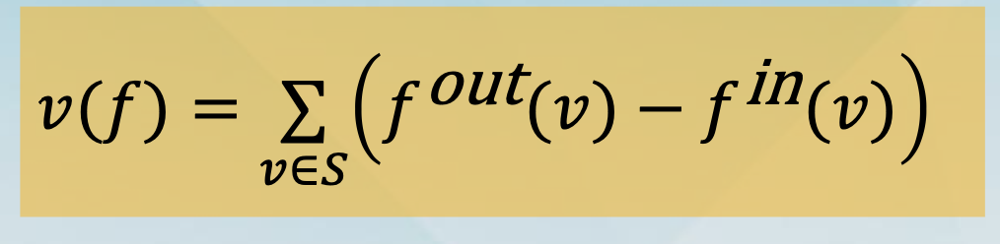
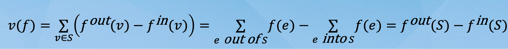

## Flow Networks

- A flow network is a directed graph G=(V, E) with the following properties:

  - Each edge e in E has a nonnegative capacity ce.

  - There is a single source node s in V.

  - There is a single sink node t in V.

  - All other nodes in V - {s, t} are called internal nodes.

- Further assumptions:

  - The source s does not have any incoming edges.

  - The sink t does not have any outgoing edges.

  - There is at least one edge incident to each node.

  - All the capacities are integer numbers.

- Flow

- An (s-t) flow is a function f: E → R+, mapping each edge e to a nonnegative real number f(e).

- A (feasible) flow must satisfy the following two properties:

  - (Capacity) For each e in E, we have 0 ≤ f(e) ≤ ce

  - (Flow Conservation) For each node v in V - {s, t}, we have that

  

### The Max Flow – Min Cut Theorem

- Minimum Cut

  - A cut C is a partition of the nodes of G into two sets S and T, such that s is in S and t is in T.

  - The capacity c(S,T) of a cut C is the sum of capacities of all edges “out of S”

    - these are edges (u, v) where u is in S and v is in T.

### The Max-Flow Min-Cut Theorem

- Theorem: In every flow network, the value of the maximum flow is equal to the capacity of the minimum cut.

### A series of facts

- Fact 1: Let f by any (s-t) flow and (S, T) be any (s-t) cut. Then v(f) = fout(S) - fin(S).

  

  - By definition, v(f) = fout(s).

  - By definition fin(s) = 0.

  - Hence, by definition v(f) = fout(s) - fin(s).

  - For every other node v≠s,t, we have fout(v) - fin(v) = 0

  

  - Let’s recount, using the edges and the flow f(e).

    - If an edge `has both endpoints in S`, it is counted once for `“out”` and once for `“in”`, so it contributes 0.

    - If an edge `has its “tail” in S`, it is only counted for `“out”` and contributes 1.

    - If an edge `has its “head” in S`, it is only counted for `“in”` and contributes -1.

    - Otherwise the edge does not appear in the sum.

  

- Fact 2: Let f by any (s-t) flow and (S, T) be any (s-t) cut. Then v(f) = fin(T) - fout(T).

- Fact 3: Let f by any (s-t) flow and (S, T) be any (s-t) cut. Then v(f) ≤ c(S, T).

- Theorem: In every flow network, the value of the maximum flow is equal to the capacity of the minimum cut.

- Fact 4: Let f by any (s-t) flow in G such that the residual graph Gf has no augmenting paths. Then there is an (s-t) cut C(S*, T*) in G such that c(S*, T*) = v(f).

### Constructing the cut

- In the residual graph Gf, identify the nodes that are reachable from the source s.

  - Put these in S\*.

  - Put the rest in T\*.

- Putting everything together

- Fact 4: Let f by any (s-t) flow in G such that the residual graph Gf has no augmenting paths. Then there is an (s-t) cut C(S*, T*) in G such that c(S*, T*) = v(f).

- Ford-Fulkerson stops when there are `no augmenting paths(无增广路径)` in the residual network.

- The value of the flow is equal to the capacity of some cut.

- This means that the value of the flow is maximum.

### Integer-Valued Flows

- Fact 5: If all the capacities in the flow network are integers, there is maximum flow for which every flow value f(e) is an integer.

  - This follows from the properties of the Ford-Fulkerson algorithm.

  - It produces a maximum flow.

  - The capacities and flows are integers in every step of the execution.

## Choosing Better Augmenting Paths
