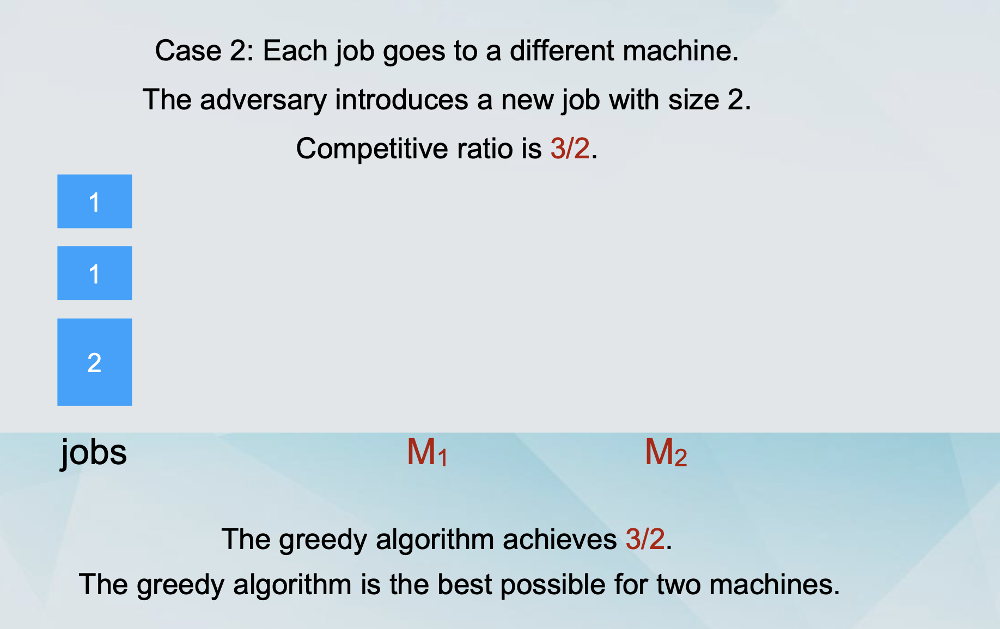
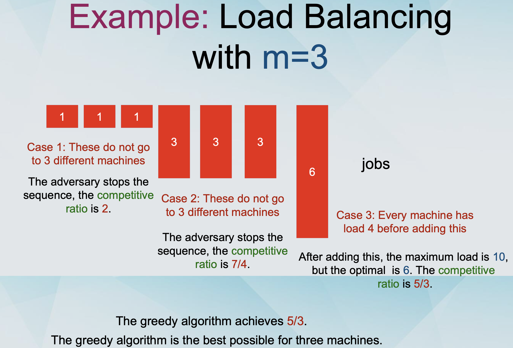

### Motivating Examples

- Suppose that you need to take 4 modules in your Masters programme, but you don’t know the difficulty, the content, or the lecturer of each module. You need to make a decision based on limited information (topic, past papers, etc).

- Suppose that you have completed your Masters programme successfully and now you are looking for jobs. You have made several applications and you receive an offer from some company. Should you accept it, or should you wait to see if you might get a better offer from another company?

- Life is an online setting

### Hindsight is 20/20

- If you knew what would happen in the future, you could make all the right decisions.

  - But you are not clairvoyant (预知未来的人).

- Let’s say that you make a series of local (myopic) decisions, based only on information that you have seen so far (and possibly what you expect to see in the future).

- You can compare the quality of your decisions to that of the clairvoyant.

- If they are not much worse, then you can convince yourself that you have made good decisions.

### Let’s talk about algorithms

- Suppose that the input of a problem P is given to you in steps.

- You have to make a decision in every step.

- The goal is to optimise some objective (e.g., minimise a cost).

- You don’t know the length of the input - the input supply might stop at any point.

- You will compare against the offline optimal algorithm, which knows the future, and computes the optimal solution on the entire input.

## Online Algorithm

- Online Algorithm: An algorithm that must make decisions now about events that will happen in the future, without having knowledge of these events.

### Recall: Load Balancing

- We have a set of m identical machines M1, ... , Mm

- We have a set of n jobs, with job j having processing time tj.

- We want to assign every job to some machine.

- Let A(i) be the set of jobs assigned to machine i. 𝑇=∑𝑡

- The load of machinei is 𝑖

- The goal is to minimise the makespan, i.e., T = maxi Ti

### Online Load Balancing

- We have a set of m identical machines M1, ... , Mm

- We have a set of n jobs, with job j having processing time tj.

- The jobs arrive over time, one in each time step.

- We want to assign every job to some machine.

- We will assign a job immediately upon arrival to some machine.

- Let A(i) be the set of jobs assigned to machine i.

- The load of machine i is 𝑇=∑𝑡 𝑗∈𝐴(𝑖) 𝑗

- The goal is to minimise the makespan, i.e., T = maxi Ti

## Approximation Ratio

- Consider a minimisation problem P and an objective obj.

  - Here: Load Balancing on identical machines and makespan.

  - Consider an approximation algorithm A.

  - Consider an input x to the problem P.

  - Let obj(A(x)) be the value of the objective from the solution of A on x.

  - Let opt(x) be the minimum possible value of the objective on x.

- The approximation ratio of A is defined as

  > maxx obj(A(x)) / opt(x)

  - i.e., the worst case ratio of the objective achieved by the algorithm over the optimal value of the objective, over all possible inputs to the problem.

## Competitive Ratio

- The competitive ratio of A is defined as

  > maxx obj(A(x)) / opt(x)

  - i.e., the worst case ratio of the objective achieved by the algorithm over the optimal value of the objective, over all possible inputs to the problem.

## Competitive Ratio vs Approximation Ratio

- Very similar notions.

- Difference:

- Approximation ratio: The constraint of our algorithm is that it must run in polynomial time. If we didn’t have a time constraint, we would obtain the optimal.

- Competitive Ratio: The constraint of our algorithm is that it does not know the future part of the input. `If we had access to the future part of the input`, we would obtain the optimal.

## Greedy algorithm for load balancing

- Pick any job.
- Assign it to the machine with the smallest load so far.

- Remove it from the pile of jobs.

Algorithm Greedy-Balanc

```pseudocode
  Start with no jobs assigned

  Set Ti = 0 and A(i) = ∅ for all machines Mi For j = 1 , ..., n

  Let Mi be the machine that achieves the minimum mink Tk Assign job j to machine Mi

  SetA(i) =A(i)U {j}

  SetTi =Ti +tj

  EndFor
```

### The limits of online algorithms

- Lower bounds: We can show lower bounds on the competitive ratio of any online algorithm, using elementary arguments.

- This comes in contrast to approximation algorithms, where inapproximability results typically required advanced techniques.

## Terminology

- We will say that the input is given by an adversary, who wishes to maximise the competitive ratio of the algorithm.

- This is equivalent to considering the worst possible case for the input sequence.

## Example: Load Balancing with m=2,3,4





- It can be proven using similar arguments that for m ≥ 4 machines, the competitive ratio of any online algorithm is at least 1.70.

- The Greedy Algorithm achieves 1.75 for m = 4, so it is not the best possible for this case.

## Better Algorithms

- We saw several better algorithms for Load Balancing.

- The problem even has an FPTAS.

- Could we use those instead of Greedy?

- You might be tempted to think so, but not really!

- Greedy approximation algorithms can sometimes be used as online algorithms, but in general

  - approximation algorithms ≠ online algorithms

- It is possible to design better online algorithms for the scheduling problem.

- For example, for m = 4, there is an algorithm with competitive ratio at 1.733.

- Lower bound: For m = 4, no online algorithm has competitive ratio better than 1.732.

- For general m, the best possible competitive ratio is between 1.88 and 1.92.

- Idea: The Tetris principle - maintain imbalance.

## Paging

- We have two types of memory, a fast memory (cache) and a slow memory.

- The cache has capacity k pages, the slow memory has capacity n pages.

- We have a sequence of page requests.

- If the page is in the cache, the algorithm returns it at no cost.

- If the page is not in the cache, the algorithm “faults” and has to bring it from the cache, paying a cost of 1.

- The algorithm must also choose a page in the cache to replace with the page brought from the slow memory.

## Costs

- The cost of an algorithm is the number of “faults” that it makes.

- How does the cost of an online algorithm compare to the cost of the optimal offline algorithm?

- The online algorithm makes x “faults”.

- The offline optimal makes y ≤ x “faults”.

- We are interested in x/y.

## Lower bound on Paging algorithms

- Theorem: The competitive ratio of any online algorithm for paging is at least k.

## Lower Bound

- The algorithm “faults” once at every step.

- What about the offline optimal?

  - Consider the strategy: “When replacing a page, replace the one that will be requested the furthest in the future”.

- Suppose that OPT “faults” on some page p. OPT replaces a page (to bring in p) that will not be requested in the next k-1 steps.

  - OPT “faults” once every k steps.

  - The competitive ratio is at least k.

## Paging Algorithms

- LRU (Least Recently Used): Replace the page that was requested the least recently.

- FIFO (First-In First-Out): Replace the page that has been in the cache the longest.

- LIFO (Last-In First-Out): Replace the page that has been in the cache the shortest.

- LFU (Least Frequently Used): Replace the page that was requested the least frequently so far.

- MIN (Offline Optimal): Replace the page whose next request happens the furthest in the future.

- Theorem: LRU and FIFO have competitive ratio k.
