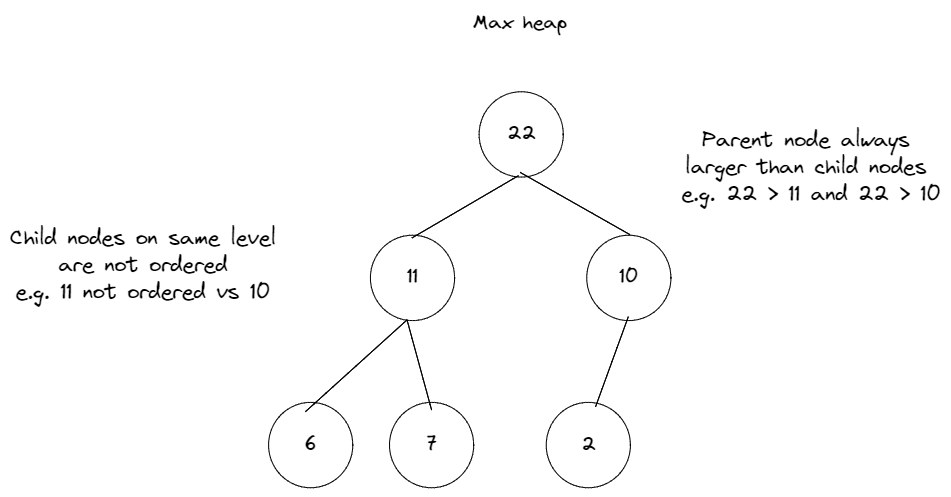
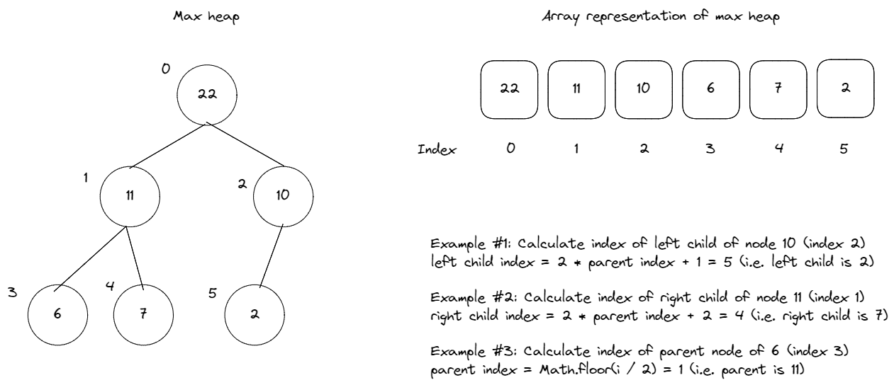
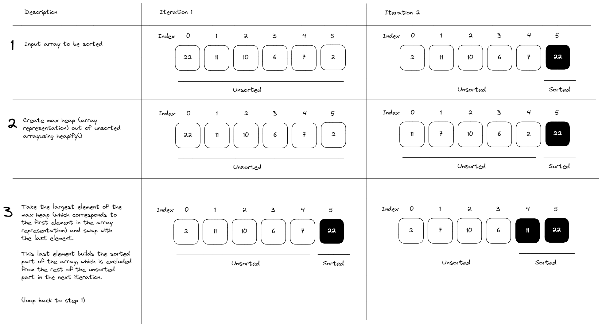

## Heap Sort

Heap sort is a comparison-based sorting algorithm that iteratively builds the unsorted array into a max heap data structure to identify the max element, and progressively swaps it to the end of the unsorted array to build a sorted array.

### Max Heaps

To understand heap sort, we need to first understand the heap data structure:

- A binary heap is a partially ordered, complete binary tree which satisfies a heap property, similar to binary search trees, but with different ordering.

- Heap property = Specific relationship between the parent and child nodes which specifies their order. One example is the max heap property, which specifies that all parent nodes have to >= than their child nodes. The order between child nodes on the same level does not matter. Hence, the largest nodes are always on the top, and the smallest nodes are at the bottom. Nodes on the same level are unordered:



- Complete binary tree = All levels of the tree are completely filled. If the last level is partially filled, it is filled first from left to right.

- Heaps are frequently implemented as arrays. We can use the following formula to compute the parent, left child and right child's indexes within the array representation of a heap:

  - Left child idx = 2 \* parentIdx + 1

  - Right child idx = 2 \* parentIdx + 2



How Heap Sort Works

A heap sort essentially works by the following steps:



```javascript
/**
 * @param {Array<number>} arr The input integer array to be sorted.
 * @return {Array<number>}
 */
export default function heapSort(arr) {
  const n = arr.length;

  // Build the big root heap firstly
  for (let i = Math.floor(n / 2 - 1); i >= 0; i--) {
    // Start with the index of the last parent node.
    // heapify: Swaps parent with child as long as child is larger than parent.
    heapify(arr, n, i);
  }

  // Sorting
  for (let i = n - 1; i >= 0; i--) {
    [arr[0], arr[i]] = [arr[i], arr[0]];

    heapify(arr, i, 0);
  }

  return arr;
}

function heapify(arr, size, parentIdx) {
  let largest = parentIdx; // Initiate largest value's index with parent index.
  const leftChildIdx = 2 * parentIdx + 1; // Calculate index of left child.
  const rightChildIdx = 2 * parentIdx + 2; // Calculate index of right child.
  // Set `largest` to index with highest value between parent, left and right child.
  // See if left child of parent exists and is larger than parent.
  if (leftChildIdx < size && arr[leftChildIdx] > arr[largest]) {
    largest = leftChildIdx;
  }
  // See if right child of parent exists and is larger than parent.
  if (rightChildIdx < size && arr[rightChildIdx] > arr[largest]) {
    largest = rightChildIdx;
  }
  // If `largest` is not the current parent, swap positions with the current parent.
  if (largest !== parentIdx) {
    [arr[parentIdx], arr[largest]] = [arr[largest], arr[parentIdx]];
    // Continue to recursively heapify the affected subtree.
    heapify(arr, size, largest);
  }
}
```
