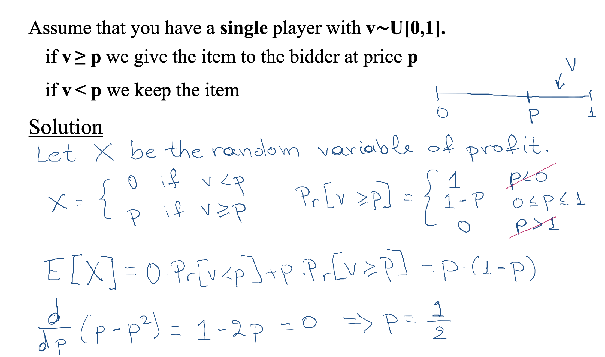
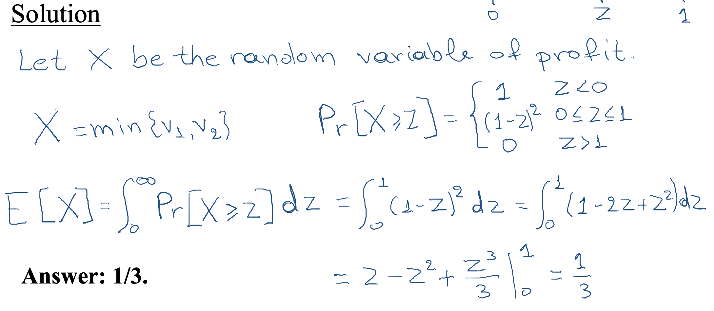
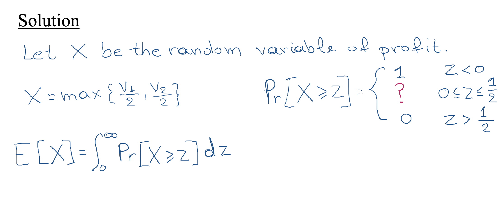
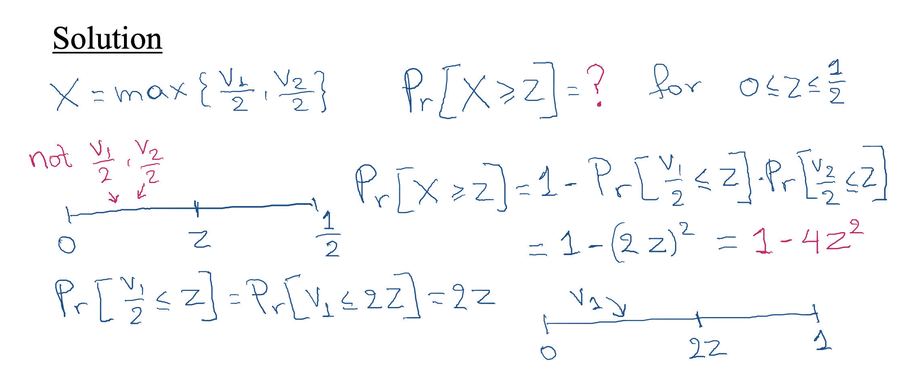
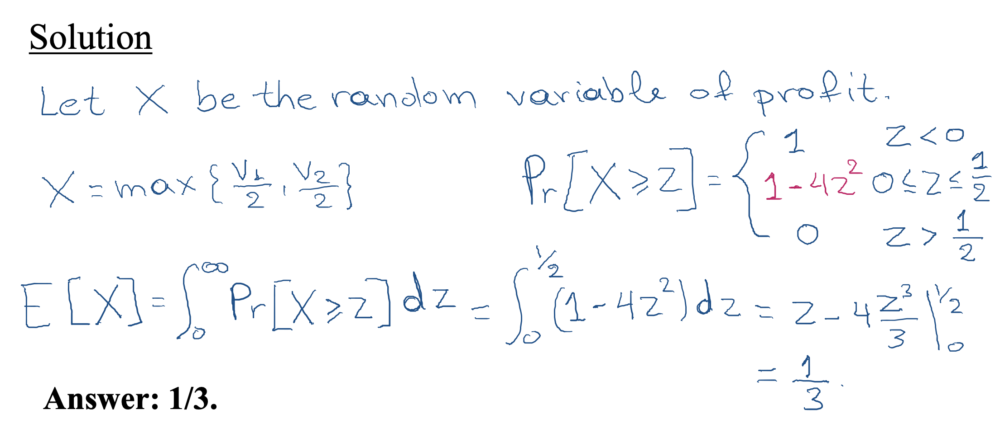
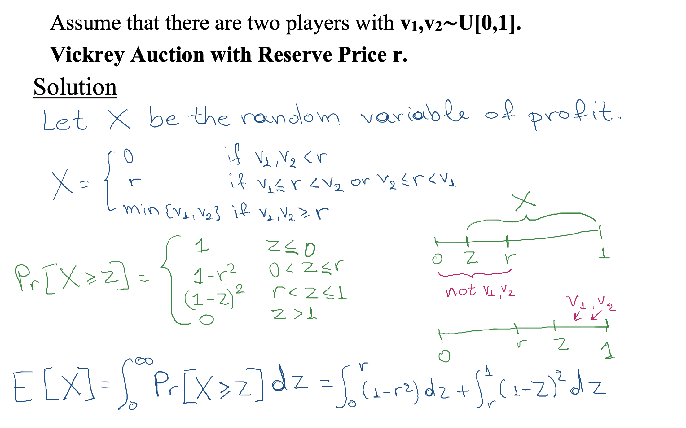
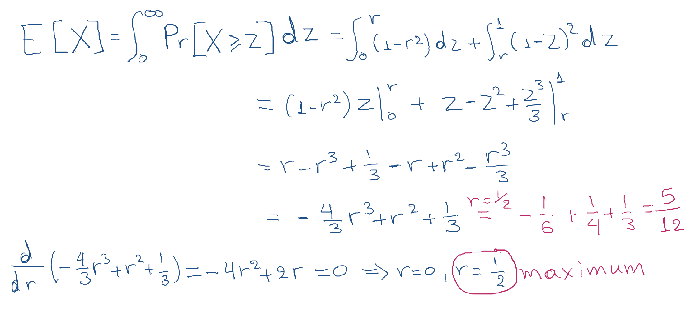

## Profit Maximization

- Goal: Maximize the profit.

- Allocation Algorithm: Give the object to the player with the `highest bid`.

- Payment Scheme: The winner pays an amount equal to the `second highest bid`.

### Bayesian Setting

- Sometimes it makes sense to assume that some partial information is known. （部分数据已知）

- Assume that the valuations come from a known probability distribution. The distribution is common knowledge! （估值来自一个概率分布， 这个分布是一个 knowledge）

- Assume that you have a single player with v1∼U[0,1].

- What sort of mechanism would we devise to maximize the expected revenue?

  - We post a price p
  - if v≥ p we give the item to the bidder at price p
  - if v < p we keep the item

- What is the optimal price p?

The optimal price is p=1/2 and gives us expected revenue 1/4.

### Second Price Auction

- Assume that there are two players with v1,v2∼U[0,1].

- What is the expected revenue that we get from the second price auction?

` - Truthful auction: we consider b1(v1)=v1, b2(v2)=v2.

- Answer: 1/3.

### First Price Auction

- Assume that there are two players with v1,v2∼U[0,1].

- First price auction is not truthful.

- What is a Bayesian Nash equilibrium for the first price auction?

  - Answer: b1(v1) = `v1/2`, b2(v2) = `v2/2`. (CANVAS)

- Notice that the social welfare is maximized in equilibrium,
  i.e. we assign the item to the highest true value!

### Revenue Equivalence Principle

> All single-item auctions that allocate (`in equilibrium`) the item to the player with `highest value` and in which `losers pay 0`, will have `identical expected revenue`.

- Assume that there are two players with v1,v2∼U[0,1].

- Can we improve upon the 1/3 expected revenue in a truthful way?

- Vickrey Auction with Reserve Price 1/2.

  - if v1 < 1/2 and v2 < 1/2 we do not allocate the item

  - if v1 < 1/2 and v2 ≥ 1/2 we allocate the item to bidder 2 for price of 1/2

  - if v1 ≥ 1/2 and v2 < 1/2 we allocate the item to bidder 1 for price of 1/2

  - if v1 ≥ 1/2 and v2 ≥ 1/2 we allocate the item to the highest bidder and charge him the second highest bid.

- Is this auction truthful? Yes

  - Add a dummy bidder (auctioneer) with value 1⁄2. Run Vickrey auction.

  - This auction is an affine maximizer.

- What is the expected revenue that we get from this auction?

  - Answer: 5/12 > 4/12 = 1/3.

- What is the highest expected revenue that we get from this auction?

  

  

  - Answer: 5/12 (r=1/2)
