## Profit Maximization

- Goal: Maximize the profit.

- Allocation Algorithm: Give the object to the player with the `highest bid`.

- Payment Scheme: The winner pays an amount equal to the `second highest bid`.

### Bayesian Setting

- Sometimes it makes sense to assume that some partial information is known. （部分数据已知）

- Assume that the valuations come from a known probability distribution. The distribution is common knowledge! （估值来自一个概率分布， 这个分布是一个 knowledge）

- Assume that you have a single player with v1∼U[0,1].

- What sort of mechanism would we devise to maximize the expected revenue?

  - We post a price p
  - if v≥ p we give the item to the bidder at price p
  - if v < p we keep the item

- What is the optimal price p?

The optimal price is p=1/2 and gives us expected revenue 1/4.

### Second Price Auction

- Assume that there are two players with v1,v2∼U[0,1].

- What is the expected revenue that we get from the second price auction?

` - Truthful auction: we consider b1(v1)=v1, b2(v2)=v2.

- Answer: 1/3.

### First Price Auction

- Assume that there are two players with v1,v2∼U[0,1].

- First price auction is not truthful.

- What is a Bayesian Nash equilibrium for the first price auction?

  - Answer: b1(v1) = `v1/2`, b2(v2) = `v2/2`. (CANVAS)

- Notice that the social welfare is maximized in equilibrium,
  i.e. we assign the item to the highest true value!

### Revenue Equivalence Principle

> All single-item auctions that allocate (`in equilibrium`) the item to the player with `highest value` and in which `losers pay 0`, will have `identical expected revenue`.

- Assume that there are two players with v1,v2∼U[0,1].

- Can we improve upon the 1/3 expected revenue in a truthful way?

- Vickrey Auction with Reserve Price 1/2.

  - if v1 < 1/2 and v2 < 1/2 we do not allocate the item

  - if v1 < 1/2 and v2 ≥ 1/2 we allocate the item to bidder 2 for price of 1/2

  - if v1 ≥ 1/2 and v2 < 1/2 we allocate the item to bidder 1 for price of 1/2

  - if v1 ≥ 1/2 and v2 ≥ 1/2 we allocate the item to the highest bidder and charge him the second highest bid.

- Is this auction truthful? Yes

  - Add a dummy bidder (auctioneer) with value 1⁄2. Run Vickrey auction.

  - This auction is an affine maximizer.

- What is the expected revenue that we get from this auction?

  - Answer: 5/12 > 4/12 = 1/3.

- What is the highest expected revenue that we get from this auction?

  

  

  - Answer: 5/12 (r=1/2)

### Single item auction

- Definition

  - Assume that there are n bidders with vi ∈ [0,h].

  - Mechanism M(x, p1, ... , pn)

  - Input: b=(b1,...,bn) the vector of declarations

  - Output: x(b) allocation function

    1. xi(b)=1 if i gets the item

    2. xi(b)=0 if i does not get the item

  - Output: p1(b),...,pn(b): payment functions

  - The utility of player i if his true value is vi but he reports bi is

    ui(bi,b-i;vi)= vi⋅xi(bi,b-i)-pi(bi,b-i)

- Notice that player i’s valuation is a single-parameter.

- A mechanism is truthful if for every i, bi,vi,b-i

  ui(vi,b-i;vi) ≥ ui(bi,b-i;vi)

  vi⋅xi(vi,b-i)-pi(vi,b-i) ≥ vi⋅xi(bi,b-i)-pi(bi,b-i)

- Theorem (9.39 AGT book). A mechanism is truthful if and only if, for any agent i and any fixed choice of bids by the other agents b−i,

  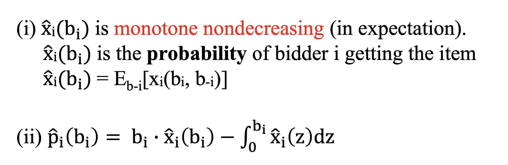

- Example:

  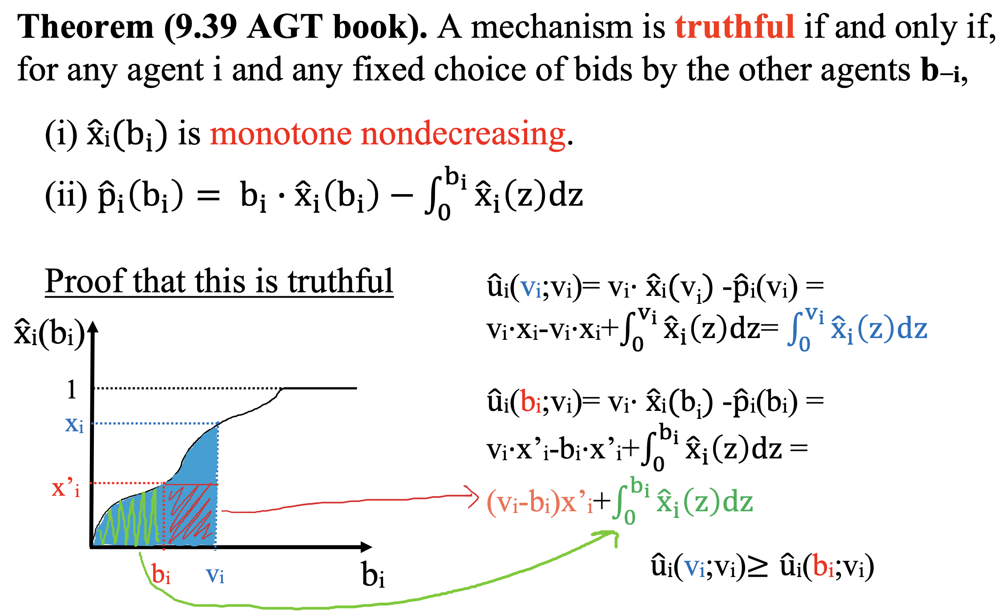

  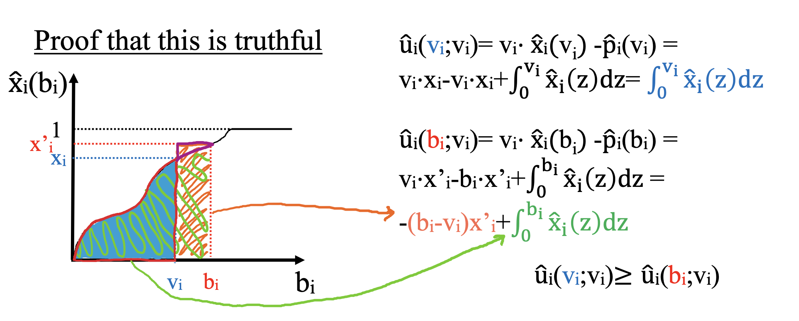

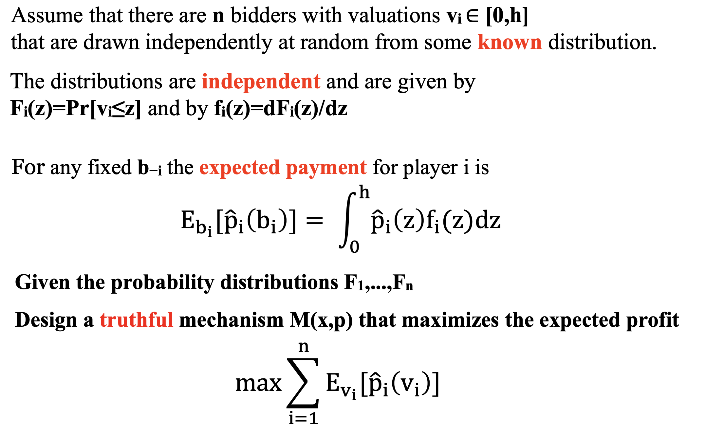

### Virtual valuations

- Definition. The virtual valuation of agent i with valuation vi is

  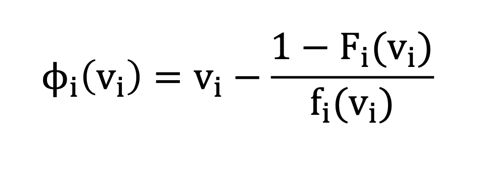

- Definition. Given valuations, vi , and corresponding virtual valuations, φi(vi), the virtual surplus (social welfare) of allocation x is

  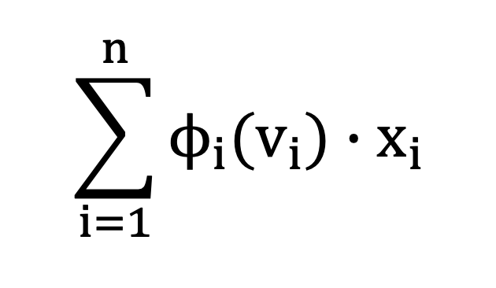

- Theorem. The expected profit of any truthful mechanism, M, is equal to its expected virtual surplus

  - example

  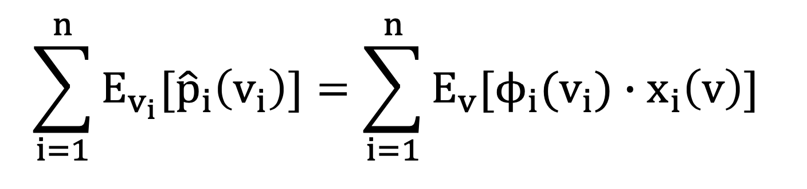

- Lemma. Consider any truthful mechanism and fix the bids v−i of all bidders except for bidder i. The expected payment of a bidder i satisfies:

  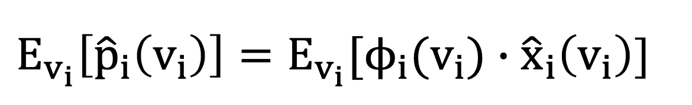

  - proof:

    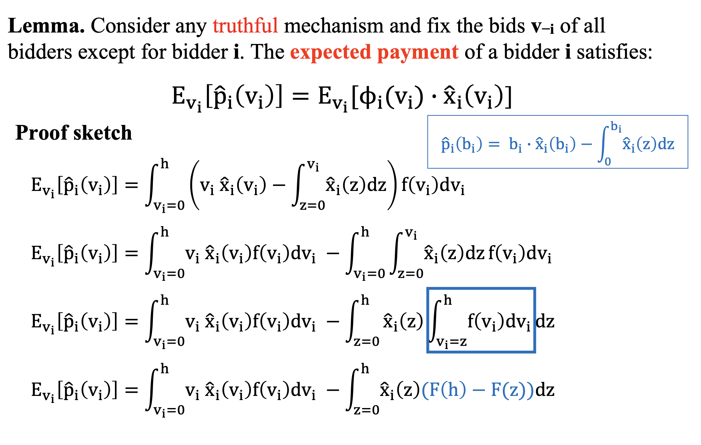
    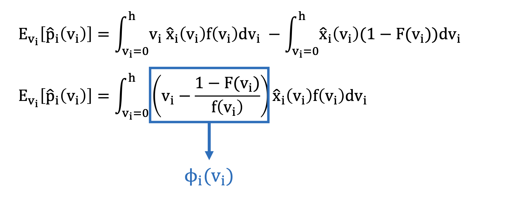

- Lemma. Virtual surplus maximization is truthful if and only if, for all i, φi(vi) is monotone nondecreasing in vi.

  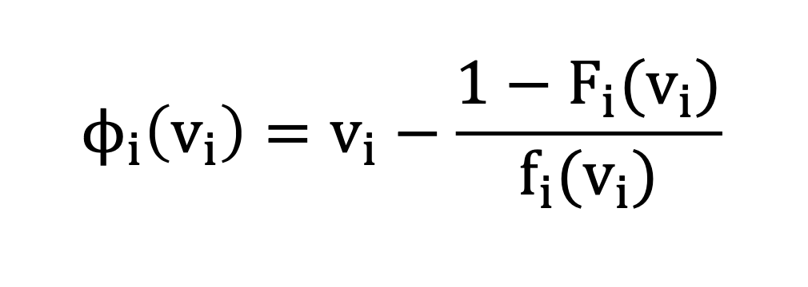

### Myerson’s Optimal Mechanism

- Definition: MyeF(b)

  1. Given the bids b and F, compute “virtual bids”: b′i = φi(bi).

  2. Run VCG on the virtual bids b′ to get x′ and p′

  3. Output x = x′ and p with pi = φ−1i (p′i) (upon winning).

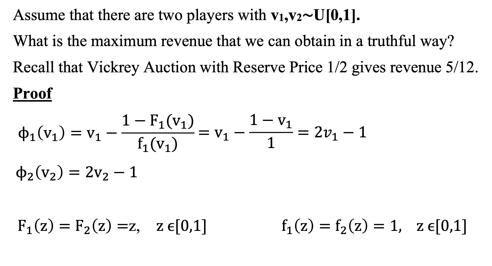

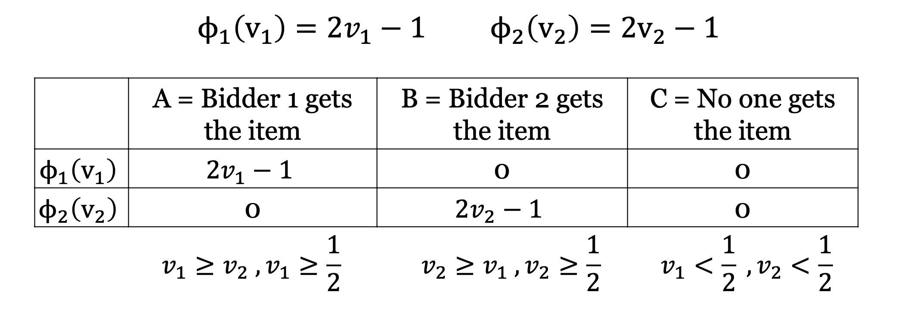

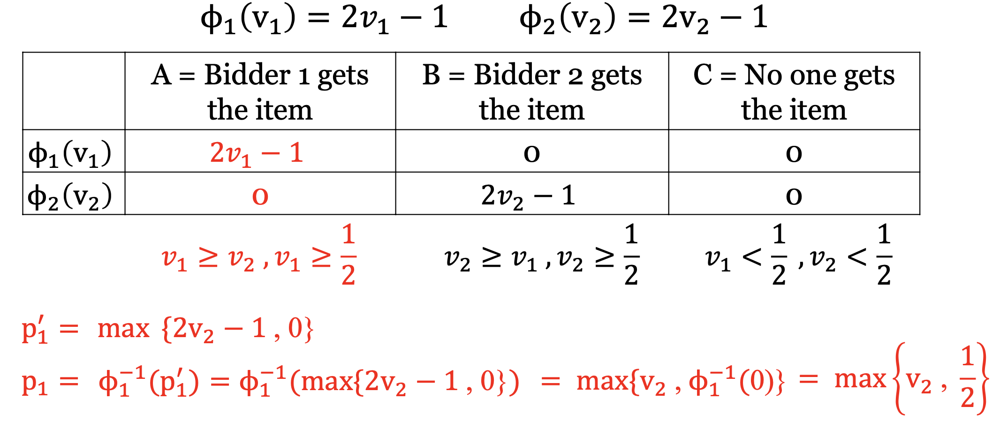

- MyeF(v1,v2): Vickrey Auction with Reserve Price 1/2

- Q: Can we do better?

  - No, Mayerson’s mechanism is optimal.
