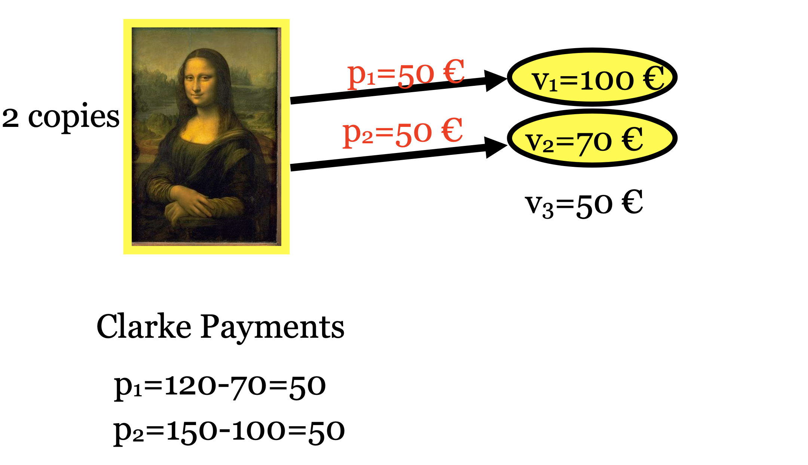
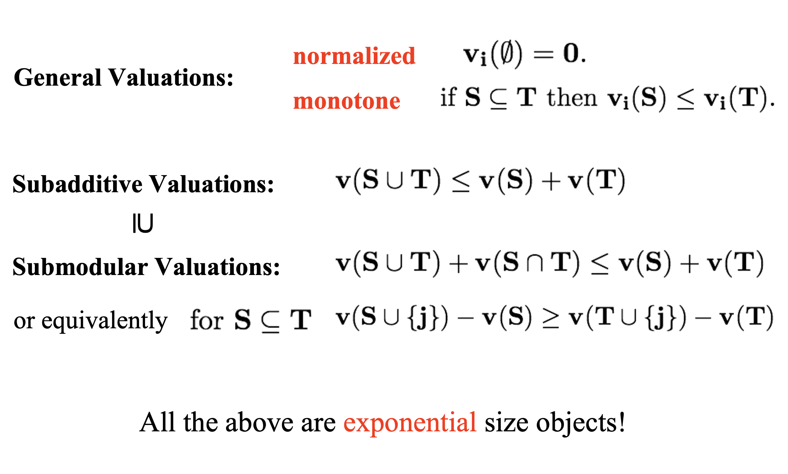
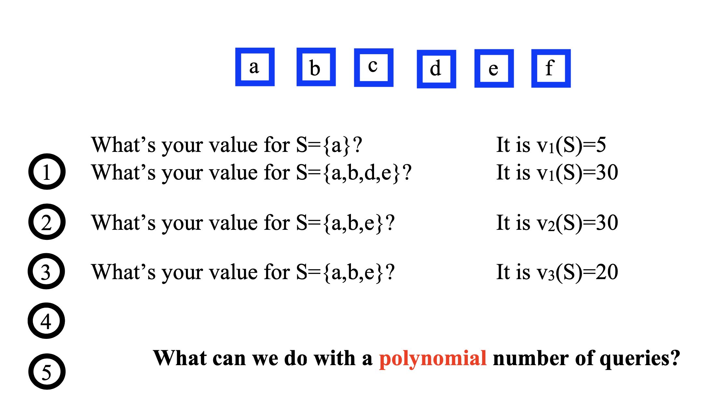
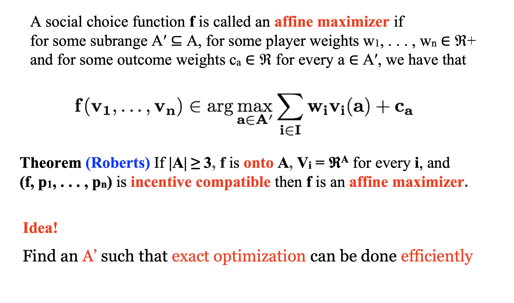
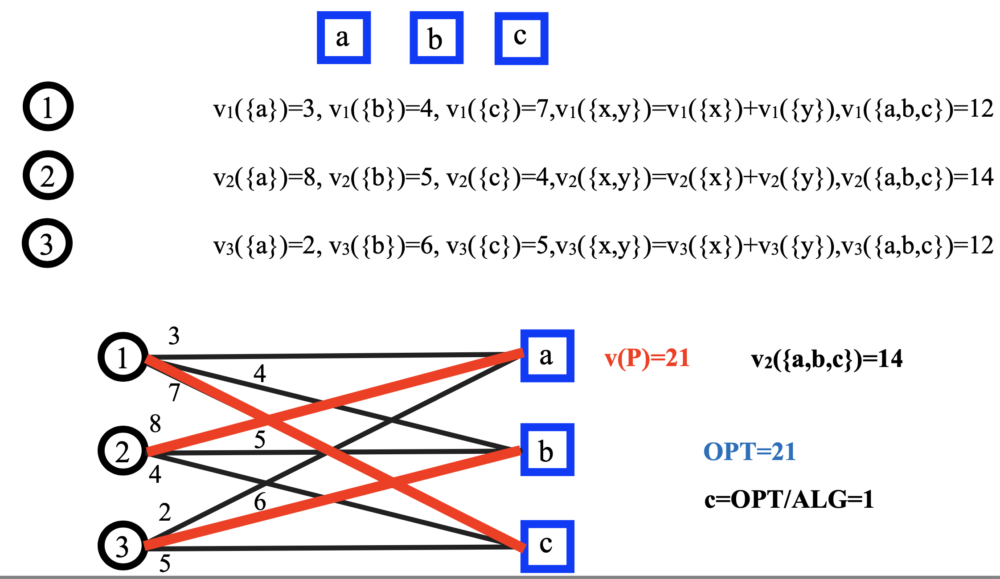
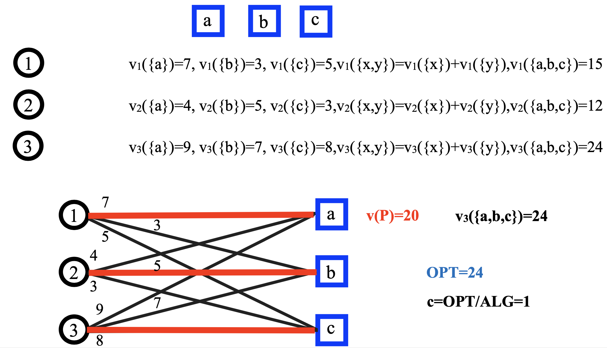
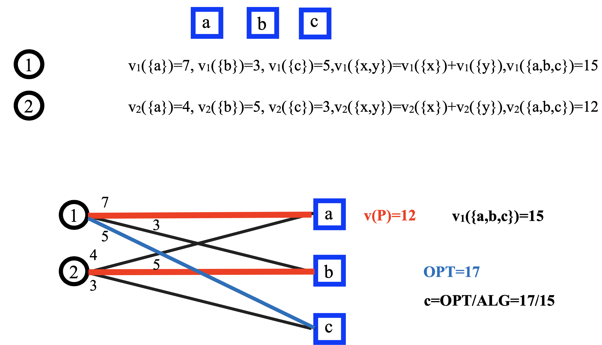
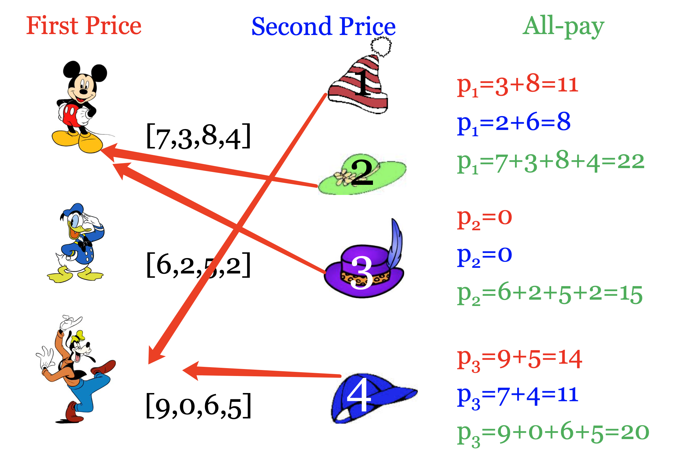
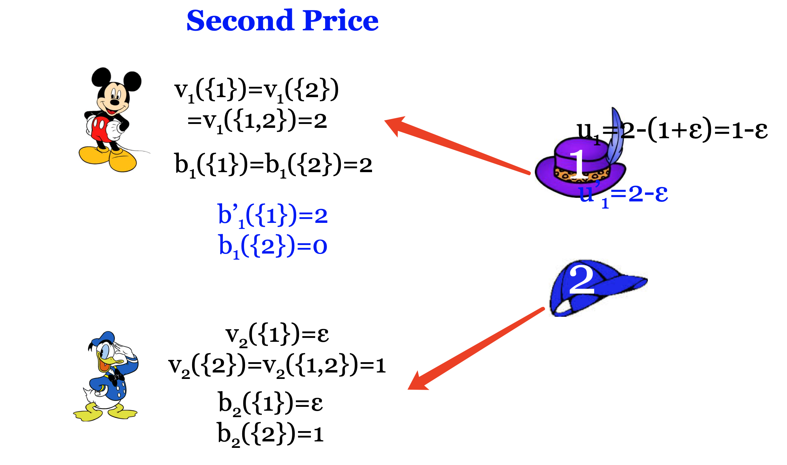
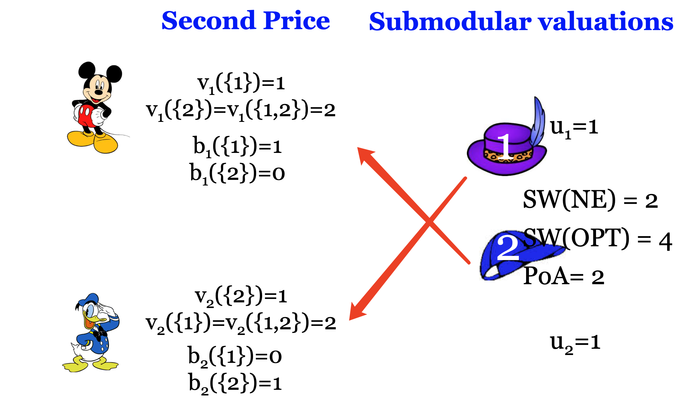

## Combinatorial Auctions (1)

### Single Item Auction

- Goal: Give the object to the player with maximum value.
- In a way that cannot be strategically manipulated

### Multiunit Auctions

- Definition:

  - Allocation Algorithm: Give the k objects to the k highest bidders.

  - Payment Scheme: The winners pay an amount equal to the k+1st highest bid.

### Example Combinatorial Valuations

- Problem Statement

  - A set M of m indivisible items M={1,...,m}

  - A set N of n bidders N={1,...,n}

  - Bidders have preferences over subsets (bundles) of items A valuation is a real valued function for every subset S of items v(S) is the value the bidder obtains if he receives the bundle S

  - free disposal: monotone v(S)≤v(T) if S⊆T

  - normalized: v(∅)=0

- Example

  

### Roberts Theorem

- Theorem (Roberts) If |A| ≥ 3, f is onto A, Vi = RA for every i, and (f, p1, . . . , pn) is incentive compatible then f is an affine maximizer.

### Valuations

Take S,T with S∩T=∅

- v is additive if v(S∪T)=v(S)+v(T)

Generally, v is not necessarily additive

- S,T are Complements: v(S∪T) > v(S)+v(T) (Superadditive)

v(pair of shoes) > v(left shoe)+v(right shoe)

-S,T are Substitutes: v(S∪T) < v(S)+v(T) (Subadditive) v({margarine,butter}) < v(margarine)+v(butter)

E.g. Multiunit Auctions (Unit demand valuation)

### Utility

- The utility is v(S)-p

- No externalities: the bidder cares only about the set of items he receives and not about how the rest of the items are allocated

### Allocation

### Social Welfare in Auctions

- Example – Maximize SW

- Goals

  1. Maximize social welfare

  2. Maximize revenue

  3. Minimize envy

- Challenges

  1. Computational Complexity:

  - The allocation problem is computationally hard even for special cases.
  - How do we handle this?

  2. Representation and Communication:

  - The valuation functions are exponential size objects. •How can we even represent them?

  - How can we transfer enough information to the auctioneer so that a reasonable allocation can be found?

  3. Strategies:

  - Can we design incentive-compatible mechanisms?

- Applications

  - Spectrum Auctions: Government sells licences/rights to transmit signals of specific electromagnetic wavelengths

  - Transportation: “Reverse” or procurement auction.

  - A commercial company (buyer) needs to buy transportation services for a large number of routes from various transportation providers (sellers).

  - Each supplier has a value for every bundle of routes.

### Single-Minded Bidders

- Definition

  1. A valuation v is called single-minded if there exists a bundle of items S∗ and a value v∗ ∈ R+ such that v(S) = v∗ for all S ⊇ S∗, and v(S) = 0 for all other S.

  2. A single-minded bid is the pair (S∗, v∗).

- Example

- Known valuations

- The allocation problem

### Computational Complexity

- Proposition. The allocation problem among single-minded bidders is NP-hard.

- More precisely, the decision problem of whether the optimal allocation has social welfare of at least k
  (where k is an additional part of the input) is NP-complete.

### Approximation

- Approximate allocation (single-minded)

- Proposition. Approximating the optimal allocation among single-minded bidders to within a factor better than m^1/2−ε is NP-hard.

- Running the VCG may need exponential time!

- Even if we knew the valuations, we couldn’t be able to approximate the optimum social welfare by a factor better than m^1/2−ε in polynomial time.

### Incentive-Compatible Mechanism

- Compute the optimal allocation and charge VCG payments

  This is incentive-compatible

  Not computationally efficient

- Take an approximate solution and charge VCG payments?

  The VCG payments work only with exact optimization.

## The Greedy Mechanism for Single-Minded Bidders

- Example

- Theorem. The Greedy mechanism is efficiently computable, incentive compatible and produces a m^1/2 approximation of the optimal social welfare.

### Incentive Compatibility

- Proof Outline

  - First, we will show that a larger class of mechanisms are truthful.

  - Then, we will show that Greedy belongs to this class, and therefore is truthful.

### Monotonicity

- A bidder who wins with bid (S∗i , v∗i) keeps winning for any v′i ≥v∗i andforanyS′i ⊆S∗i (for any fixed settings of the other bids).

- Example:

  

### Critical Payments

- Critical Payment: A bidder who wins pays the minimum value needed for winning: the infimum of all values v′i such that (S∗i , v′i ) still wins.

- Example:

  

### Incentive Compatibility

- Lemma. A mechanism for single-minded bidders, in which losers pay 0, is incentive compatible if and only if it is Monotone and uses Critical Payment.

- The Greedy is a mechanism for single-minded bidders, in which losers pay 0, and it is Monotone and uses Critical Payment. Therefore, it is incentive compatible.

### Approximation

## Part2

### Other Valuations

### Iterative Auctions

The Query Model

- Indirect way of sending information about the valuations

- The auction protocol repeatedly interacts with the different bidders, aiming to adaptively elicit enough information about the bidders’ preferences as to be able to find a good (optimal or close to optimal) allocation.

Advantages

- Reduces the amount of information transferred
- Preserve some privacy about the valuations
- Makes bidder’s life easier (concentrates on the mechanisms queries) Bidder is a “Black-Box” represented by an oracle

### Query Model

- The auctioneer presents a bundle S, the bidder reports his value v(S) for this bundle.

### Subadditive Valuations

- v(S U T) <= v(S) + v(T)

- Can we design incentive compatible mechanisms that approximate the optimal social welfare?

### Affine Maximizers

- Example 1

  A’={all the assignments that assign only the first item to a player} Optimize over A’, charge the VCG payments.

  - It is incentive compatible as an affine maximizer. - Poor approximation ratio.

  |     | a   | b   | {a, b} |
  | --- | --- | --- | ------ |
  | v1  | ε   | 1   | 1      |
  | v2  | ε   | 1   | 1      |

  - SW(ALG) = ε

  - SW(OPT) = 1+ε

  - Approximation ratio = SW(OPT)/SW(ALG) = (1+ε)/ε

- Example 2

  |     | i1  | i2  | M   |
  | --- | --- | --- | --- |
  | v1  | 1   | 1   | 1   |
  | v2  | 1   | 1   | 1   |
  | vn  | 1   | 1   | 1   |

  - SW(ALG) = 1

  - SW(OPT) = n

  - Approximation ratio = SW(OPT)/SW(ALG) = n

- Exact optimization in A’ gives good approximation for A

### (DNS) Mechanism for SA valuations

i) For each bidder i=1,..., n do:

1. Query bidder i for the set M={1,...,m}

2. For each item j=1,...,m do: Query bidder i for the item j

ii) Construct a bipartite graph G=(N,M,E)

1. a vertex bi for every player i 2) a vertex aj for every item j

2. E=(bi,aj)

3. w(bi,aj)=vi(j)

iii) Compute a maximum weighted matching P of G

iv) Find the bidder i\*∈ arg maxi vi(M)

v) Return the assignment with maximum S.W. among iii) and iv)

- example

- example 2

- example 3

- Theorem. The DNS mechanism is efficiently computable, incentive compatible and produces a O(m1/2) approximation of the optimal social welfare for subadditive valuations.

### Item Bidding Auctions

- Item-bidding or simultaneous auctions

  - Bidders simultaneously submit a single bid for each item.

  - Each item is sold in a single-item auction.

    - First price item-bidding auction

    - Second price item-bidding auction - All-pay item-bidding auction

  - Efficient computation

  - Non-truthful mechanisms

- Example

- Not Truthful

- PoA ≥ 2

- PoA ≤ 4

The PoA of item-bidding (simultaneous) auctions is constant for using first, second or all-pay single-item auctions in subadditive valuations.

### Food for thought

Suppose that we run a non-truthful mechanism that guarantees the following:

It maximizes the social welfare for (non-true) valuations vi(S) > v’i(S) > vi(S)/4 (where vi are the true valuation).

- What is the approximation to the optimal social welfare?

- Suppose that you have an incentive compatible mechanism with O(m1/2) approximation of the optimal social welfare.
  Is this a better mechanism? Why?

- Can you see the connection of the first mechanism to the PoA? How easy is it to find an equilibrium?
