## Combinatorial Auctions (1)

### Single Item Auction

- Goal: Give the object to the player with maximum value.
- In a way that cannot be strategically manipulated

### Multiunit Auctions

- Definition:

  - Allocation Algorithm: Give the k objects to the k highest bidders.

  - Payment Scheme: The winners pay an amount equal to the k+1st highest bid.

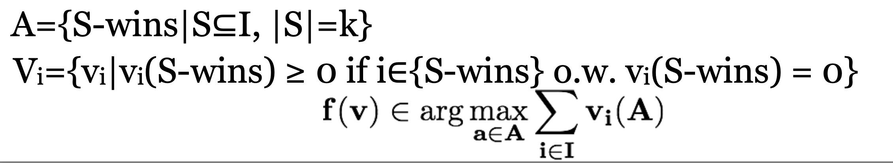

### Example Combinatorial Valuations

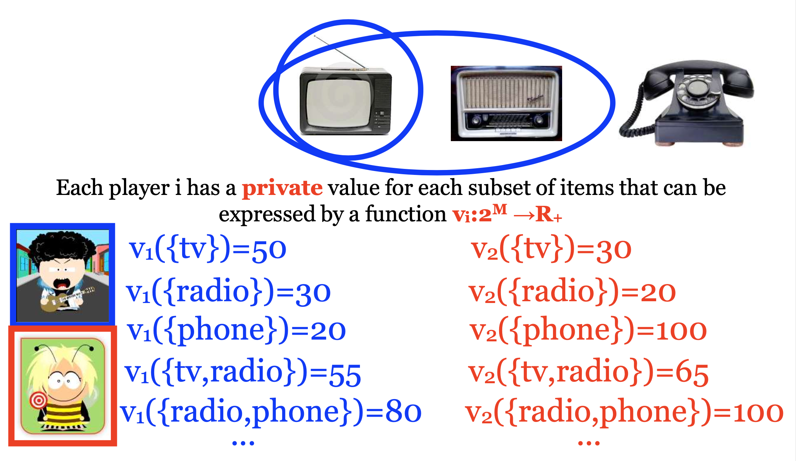

- Problem Statement

  - A set M of m indivisible items M={1,...,m}

  - A set N of n bidders N={1,...,n}

  - Bidders have preferences over subsets (bundles) of items A valuation is a real valued function for every subset S of items v(S) is the value the bidder obtains if he receives the bundle S

  - free disposal: monotone v(S)≤v(T) if S⊆T

  - normalized: v(∅)=0

- Example

  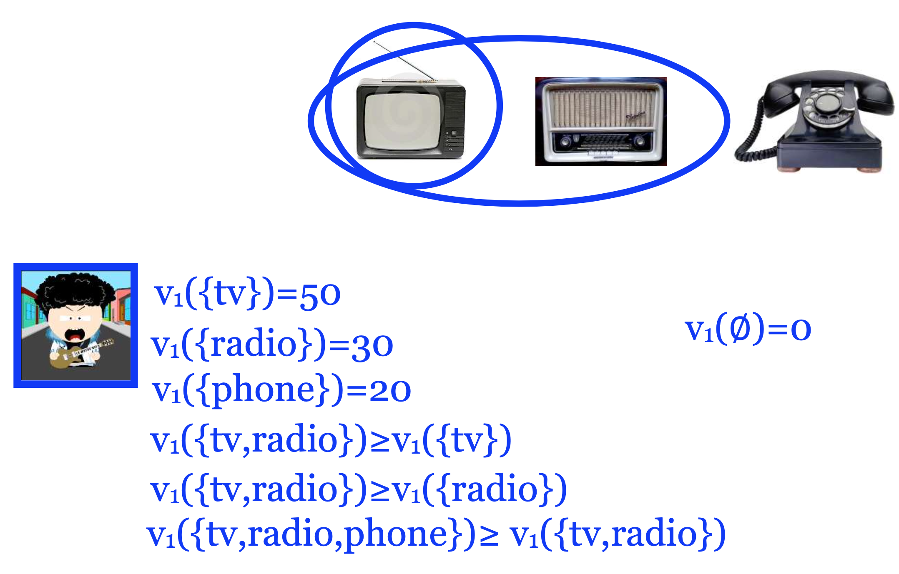

### Roberts Theorem

- Theorem (Roberts) If |A| ≥ 3, f is onto A, Vi = RA for every i, and (f, p1, . . . , pn) is incentive compatible then f is an affine maximizer.

### Valuations

Take S,T with S∩T=∅

- v is additive if v(S∪T)=v(S)+v(T)

Generally, v is not necessarily additive

- S,T are Complements: v(S∪T) > v(S)+v(T) (Superadditive)

v(pair of shoes) > v(left shoe)+v(right shoe)

-S,T are Substitutes: v(S∪T) < v(S)+v(T) (Subadditive) v({margarine,butter}) < v(margarine)+v(butter)

E.g. Multiunit Auctions (Unit demand valuation)

### Utility

- The utility is v(S)-p

- No externalities: the bidder cares only about the set of items he receives and not about how the rest of the items are allocated

### Allocation

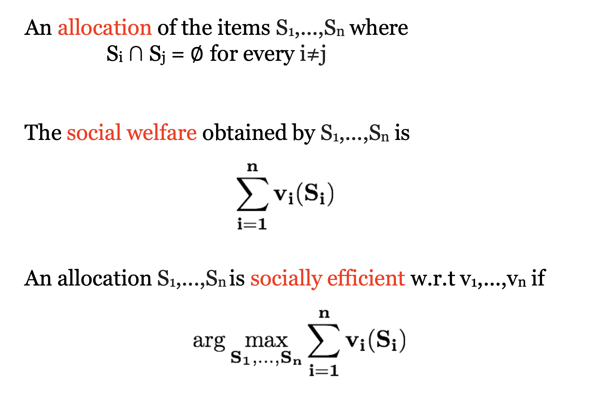

### Social Welfare in Auctions

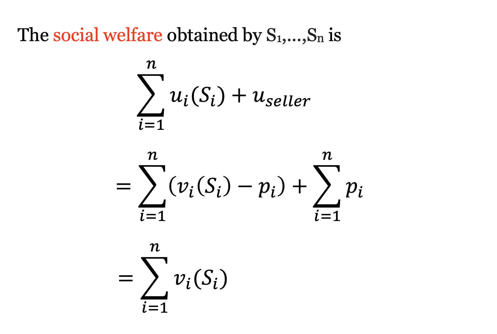

- Example – Maximize SW

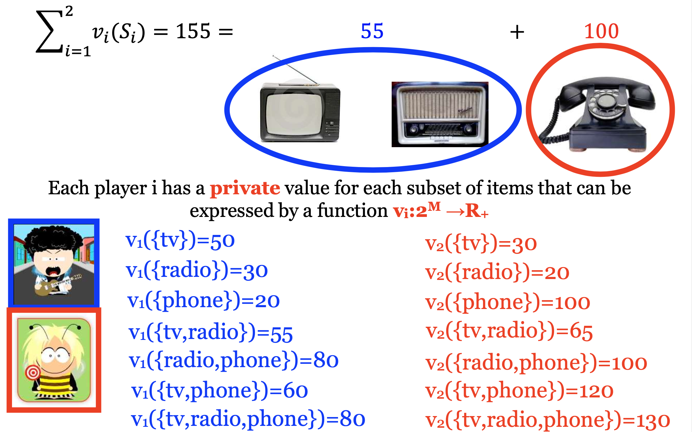

- Goals

  1. Maximize social welfare

  2. Maximize revenue

  3. Minimize envy

- Challenges

  1. Computational Complexity:

  - The allocation problem is computationally hard even for special cases.
  - How do we handle this?

  2. Representation and Communication:

  - The valuation functions are exponential size objects. •How can we even represent them?

  - How can we transfer enough information to the auctioneer so that a reasonable allocation can be found?

  3. Strategies:

  - Can we design incentive-compatible mechanisms?

- Applications

  - Spectrum Auctions: Government sells licences/rights to transmit signals of specific electromagnetic wavelengths

  - Transportation: “Reverse” or procurement auction.

  - A commercial company (buyer) needs to buy transportation services for a large number of routes from various transportation providers (sellers).

  - Each supplier has a value for every bundle of routes.

### Single-Minded Bidders

- Definition

  1. A valuation v is called single-minded if there exists a bundle of items S∗ and a value v∗ ∈ R+ such that v(S) = v∗ for all S ⊇ S∗, and v(S) = 0 for all other S.

  2. A single-minded bid is the pair (S∗, v∗).

- Example

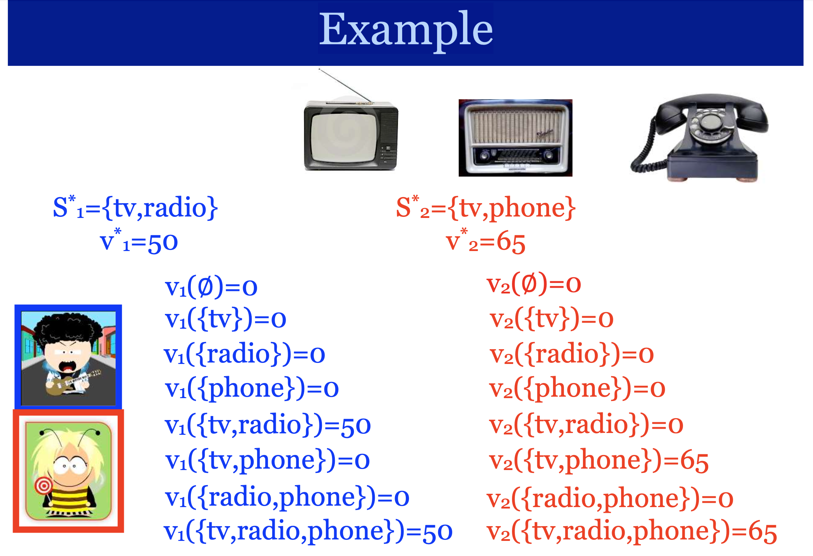

- Known valuations

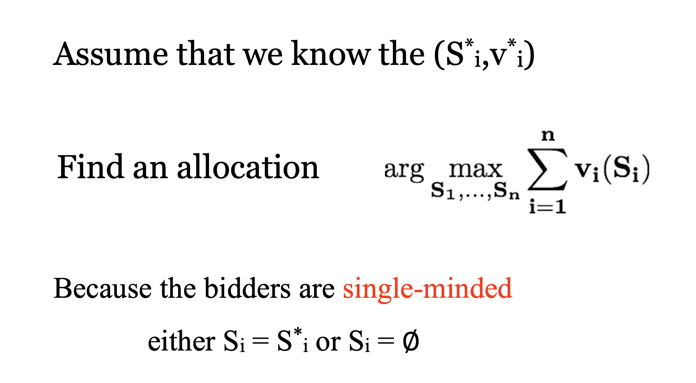

- The allocation problem

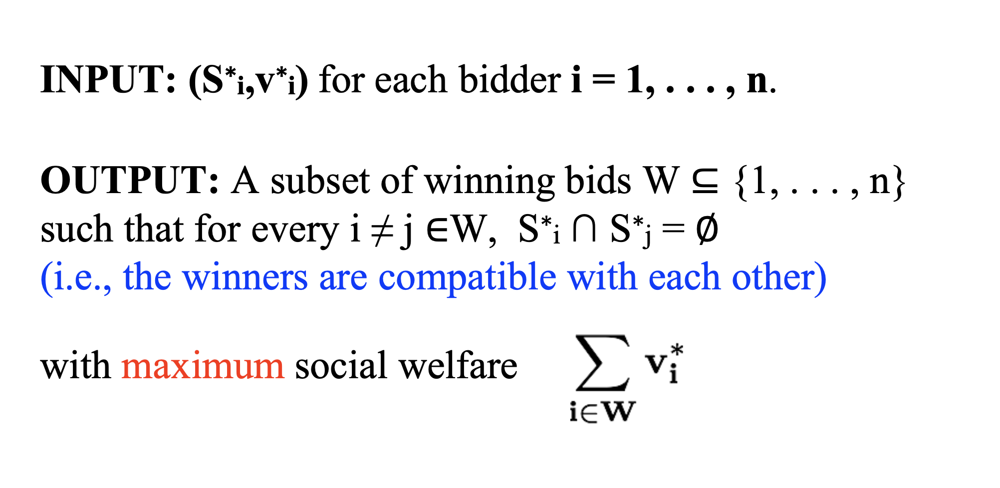

### Computational Complexity

- Proposition. The allocation problem among single-minded bidders is NP-hard.

- More precisely, the decision problem of whether the optimal allocation has social welfare of at least k
  (where k is an additional part of the input) is NP-complete.

### Approximation

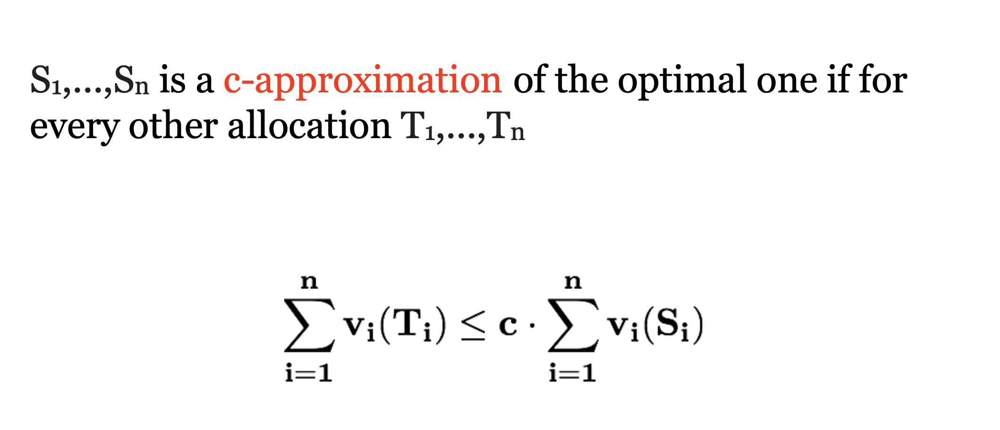

- Approximate allocation (single-minded)

- Proposition. Approximating the optimal allocation among single-minded bidders to within a factor better than m^1/2−ε is NP-hard.

- Running the VCG may need exponential time!

- Even if we knew the valuations, we couldn’t be able to approximate the optimum social welfare by a factor better than m^1/2−ε in polynomial time.

### Incentive-Compatible Mechanism

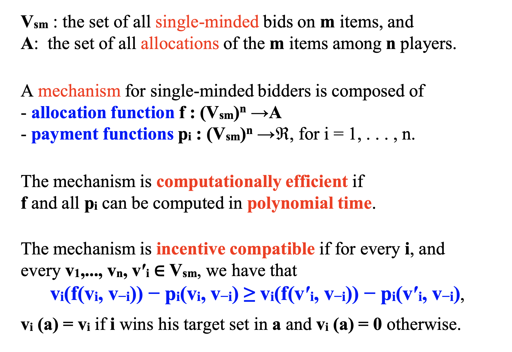

- Compute the optimal allocation and charge VCG payments

  This is incentive-compatible

  Not computationally efficient

- Take an approximate solution and charge VCG payments?

  The VCG payments work only with exact optimization.

## The Greedy Mechanism for Single-Minded Bidders

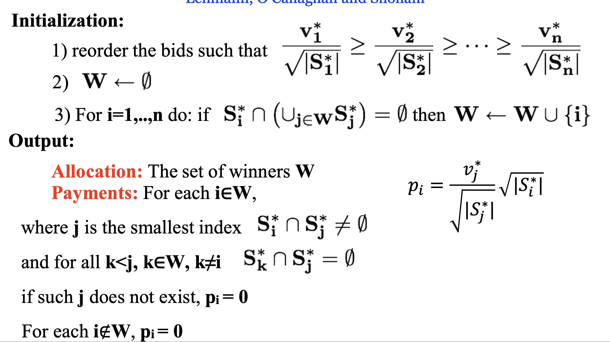

- Example

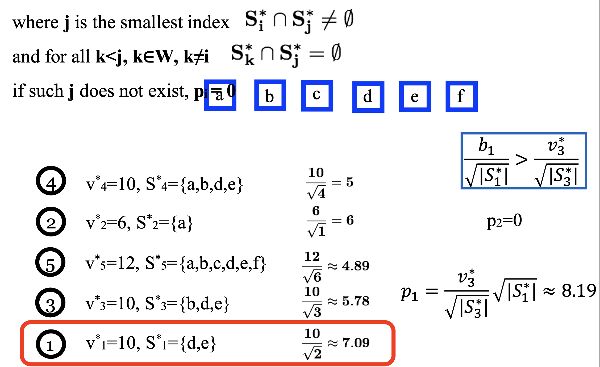

- Theorem. The Greedy mechanism is efficiently computable, incentive compatible and produces a m^1/2 approximation of the optimal social welfare.

### Incentive Compatibility

- Proof Outline

  - First, we will show that a larger class of mechanisms are truthful.

  - Then, we will show that Greedy belongs to this class, and therefore is truthful.

### Monotonicity

- A bidder who wins with bid (S∗i , v∗i) keeps winning for any v′i ≥v∗i andforanyS′i ⊆S∗i (for any fixed settings of the other bids).

- Example:

  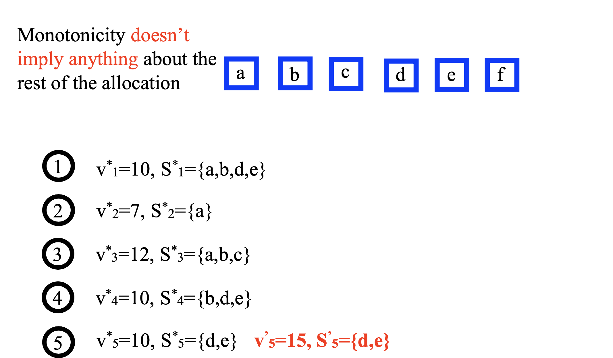

### Critical Payments

- Critical Payment: A bidder who wins pays the minimum value needed for winning: the infimum of all values v′i such that (S∗i , v′i ) still wins.

- Example:

  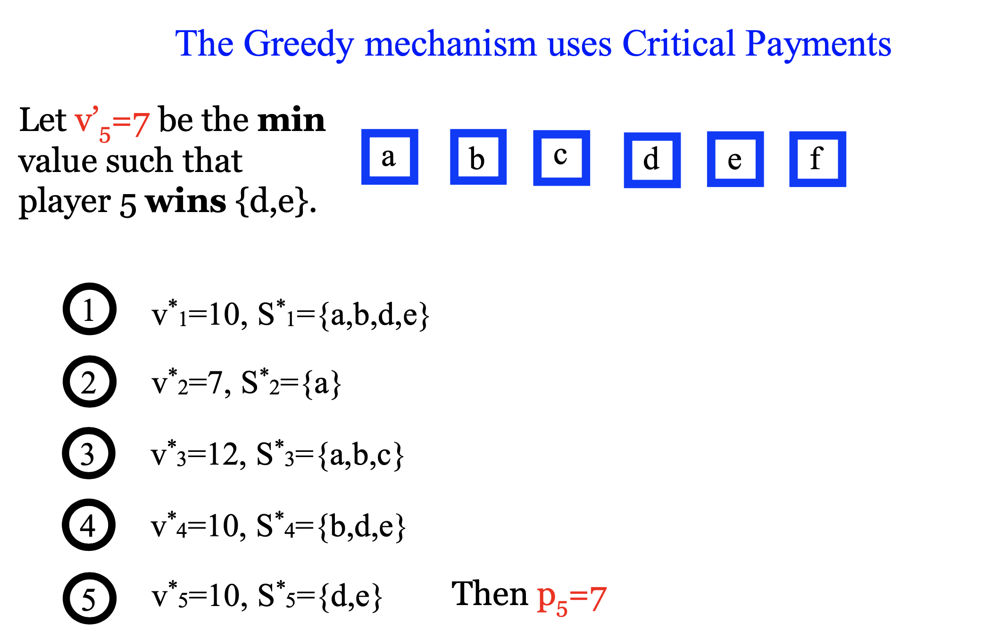

### Incentive Compatibility

- Lemma. A mechanism for single-minded bidders, in which losers pay 0, is incentive compatible if and only if it is Monotone and uses Critical Payment.

- The Greedy is a mechanism for single-minded bidders, in which losers pay 0, and it is Monotone and uses Critical Payment. Therefore, it is incentive compatible.

### Approximation

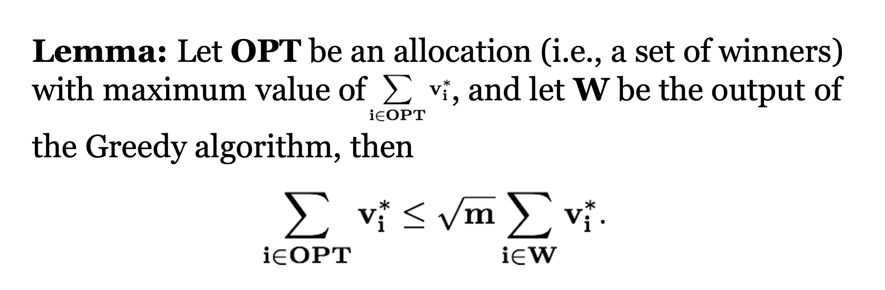
