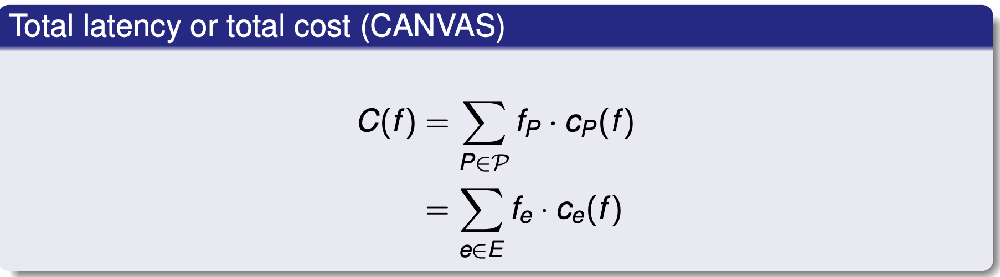
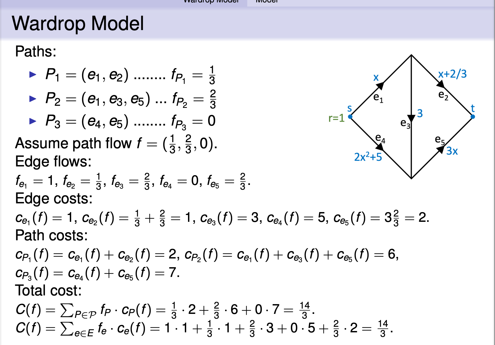
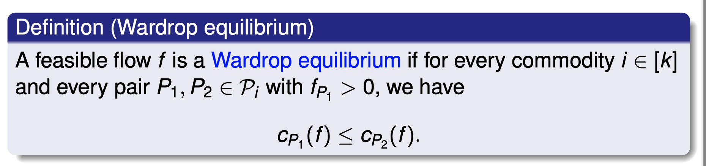
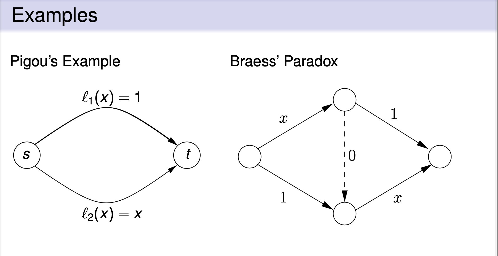
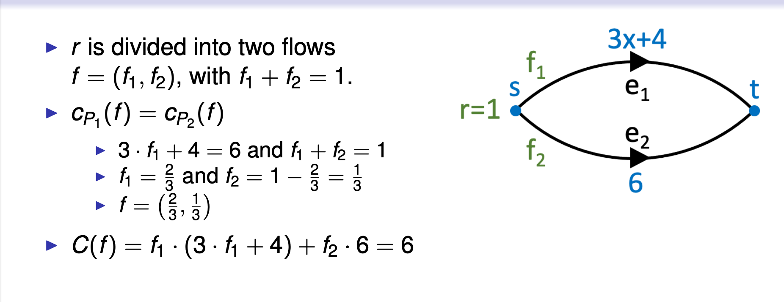
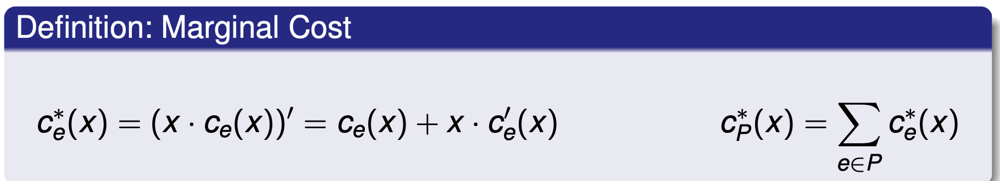
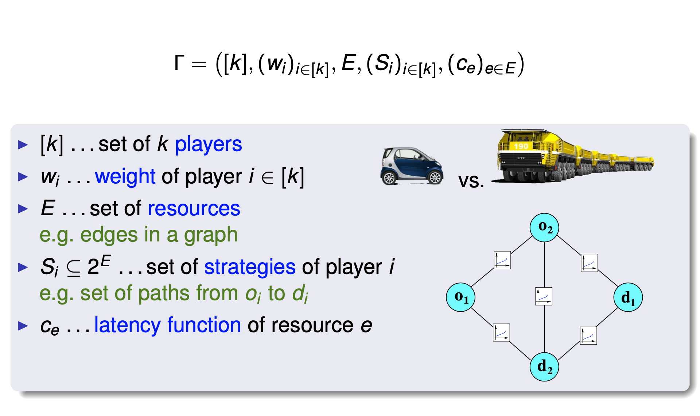
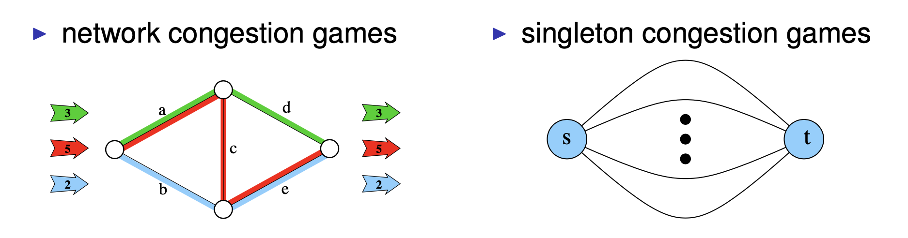
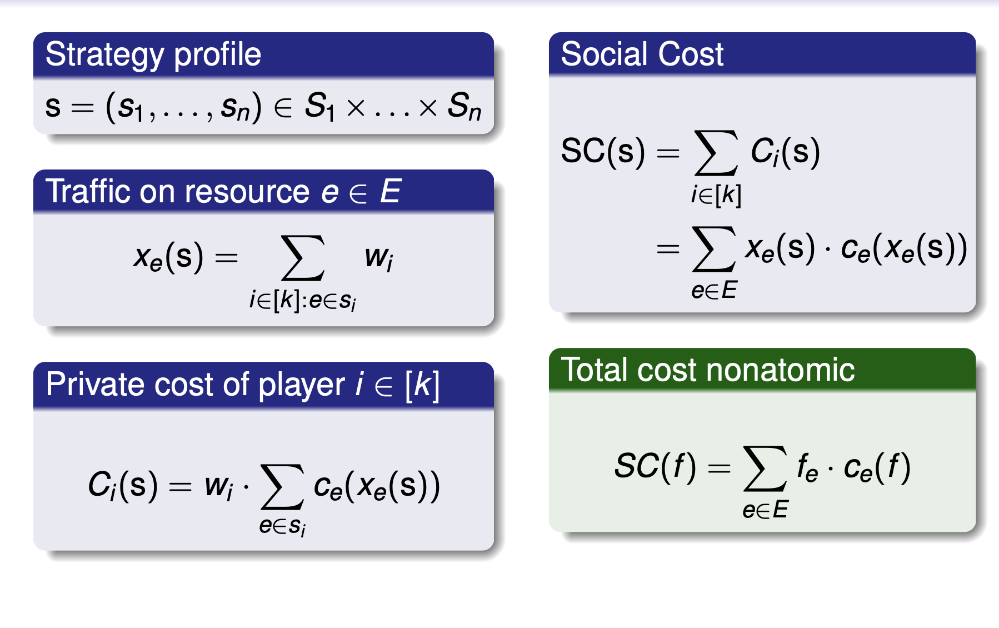
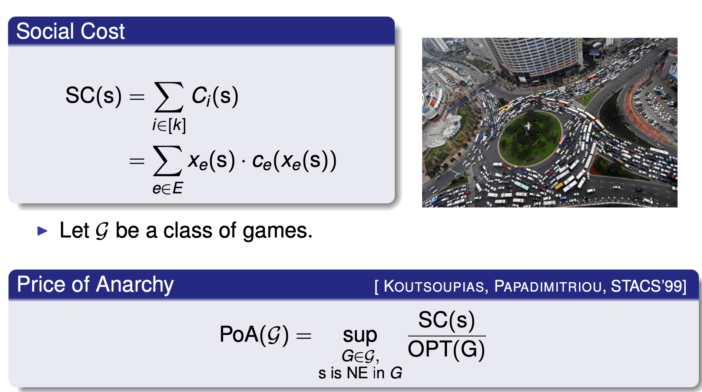

## Non-atomic congestion games: Wardrop Model

Wardrop Model

- directed graph G = (V,E)

- kcommodities,oneforeachi∈[k]

  - si , ti .. source-sink pair
  - ri .. flow demanPd to route from si to ti I normalise: r = i∈[k] ri = 1
  - Pi .. set of paths between si and ti

- P = Ui∈[k]Pi a set of paths

- ce : [0,1] → R.. latency (cost) function of edge e ∈ E

- continuous, non-decreasing, non-negative

- The triple (G,r,c) is an instance of the routing problem

- Flow and Latency:

  - Flow f: aPflow vector (fP)P∈P
  - f_e= P ∋ e f_P
  - a P flow is feasible if for all i∈[k] P ∈ Pi f_P = r_i

- C_e(f) = c_e(f_e) .. edge (lentence / cost)

- C_p(f) = Sum e ∈ P c_e(f) .. path latency

- Example:

Paths:

- P1=(e1,e2)........fP1 = 1 / 3
- P2 = (e1,e3,e5) ... fP2 = 2 / 3
- P3=(e4,e5)........fP3 =0

Assume path flow f = (1/3, 2/3,0).

Edge flows:

fe1 =1,fe2 = 1/3,fe3 = 2/3,fe4 =0,fe5 = 2/3.

Edge costs:

ce1(f)=1, ce2(f)=1/3 + 2/3 =1, ce3(f)=3, ce4(f)=5, ce5(f)=3 \* (2/3) =2.

Path costs:
cP1 (f ) = ce1 (f ) + ce2 (f ) = 2, cP2 (f ) = ce1 (f ) + ce3 (f ) + ce5 (f ) = 6,
cP3 (f ) = ce4 (f ) + ce5 (f ) = 7.

Total cost:

C(f) = Sum fp \* cp = 1/3 \* 2 + 2/3 \* 6 + 0 \* 7 = 14/3

C(f)= fe·ce(f)= 1·1 + 1/3 \* 1 + 2/3 \* 3 + 0 \* 5 + 2/3 \* 2 = 14/3

- So far,we basically just introduced a flow model.

- In the Wardrop model we assume:

  - flow is controlled by an infinite number of agents

  - each agent is responsible for an infinitesimal fraction of the flow

  - agents strive to minimise their own latency

- This implies: All used paths of the same commodity have the same latency.

### Optimal Flows & Wardrop Equilibria

- Suppose we are shifting flow from path P1 to P2.
- ⇒ Contribution of edges on P1 to total latency decreases, contribution of P2 increases.
- If decrease on P1 is more than the increase on P2 then total latency decreases.
- ⇒the flow was not optimal.

- Marginal Cost (边际成本)

### Optimum Flow via marginal costs

Assume x · ce (x ) is convex and continuously differentiable for all e ∈ E

- Lemma 3.1 (Characterisation of optimal flows) 最优流的特点

> A feasible flow f is optimal if and only if for all commodities i ∈ [k], and paths P1,P2 ∈ Pi with fP1 \> 0, we have cP∗ (f) ≤ cP∗ (f).

- Observe the similarity in the characterisation of optimal flows and Wardrop equilibria.

- Theorem 3.2 (Wardrop equilibrium vs. Optimum). 比较

> A feasible flow f is optimal for (G,r,c) if and only if f is a Wardrop equilibrium for (G,r,c∗).

- Theorem 3.3 (Existence and essential uniqueness)

> (a) Every instance (G,r,c) admits a Wardrop equilibrium. (CANVAS)

> (b) If f and ̃f are Wardrop equilibria, then ce(f) = ce( ̃f) for every e ∈ E.

- Proofs are based on the following potential function [ BECKMANN, MCGUIRE, WINSTON,1956] :

  $H(f) = \sum_{e ∈ E} h_e(f_e)$

  $he(x) = \int_0^x ce(u) du$

### Price of Anarchy

- Let f be a Wardrop equilibrium and f ∗ be an optimum for (G, r , c).

ρ(G,r,c)= C(f) / C(f∗)

- Theorem 3.4 (polynomial latency functions) 多项式延迟函数

> Suppose latency functions are of the form $ce(x) = \sum_{i = 0}^d ae&, i \* xi$ with nonnegative coefficients, Then ρ(G, r, c) <= d + 1

- Theorem 3.5 (linear latency functions) 线性延迟函数

> Suppose latency functions are linear with non-negative slope and offset. Then, ρ(G,r,c) = 4/3.

### (Atomic) congestion games

- (Weighted) congestion games

  

  - unweighted congestion games(or simply congestion games):

    wi =1 for all players i ∈[k]

  - symmetric games:

    Si = Sj for all player i,j ∈ [k]

  

### Private Cost and Social Cost

### Nash Equilibrium

> A strategy profile s is a Nash equilibrium if and only if all players i ∈ [k] are satisfied, that is, Ci(s) ≤ Ci(s−i,si′) for all i ∈ [k] and si′ ∈ Si.

- Remarks
  - For simplicity were strict to pure Nash equilibria.
  - Many result shold also for mixed Nash equilibria.
    - Players randomize over their pure strategies
    - Guaranteed to exist [ NASH, 1951]

### Price of Anarchy

