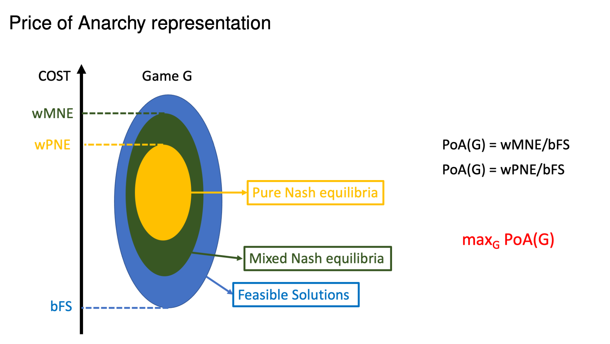

## Load Balance Games

- Makespan scheduling on uniformly related machines

- n tasks with weights w1,...,wn
- m parallel mach in es with speeds s1,...,sm
  - identical machines: s1 = s2 = ··· = sm = 1 I uniformly related machines: else
  - A:[n]7→[m]..assignmentoftaskstomachines
- The load of machine j∈[m] under the assignment A is:

  

- Objective: minimize the make span, aka the maximum load overall machines

### Definition of Load balancing games

- The task i∈[n] is managed by player `i`
- The pure strategy A(i) for each player i∈[n] yields an assignment
  A : [n] 7→ [m]
- Given an assignment `A`
  - the cost of player i is the load of the chosen machine l_A(i)
  - the social cost is the makespan: cost(A) = maxj∈[m]{l_j}

### Pure Nash equilibrium

An assignment A is a pure Nash equilibrium if for all players i ∈ [n] and all machines j ∈ [m]:


## largest Processing Time \(LPT\)

- The Largest Processing Time (LPT) scheduling algorithm computes a pure Nash equilibrium in polynomial time. // 计算纯纳什均衡多项式时间

### Algorithm

- Start with empty assignment: lj := 0 for all j ∈ [m]
- Sort task in non-increasing order w1 ≥ w2 ≥ ··· ≥ wn

- For i from 1 to n do

  - A(i) := arg minj∈[m]{lj + wi }
  - lA(i):=lA(i)+wi

- returnA

```javascript
function LPTAlgorithm(arr) {
  var res = [];
  arr.forEach((val) => {});
}
```

### Corollary 2.2

> Every instance of the load balancing game admits a pure Nash equilibrium. // 所有负载平衡游戏的实例都可以使用纯纳什均衡

### Best response sequences 1

- Improvement step: change to best response

  - Single player moves his task to the machine that minimizes his cost. // 减少花销

  - Example:

    

### Best response sequences 2

- Best response sequences

  - take the strategic nature of the players into account

  - model convergence

- Theorem 2.3

  > For every instance of the load balancing game with `related machines` every best response sequence terminates.

- Remark

  - There are instances with identical machine that have sequences of length Ω(2^√n).

### Best response sequences 3

- Theorem 2.4

  - For identical machines the length of any sequence of best responses is at most 2^n. // 对于相同的机器，任何最佳响应序列的长度都不超过 2^n

- Theorem 2.5

  - Let A : [n] → [m] denote any assignment of n tasks to m identical machines. Starting from A, the max-weight best response policy reaches a pure Nash equilibrium after each agent was activated at most once.

- Lemma 2.6

  - Suppose task i makes a best response: For all tasks j with wj ≥ wi , if j was satisfied before, it remains satisfied after i’s best response.

### Price of Anarchy: Definition

- Price of anarchy: The `worst case ratio` between the social cost in some Nash equilibrium (NE) and the optimum social cost.




- Goal: Find the exact PoA for a class of games and type of equilibria.

- Upper bound α: show that for all such instances and all such equilibria the PoA is at most α.

- Lower bound α: find such an instance and such an equilibrium where the PoA is at least α.
