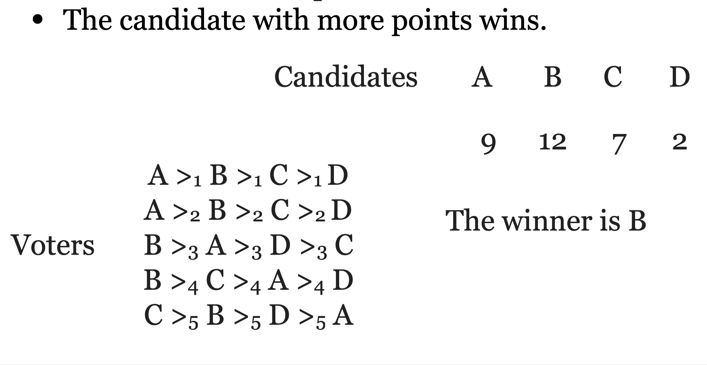

## Mechanism Design

- `Reverse engineering` in Game Theory

- Social Choice: aggregation of preferences of different participants toward a single joint decision

  - We are going to use elections as an example ONLY, but we should bare in mind that what we say apply to the general social choice.

- Mechanism Design: implement desired social choice in a strategic setting (participants are rational and selfish)

- Examples:

  - Elections

  - Auctions

  - Government Policy

- Borda count

  - Each candidate gets n-i points for every voter who ranked him in place i.

  - Example:

    
