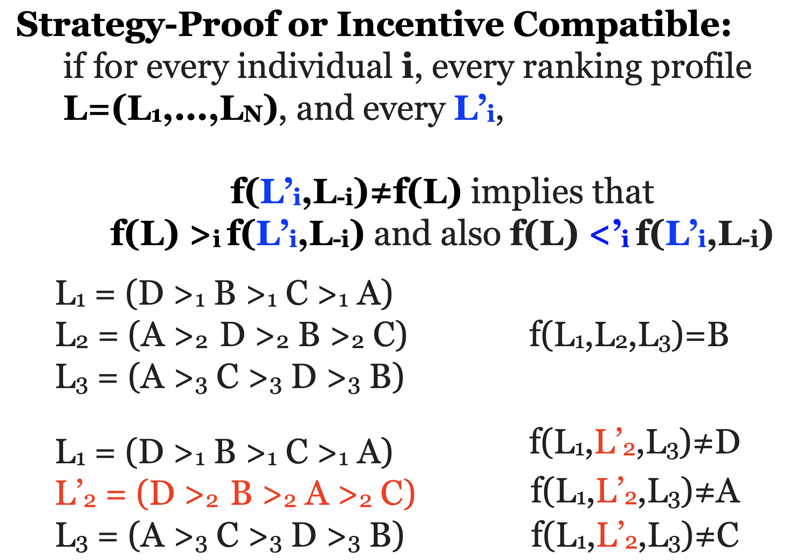

## Mechanism Design

- `Reverse engineering` in Game Theory

- Social Choice: aggregation of preferences of different participants toward a single joint decision

  - We are going to use elections as an example ONLY, but we should bare in mind that what we say apply to the general social choice.

- Mechanism Design: implement desired social choice in a strategic setting (participants are rational and selfish)

- Examples:

  - Elections

  - Auctions

  - Government Policy

- Borda count

  - Each candidate gets n-i points for every voter who ranked him in place i.

  - Example:

    

- Strategic Voting

Suppose that voter i’s preference A > B > C but all other voters “hate” A. Then voter i may have incentive to misreport e.g. B > A > C

- Plurality

  

- We would like to avoid voting rules where strategic voting is encouraged

- It is not transparent

- the interaction of strategic voters is complex

### Definitions

- Finite set of alternatives A={a,b,c,...}

- A set of N voters

- Example:

  

## Properties of social welfare functions

### Properties of s.w. functions

- Pareto Efficiency:

  - whenever an alternative a is ranked above b according to each Li, then a is ranked above b in F(L1,...,LN )

  

  

### Independence of Irrelevant Alternatives

- Independent of Irrelevant Alternatives (IIA): whenever the ranking of a versus b is unchanged for each i=1,...,N when individual i’s ranking changes from Li to L’i, then the ranking of a versus b is the same according to both F(L1,...,LN) and F(L’1,...,L’N)

- Dictatorial:

  - 1

    - If there is an individual i such that F(L1,...,LN) = Li

    - L1 = (A >1 B >1 C)

    - L2 = (B >2 A >2 C)

    - L3 = (B >3 A >3 C)

    - F(L1,L2,L3)= L2 = (B > A > C)

    - ==> Voter 2 is a dictator

  - 2

    - L1 = (A >1 B >1 C)

    - L2 = (B >2 C >2 A)

    - L3 = (B >3 A >3 C)

    - F(L1,L2,L3)= L2 = (B > C > A)

    - ==> Voter 2 is a dictator

### Summary

- We would like to design s.w functions that satisfy

  - Pareto Efficiency

  - Independence of Irrelevant Alternatives

  - Non-Dictatorship

### Arrow’s Theorem (1963)

> Theorem: If |A|≥3 and F satisfies `Pareto Efficiency` and IIA, then F is a dictatorial social welfare function.

## Properties of social choice functions

- The social choice function f can be `strategically manipulated` by some player i, if for some ranking profile L=(L1,...,LN), and for some L’i, we have

> f(L’i,L-i)≠f(L) and f(L’i,L-i) >i f(L)

- Pareto Efficiency: whenever an alternative a is on the top of every individual’s ranking Li then f(L1,...,LN ) = a

  - 1

    - L1 = (B >1 C >1 A)

    - L2 = (B >2 A >2 C)

    - L3 = (B >3 A >3 C)

    - ==> f(L1,L2,L3) = B

  - 2

  L1 = (D >1 B >1 C >1 A)

  L2 = (D >2 A >2 B >2 C)

  L3 = (D >3 C >3 A >3 B)

  - ==> f(L1,L2,L3)=D

  - 3

    - L1 = (D >1 B >1 C >1 A)

    - L2 = (B >2 A >2 D >2 C)

    - L3 = (D >3 C >3 A >3 B)

    - ==> No useful implication for this input

  - 4

    

- Monotonic: If f(L1,...,LN)=a and for every individual i and every alternative b the ranking L’i ranks a above b if Li does, then f(L’1,...,L’N)=a

  - 1

    

  - 2

    

- Dictatorial: If there is an individual i such that f(L1,...,LN)=a iff a is at the top of i’s ranking: f(L1,...,LN)=f(Li)

  - 1

    

  - 2

    

### Summary

- Strategy-Proof or Incentive Compatible: for every individual i, every ranking profile L=(L1,...,LN), and every L’i, f(L’i,L-i)≠f(L) implies that f(L) >i f(L’i,L-i) (and also f(L) <’i f(L’i,L-i))

- Monotonic: if f(L1,...,LN)=a and for every individual i and every alternative b the ranking L’i ranks a above b if Li does, then f(L’1,...,L’N)=a

- Pareto Efficient: whenever an alternative a is on the top of every individual’s ranking Li then f(L1,...,LN )=a

- Dictatorial: If there is an individual i such that f(L1,...,LN)=a iff a is at the top of i’s ranking

- We would like to design s.c functions that satisfy

  - Strategy-Proofness

  - Non-Dictatorship

### Gibbard-Satterthwaite Theorem

- Theorem: If |A|≥3 and f is strategy-proof and onto, then f is a dictatorial social choice function.

- Onto: For any alternative a 2 A there exists a profile ranking such that f(L)=a.
