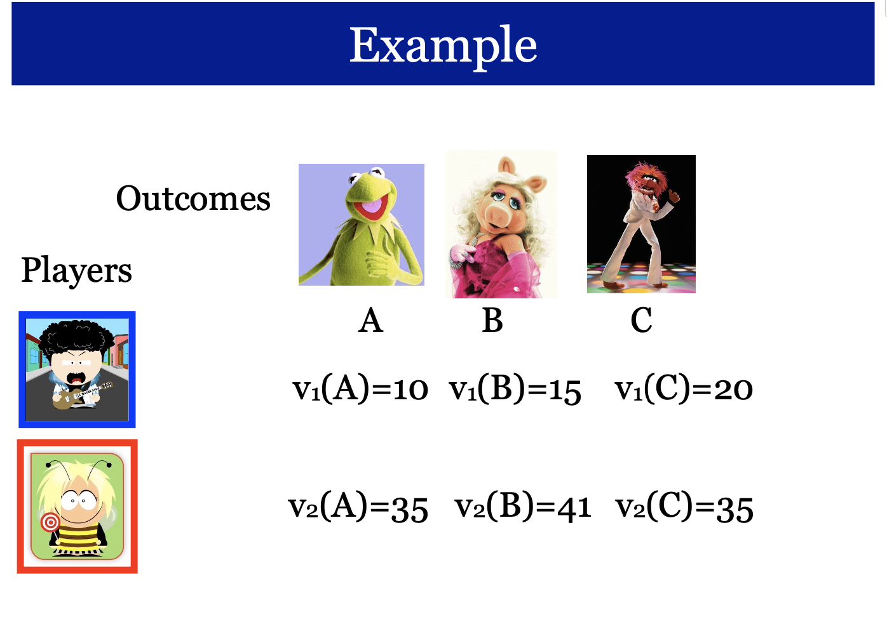
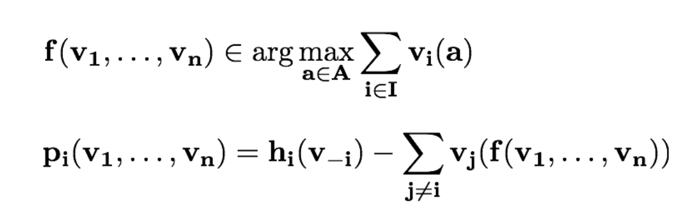

## Mechanisms with Money

### Definition

1. Finite set of alternatives A={a,b,c,...} Set I of n players

2. The preference is expressed by a valuation function

- vi = A -> R

- vi(a): the “value” in terms of some currency that player i gives to alternative `a`

- utility: ui := vi(a) + m

### Single Item Auction （拍卖）

- Goal: Give the object to the player with maximum value.

- in a way that cannot be strategically manipulated

### Description of the Game

- Strategy Set: The players bid bi (probably ≠ vi)

- Allocation Algorithm: Who is going to get the object?

  - xi = xi(b) ({0, 1}) // xi(b) 属于 0 或 1

- Payment Scheme: At what price?

  - p = p(b)

- player i wants to maximize his utility ui=xi(vi-p)

- No Payment

  1. p = 0€

  2. b2 > 100€

- First Price Auction

  - p=100 €

  - p=70+ε €

  - ==> b1 > 70+ε €

### Vickrey Auction

- definition:

  - Allocation Algorithm: Give the object to the player with the highest bid.

  - Payment Scheme: The winner pays an amount equal to the `second highest bid`.

  > Proposition (Vickrey 1961) For every v1 ,..., vn and every v'i, let ui be the utility if he bids vi and u’i his utility if he bids v’i. Then, ui ≥ u’i. (for the utilities we assume vi as the true valuation)

- Goal: The guy with the highest valuation will get the object!

- Telling the truth is a dominant strategy for the players.

- Remark:

  - “This very simple and elegant idea achieves something quite remarkable. It reliably computes a function (argmax) on n numbers (the vi’s) that are each held secretly by a different self-interested player”

### Incentive Compatible Mechanisms

- choose alternative + charge payment

- vi: A -> R for vi belong to Vi

- set of valuations for player i Vi is a truth subset of R_A (R_A 是 Vi 的真子集)

- A (direct revelation) mechanism is a social choice function f:V1×⋅⋅⋅×Vn→A and a vector of payment functions p1,...,pn, where pi:V1×⋅⋅⋅×Vn→R

- A mechanism (f, p1,...,pn) is incentive compatible (or strategy proof) if for every player i, every v=(v1,...,vn) and every v’i vi(f(vi,v-i))-pi(vi,v-i) ≥ vi(f(v’i,v-i))-pi(v’i,v-i)

- Example1:

|                 |                 |
| --------------- | --------------- |
| f(vi,v-i)=a     | f(v’i,v-i)=b    |
| pi(vi,v-i)=3    | pi(v’i,v-i)=5   |
| vi(f(vi,v-i))=6 | vi(f(vi,v-i))=7 |

- Example2:

|                            |                             |
| -------------------------- | --------------------------- |
| f(vi,v-i)=a                | f(v’i,v-i)=b                |
| pi(vi,v-i)=3               | pi(v’i,v-i)=5               |
| vi(f(vi,v-i))=vi(a)=6      | vi(f(v’i,v-i))=vi(b)=7      |
| vi(f(vi,v-i))-p(vi,v-i) =3 | vi(f(v’i,v-i))-p(v’i,v-i)=2 |

- Example3:

|                           |                             |
| ------------------------- | --------------------------- |
| f(vi,v-i)=a               | f(v’i,v-i)=b                |
| pi(vi,v-i)=3              | pi(v’i,v-i)=3               |
| vi(f(vi,v-i))=vi(a)=6     | vi(f(v’i,v-i))=vi(b)=7      |
| vi(f(vi,v-i))-p(vi,v-i)=3 | vi(f(v’i,v-i))-p(v’i,v-i)=4 |

### Vickrey-Clarke-Groves (VCG) Mechanisms

A mechanism (f,p1,...,pn) is called VCG mechanism if

### VCG Payments

- A mechanism is ex-post individually rational if players get non-negative utility.

> vi(f(vi,v-i))-pi(vi,v-i) ≥ 0

- A mechanism has no positive transfers if no player is ever paid money.

> pi(vi,v-i) ≥ 0
