## Mechanisms without Money Part 2

### House Allocation Problem

- 1,...,n agents

- 1,...,n houses

- agent i owns the house i

- A = set of (re)allocating the houses among the agents

- Li or >i agent i’s strict preference over the houses

- agent i is indifferent among all allocations that give him the same house

- therefore the G-S Theorem does not apply

### We are interested in strategy-proof allocation rules

- However in this problem agents own the resources to be allocated, and therefore they may decide to trade the houses among themselves if they don’t like the allocation.

### Allocation Requirements

- allocation: vector a=(a1 ,. . . , an). 向量 A

- ai is the number of the house assigned to agent i.

- For an allocation to be feasible, we require that ai ≠ aj ,foralli ≠ j.

- If a is the initial allocation then ai = i.

- Definition:

  1. For every S ⊆ N let A(S) = {z ∈ A: zi ∈ S ∀i ∈ S}

  2. Denote the set of allocations that can be achieved by the agents in S trading among themselves alone.

  3. Given an allocation a ∈ A, a set S of agents is called a blocking coalition (for a) if there exists some z ∈ A(S) such that for all i ∈ S it is zi ≽ i ai and for at least one j∈S we have that zj ≻ aj.

  4. A blocking coalition can, by trading among themselves, receive homes that each strictly prefers (or is the same) to the home she receives under a, with at least one agent being strictly better off.

  5. The set of allocations that is not blocked by any subset of agents is called the core.

  

### Top Trading Cycle Algorithm

- Round i

  1. Construct a directed graph using one vertex for each agent:

     - If house j' is agent j’s top preference ranked choice, insert a directed edge from j to j'. (An edge of the form (j, j) will be called a loop.)

  2. Identify all directed cycles and loops.

  3. Let Ni be the set of vertices (agents) incident to these cycles.

     - Supposei1 →i2 →i3 →°°°→ir →i1 isonesuchcycle. Give house i1 to agent ir , house ir to agent ir−1, and so on.

  4. Let N <- N\Ni . While non empty, repeat.

- Note that the description of the TTC in the 1st printing of the AGT book is NOT correct.

- Example:

  

  

- Example 2:

  

  

- How do we know that there exists a cycle or a loop?

  1. There are n edges/agents and each vertex has outdegree 1

  2. This means that the algorithm terminates (at most n rounds)!

- Theorem.

  1. The core of the house allocation problem consists of exactly one matching.

  2. The TTC (Top Trading Cycle) mechanism is strategy-proof.

## Mechanisms without Money Part 3

### Stable Matching

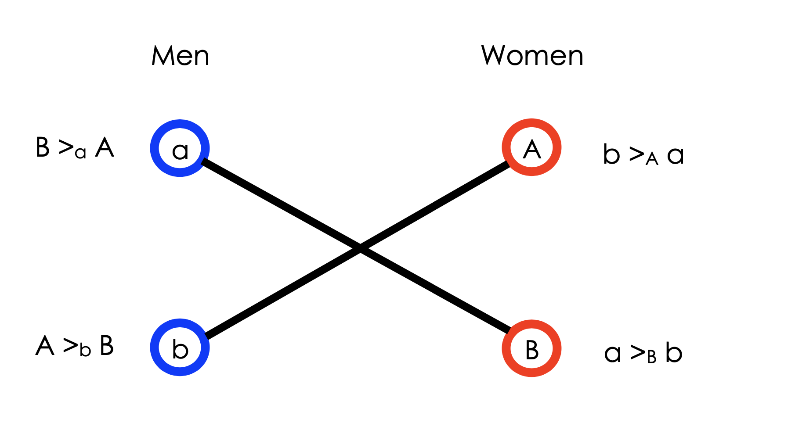

- M is a set of men

- W is a set of women

- For simplicity:|M|=|W|=n

- Man m has a strict preference ordering over the set of women

- Woman w has a strict preference ordering over the set of men

- A=set of matchings

- the G-S Theorem does not apply Why?

- man m is indifferent among all allocations that match him with the same woman

- woman w is indifferent among all allocations that match him with the same man

- In general it can be |M|>|W| or |M|<|W|

  1. Some (wo)men may stay single

  2. We can insert dummy (wo)men to make |M|=|W|=n

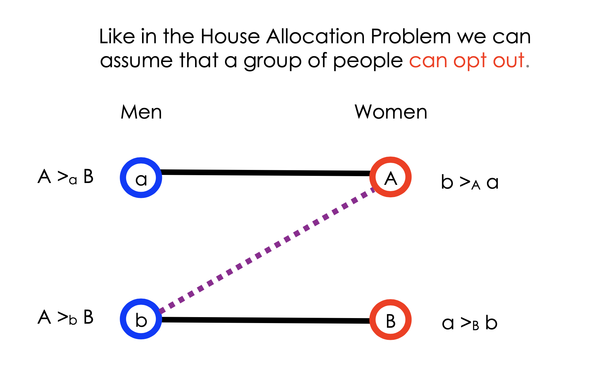

- A matching is called unstable if there are two men m,m′ and two women w, w′ such that

  1.  m is matched to w,

  2.  m′ is matched to w′, and

  3.  w′≻ m w and m ≻ w′ m′

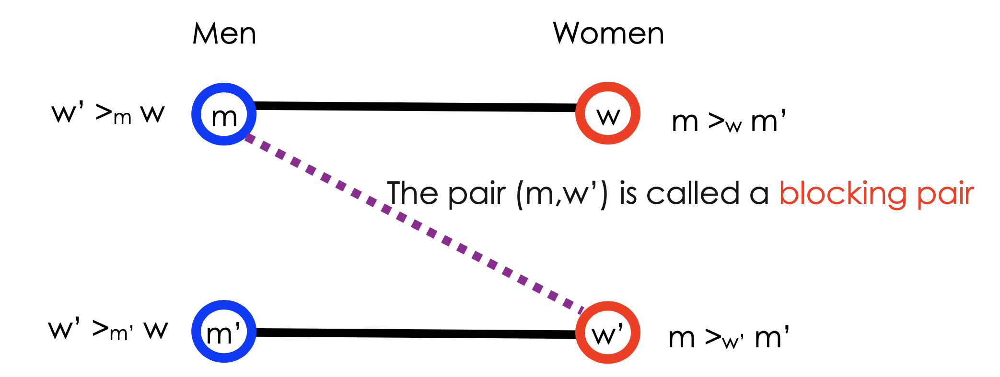

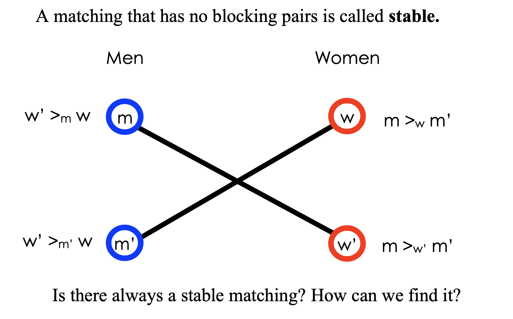

### Gale-Shapley Algorithm

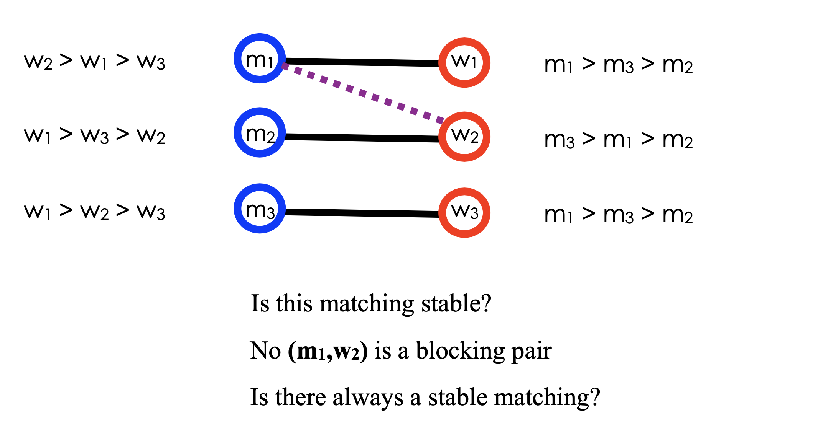

- Round 1

  1. Step 1: each man proposes to his top-ranked choice

  2. Step 2: each woman who has received at least two proposals keeps (tentatively) her top- ranked proposal and rejects the rest.

- Round 2

  1. Step 1: each man who has been rejected proposes to his top-ranked choice among
     the women who have not rejected him.

  2. Step 2: each woman who has at least two proposals (including ones from previous
     rounds) keeps her top-ranked proposal and rejects the rest.

- Repeat until each woman has at most one proposal.

- Each man is assigned to a woman who has not rejected his proposal.

- stable matching (man version)

  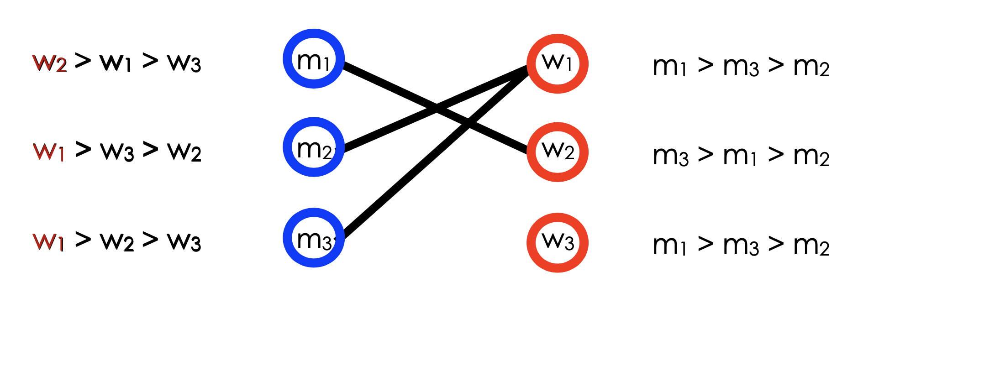

  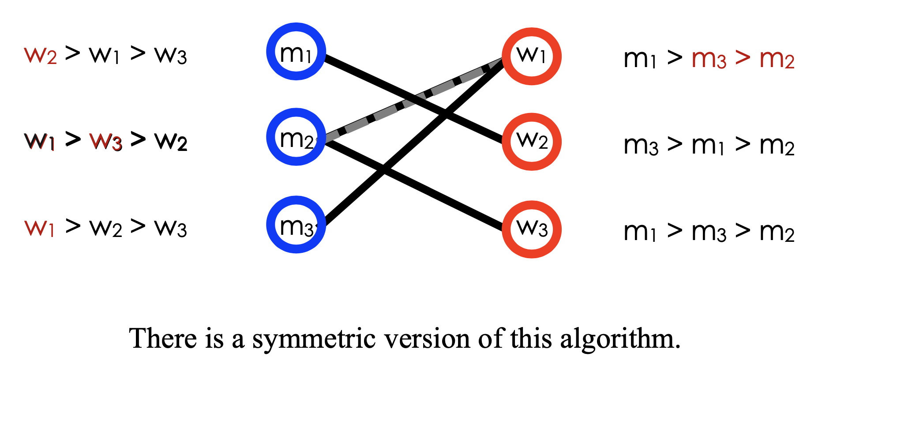

- stable matching (women version)

  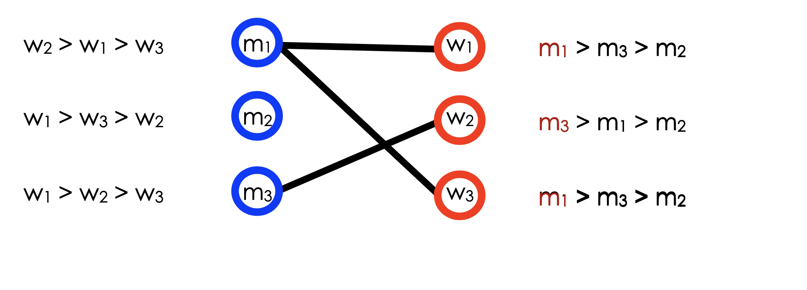

  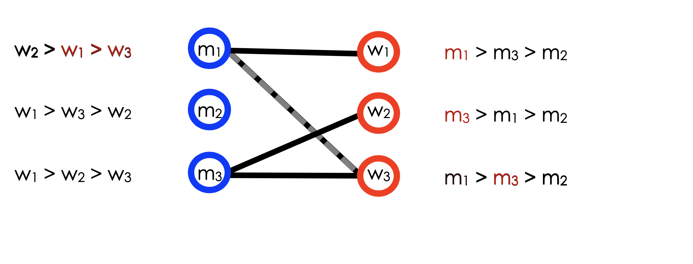

  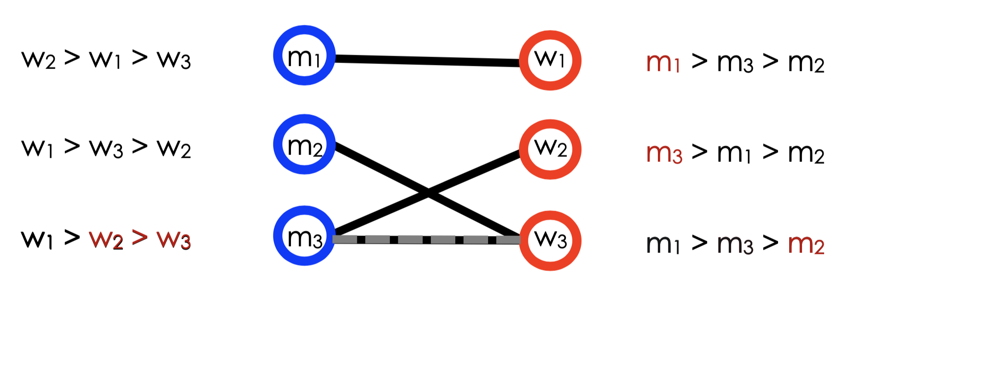

- comparison

  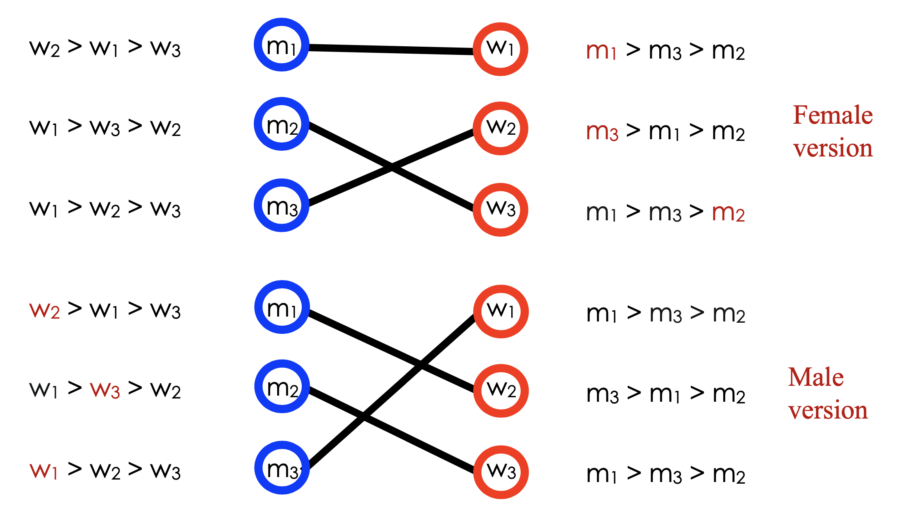

- Time complexity: at most n2 rounds!

- Theorem: The Gale-Shapley algorithm (Deferred Acceptance Algorithm) terminates in a stable matching.

### (Fe)male optimal matching

- Denote a matching by μ.

  1. the woman assigned to man m in the matching μ is denoted by μ(m).

  2. the man assigned to woman w in the matching μ is denoted by μ(w).

- A matching μ is male-optimal if there is no stable matching μ’ such that μ’(m) ≽m μ(m) for all m with μ’(j ) ≻ j μ(j ) for at least one j ∈ M.

- Similarly define female-optimal.

- Theorem:

  1. The stable matching produced by the (male-proposal) Gale-Shapley algorithm (Deferred Acceptance Algorithm) is male-optimal.

  2. The direct mechanism associated with the male proposal Gale-Shapley algorithm is strategy-proof for the males.
