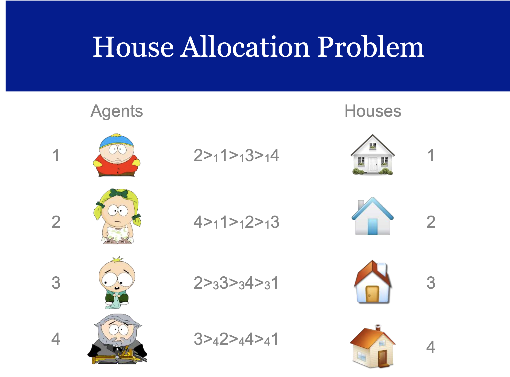
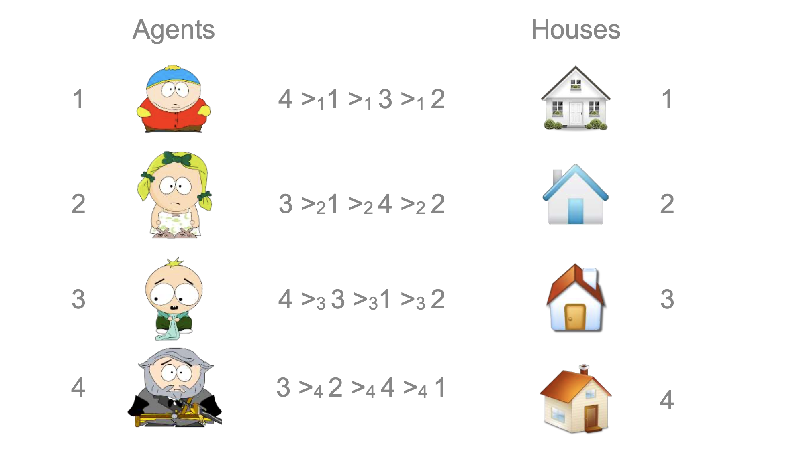
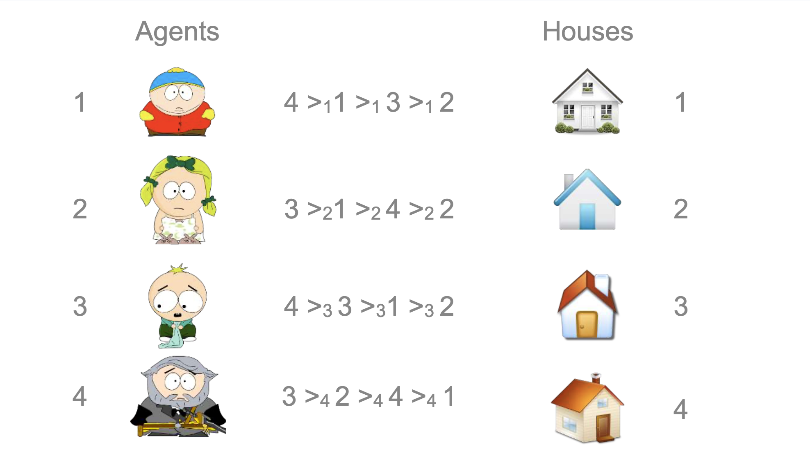
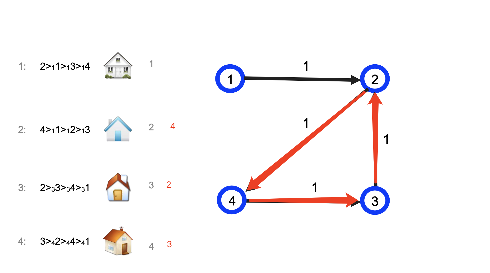
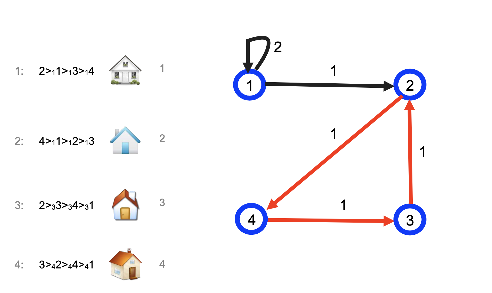
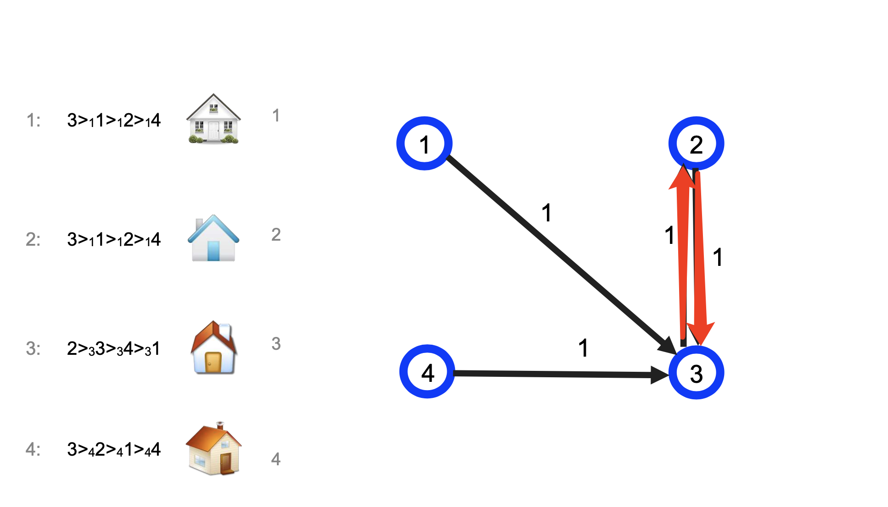
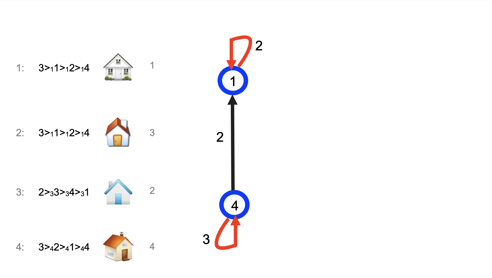

## Mechanisms without Money Part 2

### House Allocation Problem

- 1,...,n agents

- 1,...,n houses

- agent i owns the house i

- A = set of (re)allocating the houses among the agents

- Li or >i agent i’s strict preference over the houses

- agent i is indifferent among all allocations that give him the same house

- therefore the G-S Theorem does not apply

### We are interested in strategy-proof allocation rules

- However in this problem agents own the resources to be allocated, and therefore they may decide to trade the houses among themselves if they don’t like the allocation.

### Allocation Requirements

- allocation: vector a=(a1 ,. . . , an). 向量 A

- ai is the number of the house assigned to agent i.

- For an allocation to be feasible, we require that ai ≠ aj ,foralli ≠ j.

- If a is the initial allocation then ai = i.

- Definition:

  1. For every S ⊆ N let A(S) = {z ∈ A: zi ∈ S ∀i ∈ S}

  2. Denote the set of allocations that can be achieved by the agents in S trading among themselves alone.

  3. Given an allocation a ∈ A, a set S of agents is called a blocking coalition (for a) if there exists some z ∈ A(S) such that for all i ∈ S it is zi ≽ i ai and for at least one j∈S we have that zj ≻ aj.

  4. A blocking coalition can, by trading among themselves, receive homes that each strictly prefers (or is the same) to the home she receives under a, with at least one agent being strictly better off.

  5. The set of allocations that is not blocked by any subset of agents is called the core.

  

### Top Trading Cycle Algorithm

- Round i

  1. Construct a directed graph using one vertex for each agent:

     - If house j' is agent j’s top preference ranked choice, insert a directed edge from j to j'. (An edge of the form (j, j) will be called a loop.)

  2. Identify all directed cycles and loops.

  3. Let Ni be the set of vertices (agents) incident to these cycles.

     - Supposei1 →i2 →i3 →°°°→ir →i1 isonesuchcycle. Give house i1 to agent ir , house ir to agent ir−1, and so on.

  4. Let N <- N\Ni . While non empty, repeat.

- Note that the description of the TTC in the 1st printing of the AGT book is NOT correct.

- Example:

  

  

- Example 2:

  

  

- How do we know that there exists a cycle or a loop?

  1. There are n edges/agents and each vertex has outdegree 1

  2. This means that the algorithm terminates (at most n rounds)!

- Theorem.

  1. The core of the house allocation problem consists of exactly one matching.

  2. The TTC (Top Trading Cycle) mechanism is strategy-proof.
