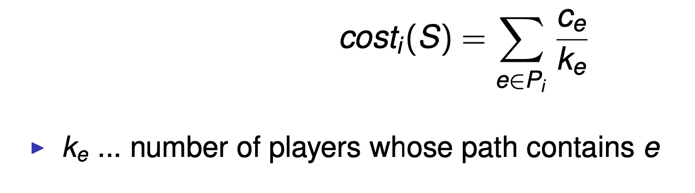

## Network Formation Games

Scenario

- Consider users constructing a shared network

  - Each user has its own interest and is driven by:

  - Minimising the price he pays for creating/using the network

- Receiving a high quality of service

- We wish to model the networks generated by such selfish behaviour(自私的行为) of the users and compare them to the optimal networks

### Objectives

- How to evaluate the overall quality of a network?

  - social cost = sum of players’ costs

- What are stable networks?

  - we use Nash equilibrium as solution concept

  - we refer to networks corresponding to Nash equilibrium as being stable

### Global Connection Game

- Global connection game:

  - users want to connect two nodes si , ti in the network // 用户想在网络中链接 si, ti

  - users share the cost of used edges // 用户分享已使用边的花销

  - users minimise their cost // 用户最小化他们的（通信）花销

  - Resembles (似) use of a large scale shared network

- Model

- Directed G=(V,E) with non-negative edge cost ce.

- k players , each player i ∈ [k] has a source si and sink node ti

- A strategy for a player i is a path Pi from si to ti in G.

- Given a strategy profile S = (P1,...,Pk), we define the constructed network to be ∪i Pi .

- Players who use edge e divide the cost ce according to some cost sharing mechanism.

- We will consider the equal-division(等分) mechanism:

  // Sum(每条边的花销 / 人数) = Cost ce

  

- Example

### Existence of Stable Networks

- Does every global connection game have a pure Nash equilibrium? `Y`

  This is because it is a special congestion game! ce(x) = ce/x

- Rosenthal’s potential function

  

### Price of Anarchy

- Example

  

- Theorem 4.1

  > For any global connection game with k players, PoA ≤ k.

- Some definitions

  - PoA(Price of Anarchy): worst NE

  - PoS(Price of Stabity): best NE

- Definition: Price of Stability

  

### Potential Games and Price of Stability

- Potential Games: All games that admit a potential function Φ, s.t. for all outcomes s, all player i, and all alternative strategies si′,

  Ci (si′, s−i ) − Ci (s) = Φ(si′, s−i ) − Φ(s).

- Existence of Equilibrium: Φ(s) minimal ⇒ s is a Nash equilibrium.

- Theorem 4.2

  - Suppose that we have a potential game with potential function Φ, and assume that for any outcome s, we have

    (SC(s) / A) ≤ Φ(s) ≤ B · SC(s)

  for some constants A, B ≥ 0. Then the price of stability is at most A · B.

- Lemma 4.3

  - For any strategy profile S = (P1,...,Pk) we have SC(S) ≤ Φ(S) ≤ Hk · SC(S)

  

- Theorem 4.4

  - The price of stability in the global connection game with k players is at mostHk =Θ(logk).

- Theorem 4.5

  - The price of stability in the global connection game with k players is at least Hk.

- Finding PoS Lower bound α

Similarly to the PoA, we need to construct an instance with PoS ≥ α. But here all equilibria should be at least α away from optimal solution.
