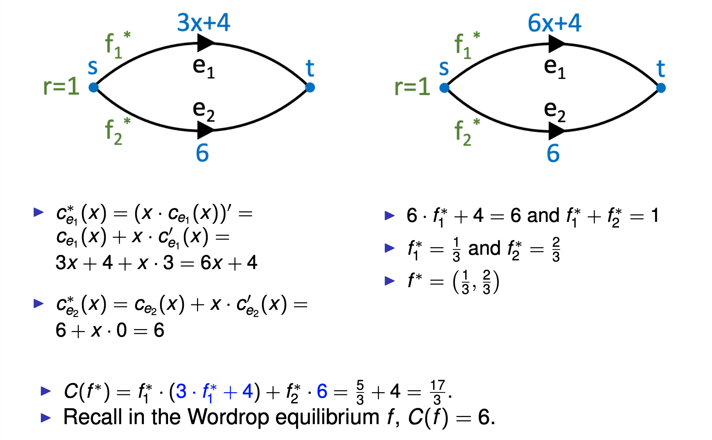

## Outline

- Load-Balancing Games (Ch. 20)

- Routing Games (Ch. 18)

- Formation Games (Ch.19)

- Introduction to Mechanism Design (Ch. 9)

- Mechanisms Without Money (Ch. 10)

- Combinatorial Auctions (Ch. 11)

- Profit Maximization (Ch. 13)

## Network Games

### Bandwidth sharing game 带宽分享游戏

- Utility player i : ui(x1, ... , xn) = xi · (1− Sum^n^j=1 xj)

- A strategy vector s ∈ S is a pure Nash equilibrium, if for each player i , and each alternate strategy si′ ∈ Si , we have that ui(si,s−i) ≥ ui(si′,s−i).

- A strategy vector s ∈ S is a dominant strategy solution, if for each player i , and each alternate strategy vector s′ ∈ S , we have that ui(si,s′−i) ≥ ui(si′,s′−i).

### Load Balancing Games 负载平衡游戏

- Makespan scheduling on uniformly related machines：

  1. n tasks with weights w1,...,wn

  2. m parallel machines with speeds s1, ... , sm

     - identical machines: s1 = s2 = ··· = sm = 1

     - uniformly related machines: else

  3. A:[n] → [m].. assignment of tasks to machines

  4. The load of machine j∈[m] under the assignment A is:

     - lj= sum wi / sj

  5. Objective: minimize the makespan, aka the maximum load overall machines

- Pure Nash equilibrium

  - An assignment A is a pure Nash equilibrium if for all players i ∈ [n] and all machines j ∈ [m]:

    lA(i) ≤ lj + wi / sj

- Computing pure Nash equilibria

  - LPT (important!): The Largest Processing Time (LPT) scheduling algorithm computes a pure Nash equilibrium in polynomial time.

  - LPT algorithm

    1. Start with empty assignment: lj := 0 for all j ∈ [m]

    2. Sort task in non-increasing order w1 ≥ w2 ≥ ··· ≥ wn

    3. For i from 1 to n do

       - A(i) := arg min j∈[m] { lj + wi }

       - lA(i) := lA(i) + (wi / sj)

       - return A

  - Every instance of the load balancing game admits a pure Nash equilibrium.

- Improvement step: change to best response

  - Single player moves his task to the machine that minimizes his cost.

  - Theorem 2.3: For every instance of the load balancing game with related machines every best response sequence terminates.

  - Theorem 2.4: For identical machines the length of any sequence of best responses is at most 2^n.

  - Theorem 2.5: Let A : [n] 7→ [m] denote any assignment of n tasks to m identical machines. Starting from A, the max-weight best response policy reaches a pure Nash equilibrium after each agent was activated at most once.

  - Lemma 2.6: Suppose task i makes a best response: For all tasks j with wj ≥ wi, if j was satisfied before, it remains satisfied after i’s best response.

- PoA (Price of Anarchy): The worst case ratio between the social cost in some Nash equilibrium (NE) and the optimum social cost.

  PoA = max (cost(P) / opt(G))

- Upper bound α: show that for all such instances and all such equilibria the PoA is at most α.

- Lower bound α: find such an instance and such an equilibrium where the PoA is at least α.

### Congestion Games (拥堵游戏)

- Wardrop Model

  - Given a directed graph G = (V,E)

  - k commodities, one for each i ∈ [k]

    1. si , ti .. source-sink pair

    2. ri .. flow demanPd to route from si to ti

    3. normalise: r = sum^i∈[k] ri = 1

    4. Pi .. set of paths between si and ti

  - P = ∪i∈[k] Pi

  - ce : [0,1] 7 → R .. latency (cost) function of edge e ∈ E

    - continuous, non-decreasing, non-negative

  - Total latency or total cost

    1. C(f) = Sum fP · cP(f) = sum fe · ce(f)

    2. ce = edge latency / cost

    3. cp(f) = sum ce(f) path latency

  - Definition (Wardrop equilibrium): A feasible flow f is a Wardrop equilibrium if for every commodity i ∈ [k] and every pair P1,P2 ∈ Pi with fP1 > 0, we have:

    cP1(f) ≤ cP2(f)

  - Finding Wardrop Equilibrium

    1. get f: f = (f1, f2), with f1 + f2 = 1.

    2. cP1(f) = cP2(f)

  - Definition: Marginal Cost

    1. ce∗(x) = (x·ce(x))′ = ce(x) + x·ce′(x)

    2. cP∗(x)= Sum ce∗(x)

  - Lemma 3.1 (Characterisation of optimal flows): A feasible flow f is optimal if and only if for all commodities i ∈ [k], and paths P1,P2 ∈ Pi with fP1 > 0, we have cP∗ (f) ≤ cP∗ (f).

  - Theorem 3.2 (Wardrop equilibrium vs. Optimum): A feasible flow f is optimal for (G,r,c) if and only if f is a Wardrop equilibrium for (G,r,c∗).

  - Finding Optimal Flow via Wardrop Equilibrium (important)

    

- Existence of Wardrop Equilibria

  - Theorem 3.3 (Existence and essential uniqueness)

    1. Every instance (G,r,c) admits a Wardrop equilibrium.

    2. If f and ̃f are Wardrop equilibria, then ce(f) = ce( ̃f) for every e ∈ E.

- Price of Anarchy

  - Let f be a Wardrop equilibrium and f ∗ be an optimum for (G, r , c).

  - Definition: Price of Anarchy: ρ(G,r,c)= C(f) / C(f∗)

  - Theorem 3.4 (polynomial latency functions): Suppose latency functions are of the form ce(x) = Sumi=1^d ae,i · xi with non-negative coefficients. Then ρ(G,r,c) <= d + 1

  - Theorem 3.5 (linear latency functions): Suppose latency functions are linear with non-negative slope and offset. Then, ρ(G,r,c) = 4/3.

### (Weighted) congestion games

- Private Cost and Social Cost

  - Private cost of player i ∈ [k]: Ci(s)= wi · Sum ce(xe(s))

  - Social Cost: SC(s) = Sum Ci (s) = Sum xe(s) · ce(xe(s))

  - Total cost nonatomic SC(f)= Sum fe ·ce(f)

- Nash Equilibrium: A strategy profile s is a Nash equilibrium if and only if all players i ∈ [k] are satisfied, that is, Ci(s) ≤ Ci(s−i,si′) for all i ∈ [k] and si′ ∈ Si.

- Theorem 3.6: Every unweighted congestion game possesses a pure Nash equilibrium.

- Theorem 3.7: There is a weighted network congestion game that does not admit a pure Nash equilibrium.

- Theorem 3.8: Every weighted congestion game with linear latency functions possesses a pure Nash equilibrium.

- Price of Anarchy: Example

### Network Formation Games

- maingoal:bounding the efficiency loss resulting from selfishness

  1. Price of Anarchy

  2. Price of Stability

- Global Connection Game

  1. DirectedG=(V,E) with non-negative edge cost ce.

  2. k players , each player i ∈ [k] has a source si and sink node ti I Astrategy for a player i is a path Pi from si to ti in G.

  3. Given a strategy profile S = (P1,...,Pk), we define the constructed network to be ∪i Pi.

  4. Players who use edge e divide the cost ce according to some cost sharing mechanism.

  5. We will consider the equal-division mechanism: costi(S) = Sum^e ∈ P ce / ke

  6. Social cost: SC(S) = Sum^Pi∈[k] costi (S) = Sum^Pe ∈ ∪iPi ce.

- Price of Anarchy

  - Social Cost (total cost of used edges):
    For any S = (P1,...,Pk), SC(S) = Sum^i∈[k] cost i(S) = Sum^e ∈ ∪iPi ce

  - Theorem 4.1: For any global connection game with k players, PoA ≤ k.

- Price of Stability

  - Potential Games and Price of Stability:

    All games that admit a potential function Φ,s.t. for all outcomes s, all player i, and all alternative strategies si′, Ci (si′, s−i ) − Ci (s) = Φ(si′, s−i ) − Φ(s).

    Φ(s) minimal ⇒ s is a Nash equilibrium.

  - Definition: Price of Stability:

    1. For a game G: PoS(G)= min SC(s) / OPT

    2. For a class of games G: PoS(G) = sup PoS(G)

  - Theorem 4.2: Suppose that we have a potential game with potential function Φ, and assume that for any outcome s, we have SC(s) / A ≤ Φ(s) ≤ B · SC(s), for some constants A, B ≥ 0. Then the price of stability is at most A · B.

  - Lemma 4.3: For any strategy profile S = (P1,...,Pk) we have SC(S) ≤ Φ(S) ≤ Hk · SC(S)

  - Theorem 4.4: The price of stability in the global connection game with k players is at most Hk = Θ(logk).

  - Theorem 4.5: The price of stability in the global connection game with k players is at least Hk.

## Introduction to Mechanism Design

- Mechanism Design: Reverse engineering in Game Theory

### Social Choice

- Majority Vote

  1. Candidates: A, B

  2. Voters: A > B, B > A, B > A

  3. Majority vote: 50%

  4. Outcome: B

- Plurality: The candidate that was placed first by the largest number of voters wins

  1. Candidates: A, B, C, D

  2. Voters: A >1 B >1 C >1 D, A >2 B >2 C >2 D, D >3 A >3 B >3 C, B >4 C >4 A >4 D, C >5 A >5 B >5 D

  3. Outcome: A

- Borda count: Each candidate gets n-i points for every voter who ranked him in place i.

  1. Candidates: A, B, C, D

  2. Voters: A >1 B >1 C >1 D, A >2 B >2 C >2 D, B >3 A >3 D >3 C, B >4 C >4 A >4 D, C >5 B >5 D >5 A

  3. A: 9, B: 12, C: 7, D: 2

  4. The winner is B

- Strategic Voting

  1. We would like to avoid voting rules where strategic voting is encouraged

     - It is not transparent

     - the interaction of strategic voters is complex

  2. Definitions

     - A function F: Ln => L is called social welfare function

     - A function f: Ln => `A` is called social choice function

     - `A`: Finite set of alternatives A={a,b,c,...}

### Properties of social welfare functions

- Pareto Efficiency: whenever an alternative a is ranked above b according to each Li, then a is ranked above b in F(L1,...,LN)

- Independent of Irrelevant Alternatives (IIA):

  1. whenever the ranking of a versus b is unchanged for each i=1,...,N when individual i’s ranking changes from Li to L’i,

  then the ranking of a versus b is the same according to both F(L1,...,LN) and F(L’1,...,L’N)

- Dictatorial: If there is an individual i such that F(L1,...,LN)=Li

- Theorem: If |A|≥3 and F satisfies Pareto Efficiency and IIA, then F is a dictatorial social welfare function.

### Properties of social choice functions

- Definitions:

  1. The social choice function f can be strategically manipulated by some player i, if for some ranking profile L=(L1,...,LN), and for some L’i, we have f(L’i,L-i) ≠ f(L) and f(L’i,L-i) > i f(L)

- Monotonic: if f(L1,...,LN)=a and for every individual i and every alternative b the ranking L’i ranks a above b if Li does, then f(L’1,...,L’N)=a

- Onto(满射): For any alternative a 2 A there exists a profile ranking such that f(L)=a.

## Mechanisms with Money

### Single Item Auction

- Description: Strategy Set: The players bid bi (probably ≠ vi)

- Goal: Give the object to the player with maximum value.

- Can it be strategically manipulated? YES

### First Price Auction

- Can it be strategically manipulated? YES

### Vickrey Auction

- Allocation Algorithm: Give the object to the player with the highest bid.

- Payment Scheme: The winner pays an amount equal to the second highest bid.

- Proposition (Vickrey 1961): For every v1 ,..., vn and every v'i, let ui be the utility
  if he bids vi and u’i his utility if he bids v’i. Then, ui ≥ u’i.

### Incentive Compatible Mechanisms(激励相容)

- A mechanism (f, p1,...,pn) is incentive compatible (or strategy proof) if for every player i, every v=(v1,...,vn) and every v’i vi(f(vi,v-i))-pi(vi,v-i) ≥ vi(f(v’i,v-i))-pi(v’i,v-i)

- Example:

|                           |                             |
| ------------------------- | --------------------------- |
| f(vi,v-i)=a               | f(v’i,v-i)=b                |
| pi(vi,v-i)=3              | pi(v’i,v-i)=5               |
| vi(f(vi,v-i))=vi(a)=6     | vi(f(v’i,v-i))=vi(b)=7      |
| vi(f(vi,v-i))-p(vi,v-i)=3 | vi(f(v’i,v-i))-p(v’i,v-i)=2 |

### VCG Mechanisms(!important)

- A mechanism (f,p1,...,pn) is called VCG mechanism if

  

- Theorem:

  1. A VCG mechanism with Clarke pivot payments makes no positive transfers.

  2. If vi(a) ≥ 0 for every vi and alternative a then it is also individually rational.

- VCG Applications

  1. Multiunit Auctions

     - Allocation Algorithm: Give the k objects to the k highest bidders.

     - Payment Scheme: The winners pay an amount equal to the k+1st highest bid.

  2. Path Auctions

### Characterizations of Incentive Compatible Mechanisms

- Proposition: A mechanism is incentive compatible if and only if it satisfies the following conditions for every i and every v−i :

  1. The payment pi does not depend on vi , but only on the alternative chosen f(vi, v−i ).

  2. The mechanism optimizes for each player.

### Weak Monotonicity

- A social choice function f satisfies Weak Monotonicity (WMON) if for all i, all v−i we have that
  f(vi, v−i) = a ≠ b = f (v′i, v−i) implies that vi(a) − vi(b) ≥ v′i(a) − v′i(b).

### Affine Maximizers

- 带权和附加 cost 的 VCG

- Theorem (Roberts) If |A| ≥ 3, f is onto A, Vi = R|A| for every i, and (f, p1, . . . , pn) is incentive compatible then f is an affine maximizer.

- Theorem (Gibbard-Satterthwaite): If |A|≥3 and f is strategy-proof and onto, then f is a dictatorial social choice function.

## Mechanisms without Money

- Single-Peaked Preferences

  1. Each player’s preference has a single most preferred point in an interval.

  2. The preferences are decreasing as one moves away from that peak.

- Dictatorship: Player 1 is a dictator if f(b1,b2)=b1

- Leftmost: Assign the facility to the leftmost bid.

- Rightmost: Assign the facility to the rightmost bid is strategyproof.

- k-th Leftmost: Assign the facility to the k-th leftmost bid is strategy proof.

- Fixed Point: Assign the facility to some fixed point.

### Social Cost Minimization

- Assign the facility to the median: Is it strategyproof? Yes

### Single-Peaked Preferences

- Strategyproofness

- Onto:

- Unanimity: 一致性在社会选择理论中意味着，如果所有社会成员都对某个选项有相同的偏好，那么社会选择函数应该选择这个选项。例如，如果每个成员都认为选项 A 是最好的，那么一致的社会选择函数也应该选择 A。

- Pareto Optimality: f is Pareto Optimal if there is no point x >= f(L)
  一个选择是帕累托最优的，如果没有其他选择能够使得至少一个人的福利更好而不损害其他人的福利。在社会选择的上下文中，一个社会选择函数生成的结果是帕累托最优的，意味着任何偏好配置下生成的选择结果都是帕累托最优的。

- Lemma: Suppose f is strategyproof. Then f is onto iff it is unanimous iff it is Pareto Optimal.

- Median:

  1. Theorem. A rule f is strategyproof, onto and anonymous iff there exist y1,...,yn-1 such that
     f(L)=med(p1,...,pn,y1,...,yn-1)

## House Allocation Problem

- 1,...,n agents

- 1,...,n houses

- agent i owns the house i

- Allocation Requirements:

  - allocation: vector a=(a1 ,. . . , an).

  - ai is the number of the house assigned to agent i.

  - For an allocation to be feasible, we require that ai ≠aj ,foralli≠j.

  - If a is the initial allocation then ai = i.

- Top Trading Cycle Algorithm:

Round i

1. Construct a directed graph using one vertex for each agent:
   If house j' is agent j’s top preference ranked choice, insert a
   directed edge from j to j'. (An edge of the form (j, j) will be called a loop.)

2. Identify all directed cycles and loops.

3. Let Ni be the set of vertices (agents) incident to these cycles. Supposei1 →i2 →i3 →°°°→ir →i1 is one such cycle. Give house i1 to agent ir , house ir to agent ir−1, and so on.

4. Let N N\Ni . While non empty, repeat.

- Theorem: The core of the house allocation problem consists of exactly one matching.

- Theorem: The TTC mechanism is strategy-proof.
