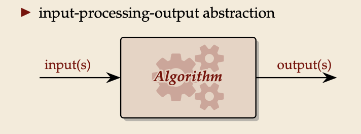

## What is an algorithm?

- An algorithm is a sequence of instructions.

  - Mechanically executable
  - Finite description
  - Solves a problem

  

## What is a data structure?

- a rule for encoding data (in computer memory), plus
- algorithms to work with it (queries, updates, etc.)

## Algorithm analysis

### Good algorithms

- fast running time
- moderate memory space usage

### Algorithm analysis is a way to

- compare different algorithms
- predict their performance in an application

## Running time experiments

### Why not simply run and time it

results only apply to

- single test machine
- tested inputs
- tested implementation

instead: consider and analyze algorithms on an abstract machine

- provable statements for model
- testable model hypotheses

Need precise model of machine (costs), input data and algorithms

### Data Models

- worst-case performance: consider the worst of all inputs as our cost metric

- best-case performance: consider the best of all inputs as our cost metric

- average-case performance: consider the average/expectation of a random input as our cost metric

## The RAM Model

### Machine models

The machine model decides

- what algorithms are possible
- how they are described (= programming language)
- what an execution costs

Goal: Machine models should be

- detailed and powerful enough to reflect actual machines
- abstract enough to unify architectures
- simple enough to analyze

### Random Access Machines (RAM)

- unlimited memory MEM[0],MEM[1],MEM[2],...
- fixed number of registers 𝑅1,...,𝑅𝑟
- memory cells MEM[𝑖] and registers 𝑅𝑖 store 𝑤-bit integers, i. e., numbers in [0..2𝑤 − 1]
  𝑤 is the word width/size; typically 𝑤 ∝ lg 𝑛 ⇝ 2𝑤 ≈ 𝑛

- Instructions:

  - load & store: 𝑅𝑖 := MEM[𝑅𝑗] MEM[𝑅𝑗] := 𝑅𝑖
  - operations on registers: 𝑅𝑘 := 𝑅𝑖 + 𝑅𝑗 (arithmetic is modulo 2𝑤!)
    - also 𝑅𝑖 −𝑅𝑗, 𝑅𝑖 ·𝑅𝑗, 𝑅𝑖 div𝑅𝑗, 𝑅𝑖 mod𝑅𝑗
    - C-style operations (bitwise and/or/xor, left/right shift)
  - conditional and unconditional jumps

- Cost: number of executed instructions

## Memory management & Pointers

- A random-access machine is a bit like a bare CPU . . . without any operating system

- All high-level programming languages add memory management to that:

  - Instructiontoallocateacontiguouspieceofmemoryofagivensize(likemalloc).
    - used to allocate a new array(of a fixed size) or
    - a new object/record(with a known list of instance variables)
    - There’s a similar instruction to free allocated memory again.
  - A pointer is a memory address (i. e., the 𝑖 of MEM[𝑖]).
  - Support for procedures (a.k.a. functions, methods) calls including recursive calls
    - (this internally requires maintaining call stack)

> We will mostly ignore how all this works in COMP526.
