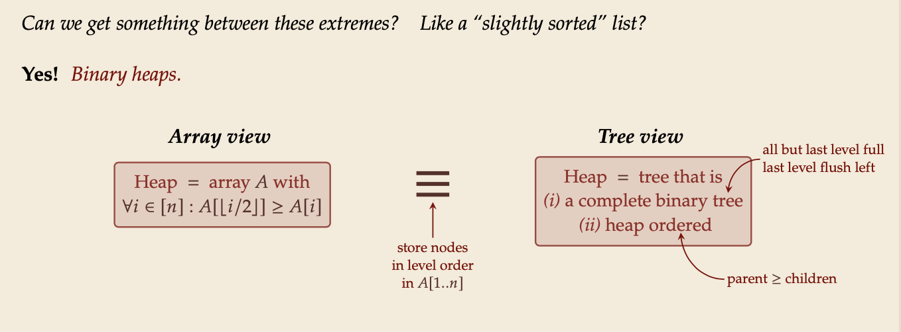
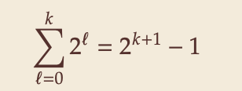

## Fundamental Data Structures

Data structures make heavy use of pointers and dynamically allocated memory.

## Stacks & Queues

### ATD: Abstract Data Types

| ADT                          | data structures           |
| ---------------------------- | ------------------------- |
| list of supported operations | specify exactly           |
| how data is represented      |
| what should happen           | algorithms for operations |
| not: how to do it            | has concrete costs        |
| (space and running time)     |
| not: how to store data       |                           |

### Stack

- Operators
  - top(): Return the topmost item on the stack Does not modify the stack.
  - push(x): Add 𝑥 onto the top of the stack.
  - pop(): Remove the topmost item from the stack (and return it).

### Queue

- Operators:
  - enqueue(x): Add 𝑥 at the end of the queue.
  - dequeue(): Remove item at the front of the queue and return it.

## Resizable Arrays (可变大小的数组)

// Digression 题外话

- Array operations:
  - create(n)
  - get(i)
  - set(i, x)

Arrays have fixed size (supplied at creation).

### Doubling trick

maintain capacity 𝐶 = 𝑆.length so that 14 𝐶 ≤ 𝑛 ≤ 𝐶

- How to maintain the last invariant?

  - before push: If 𝑛 = 𝐶, allocate new array of size 2𝑛, copy all elements.

  - after pop: If 𝑛 < 14 𝐶, allocate new array of size 2𝑛, copy all elements.

### Amortized Analysis (摊销分析)

- Any individual operation push / pop can be expensive! Θ(𝑛) time to copy all elements to new array.

- But: An one expensive operation of cost 𝑇 means Ω(𝑇) next operations are cheap!

Formally: consider “credits/potential” Φ = min{𝑛 − 14 𝐶, 𝐶 − 𝑛} ∈ [0, 0.6𝑛]

_amortized cost_ of an operation = actual cost (array accesses) − 4 · change in Φ

- cheap push/pop: actual cost 1 array access, consumes ≤ 1 credits ⇝ amortized cost ≤ 5
- copying push: actual cost 2𝑛 + 1 array accesses, creates 21 𝑛 + 1 credits ⇝ amortized cost ≤ 5
- copying pop: actual cost 2𝑛 + 1 array accesses, creates 12 𝑛 − 1 credits ⇝ amortized cost 5
- sequence of 𝑚 operations: total actual cost ≤ total amortized cost + final credits
  - here: ≤ 5𝑚 + 4·0.6𝑛 = Θ(𝑚+𝑛)

## Priority Queues & Binary Heaps

### Priority Queue ADT

elements in the bag have different priorities.

- Operators:

  - construct(𝐴): Construct from from elements in array 𝐴.
  - insert(𝑥,𝑝): Insert item 𝑥 with priority 𝑝 into PQ.
  - max(): Return item with largest priority. (Does not modify the PQ.)
  - delMax(): Remove the item with largest priority and return it.
  - changeKey(𝑥,𝑝′): Update 𝑥’s priority to 𝑝′. Sometimes restricted to increasing priority.

- PQ implementations

  - Elementary implementations
    - unordered list ⇝ Θ(1) insert, but Θ(𝑛) delMax
    - sorted list ⇝ Θ(1) delMax, but Θ(𝑛) insert

### Why heap-shaped trees(堆形树)?

- Why complete binary tree shape?

  - only one possible tree shape
  - complete binary trees have minimal height among all binary trees
  - simple formulas for moving from a node to parent or children:
    - parent at ⌊𝑘/2⌋
    - left child at 2𝑘
    - right child at 2𝑘+1

- Why heap ordered?
  - Maximum must be at root!
  - But: Sorted only along paths of the tree; leaves lots of leeway for fast inserts

## Operations on Binary Heaps

### Insert

- Add new element at only possible place: bottom-most level, next free spot.

- Let element swim up(游上) to repair heap order.

### Delete Max

- Remove max (must be in root).
- Move last element (bottom-most, rightmost) into root.
- Let root key sink in(沉入) heap to repair heap order.

### Heap construction

- 𝑛 times insert ⇝ Θ(𝑛 log 𝑛)
- instead:

  - Start with singleton heaps (one element)
  - Repeatedly merge two heaps of height 𝑘 with new element into heap of height 𝑘 + 1

- Analysis
  - Height of binary heaps:
    - height of a tree: # edges on longest root-to-leaf path
    - depth/level of a node: # edges from root ⇝ root has depth 0 𝑘
    - How many nodes on first 𝑘 full levels?
      

### Binary heap summary

| Operation | Running Time |
| --------- | ------------ |

construct(𝐴[1..𝑛])
max()
insert(𝑥,𝑝)
delMax() changeKey(𝑥,𝑝′) isEmpty()
size()
𝑂(𝑛)
𝑂 (1) 𝑂(log 𝑛) 𝑂(log 𝑛) 𝑂(log 𝑛) 𝑂 (1)
𝑂 (1)
