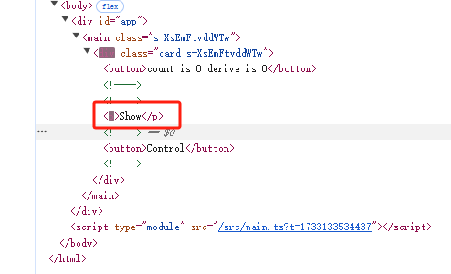
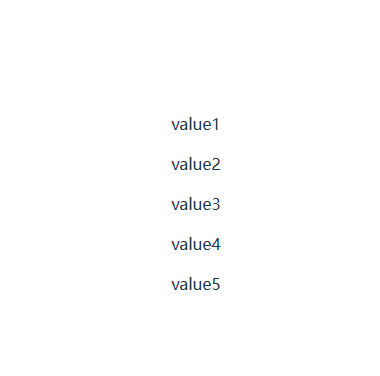
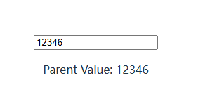
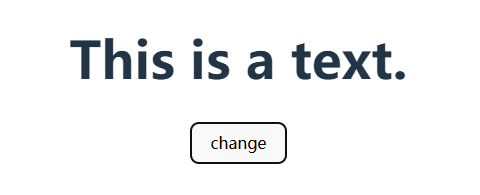
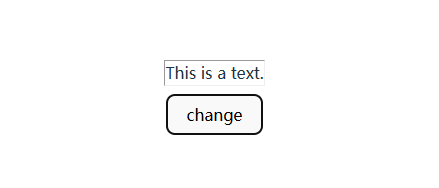

## Introduction of Svelte

`Svelte` 是一个在 web 中构建用户界面的框架。它使用编译器并使用 HTML，CSS 和 Javascript 来编写声明式组件.

> Svelte is a framework for building user interfaces on the web. It uses a compiler to turn declarative components written in HTML, CSS and JavaScript...

`.svelte`后缀的文件是用于构建 Svelte 应用的组件。与`.vue`文件类似，`.svelte`文件包括三部分：`HTML`, `style`, `script`, 其中 `style` 和 `script` 是可选的。

```javascript
// .svelte file

<script module lang="ts">
    // Script module
</script>

<script lang="ts">
    // Script logic
</script>

<style>
    // Style
</style>

```

## Rune(s)

`Runes` 是一个用于在**.svelte**文件中控制 Svelte 编译器的一种特殊符号。

```javascript
let message = $state("hello");
```

### $state

与 React 的 state 相似，`$state` 允许我们创建一个响应状态，让 UI 可以动态地响应数据变化。

```svelte

<script lang="ts">

let count = $state(1)
const onClick = () => count++

</script>

<button onClick={onClick}>
{ count }
</button>

```

如果声明的`stste`是一个数组或对象，state 则会返回一个`proxy`对象

```svelte

<script lang="ts">
    const obj = $state<{ test: number }>({ test: 1 })

    console.log(obj) // Proxy
</script>

<p>{ obj.test }</p> // 1

```


我们也可以使用`class`关键字来使用`$state`

```svelte
<script lang="ts">
  class TestClass {
    num: number = $state(0);
    text: string = $state("");
    constructor(text: string) {
      this.text = text;
    }

    public addCount() {
      this.num++;
    }
  }

  const test = new TestClass("Hello World");
</script>

<button onclick={() => test.addCount()}>Add Count</button>
<p>{test.text} {test.num}</p>
```

- `$state.raw`

如果我们不想在 Array 或 Object 中`深度监听`数据变化，我们可以用`$state.raw`方法声明变量。

```svelte

<script lang="ts">

let test = $state.raw({
    text: "Hello world"
})

test.text = "New Text"

setTimeout(() => {
    test = {
        text: "Text Changed"
    }
}, 2000)

</script>

<p>{test.text}</p>

```

这种方法可以`提高`在大型数组和对象中的`性能`，避免在这样的数据中进行过度的监听。

- `$state.snapshot`

在`$state`进行深度监听数据时，返回的是一个`Proxy`对象，如果我们想获取在某一个时间片段中获取该`Proxy`对象的静态数据，需要用到`$state.snapshot`方法。

```svelte
<script lang="ts">
    const test = $state({ a: 1, b: 2 })
    console.log(test); // Proxy
    console.log($state.snapshot(test)); // { a: 1, b: 2 }
</script>
```

### $derived

类似于 Vue 的`computed`和 React 的`useMemo`, `$derived`可以监听已有的 state 变化而返回经过开发者处理后的数据，例如

```svelte
<script lang="ts">
  let num = $state(1);
  let multiple = $derived(num * 2);
</script>

<button onclick={() => num++}>add</button>
<p>{num} {multiple}</p>
```

- `$derived.by`

`$derived` 可以捕捉到一些基本的数据类型的变化并返回，如果要进行复杂的数据处理，需要用到`$derived.by`方法

```svelte
<script lang="ts">
let arr = $state([1,2,3,4])
let total = $derived.by(() => arr.reduce((a, b) => a + b, 0))
</script>

<button onclick={() => arr.push(arr.length + 1)}>Push</button>
<p>{ arr.join(" + ") } = {total}</p>
```


### $effect

`$effect` 函数会追踪那些**state**和**derived**发生变化，然后重新执行对应的函数。（类似于 React 中的副作用函数 useEffect）
大多数`effects`都用于通过 Svelte 本身创建，例如 `<h1>{ title }</h1>`, 当 title 发生变化时，Svelte 内置的 effect 函数则会调用。
同时，我们也可以通过`$effect`来自定义 effect 函数。

```svelte
<script lang="ts">
  let testNum = $state(0)

  $effect(() => {
    console.log("state is changed: ", testNum)

  })

</script>

<button onclick={() => testNum++}>{ testNum }</button>

```


可以看到当点击按钮 state 发生变化后，先前声明的 effect 函数会进行调用。

需要注意的是，$effect 中只能监听函数内同步读取的依赖，异步读取的数据不会被追踪，例如 `await` 和 `setTimeout` 中的数据

```svelte
<script lang="ts">
  let testNum = $state(0)
  let testDerive = $state(0)

  $effect(() => {
    setTimeout(() => {
      // 依赖不会被追踪
      testDerive = testNum * 2
    }, 0)
  })

</script>

<button onclick={() => testNum++} >{testNum}</button>
<p>testDerive: {testDerive}</p>
```


- $effect.pre

顾名思义，`$effect.pre`会在 DOM 更新之前调用该 effect 函数。

- $effect.tracking

方法会返回一个`布尔值`, 用于查看当前组件是否存在追踪上下文

```svelte
<script lang="ts">
  console.log("Current component is tracking:", $effect.tracking()); // false

  $effect(() => {
    console.log("Current component is tracking:", $effect.tracking()) // true
  })
</script>

<p>in template: {$effect.tracking()}</p> <!-- false -->
```

- $effect.root

改方法会创建一个非追踪并且不会被自动清除的作用域，适用于手动控制内嵌`effect`函数，For example:

```svelte
<script lang="ts">
	let count = $state(0);

	const cleanup = $effect.root(() => {
		$effect(() => {
			console.log(count);
		});

		return () => {
			console.log('effect root cleanup');
		};
	});
</script>
```

### $props

- 与 `Vue` 和 `React` 类似，**$props** 用于获取传入组件的参数

```svelte
<script lang="ts">
  const { test }: { test: string } = $props()
</script>
  
<p>This is a props: { test }</p>
```

### $bindable

从`$props`中传入的数据，通常是从父组件到子组件单向的数据流。如果我们想创建一个从子组件往上流动的数据，则需要使用`$bindable`.

```svelte
<!-- child.svelte -->
<script lang="ts">
  let { test = $bindable() }: { test: string } = $props()
</script>
<input bind:value={test} />


<!-- Parent Component 父组件 -->

<script lang="ts">
  import Child from './child.svelte'
  let label = $state("Hello")
</script>

<Child bind:test={label} />
<p>{label}</p>
```

### $inspect 和 $inspect(...).with

- ⚠ 该方法仅在开发时使用

- 主要用于打印$state和$derived数据的变化，作用是当监听的数据发生变化时，将数据打印到控制台。

```svelte
<script lang="ts">
  let count = $state(0)
  let num = $derived(count * 2)

  $inspect(num)
</script>

<button onclick={() => count++} >Add</button>

```


- `$inspect(...).with` 则是用于自定义debug的方法

```svelte
<script lang="ts">
  let count = $state(0)
  let num = $derived(count * 2)

  $inspect(num).with((type, value) => {
    console.log("custom:", type, value)
  })
</script>

<button onclick={() => count++} >Add</button>

```


### $host

- 该rune为子组件提供了一个可以访问宿主元素并调度自定义事件


```svelte
<svelte:options customElement="my-test" />

<script lang="ts">
	function dispatch(type: string) {
		$host().dispatchEvent(new CustomEvent(type));
	}
</script>

<button onclick={() => dispatch('decrement')}>decrement</button>
<button onclick={() => dispatch('increment')}>increment</button>

<!-- 父组件 -->

<script lang="ts">
  import "./lib/Test.svelte";

  let count = $state(0);

</script>

<main>
  <div class="card">
    <my-test
      ondecrement={() => count -= 1}
      onincrement={() => count += 1}
    ></my-test>
    <p>count: {count}</p>
  </div>
</main>
```

需要注意的是:

- 要使用customElement需要在编译配置中加上`customElement:true`

- 子组件中的customElement命名必须带有`-`，例如`my-test`, `my-example`

```typescript

// vite.config.ts
export default defineConfig({
  plugins: [svelte({
    compilerOptions: {
      customElement: true
    }
  })],
})

```

## Template 表达式

Template 表达式主要用于在`.svelte`文件中编写`动态的HTML`。

### 条件表达式 {#if ...}

- 用于控制HTML元素的显示和隐藏

```svelte
<script lang="ts">
  let isShow = $state(false)
</script>

{#if isShow}
  <p>Show</p>
{/if}
{#else}
  <p>Hide</p>
{/else}

<button onclick={() => isShow = !isShow}>Control</button>

```



从Dom结构中可以看到，条件表达式控制是直接改变Dom结构的，并不是简单的`display: none`隐藏。

### 遍历表达式 {#each ...}

用于遍历数据，对象，Set和Mac并生成相应的HTML结构

- {#each expression as \[itemName, index\] (key)}...{/each}

```svelte
<script lang="ts">
  const list: {key: string, value: string}[] = [
    {key: "key1", value: "value1"},
    {key: "key2", value: "value2"},
    {key: "key3", value: "value3"},
    {key: "key4", value: "value4"},
    {key: "key5", value: "value5"},
  ]
</script>

{#each list as item (item.key)}
  <p>{item.value}</p>
{/each}

```



### {#key ...}

`{#key}`的作用时：当Key值改变时，表达式中的内容会销毁并重新创建。如果表达式中内容为**组件**， 则组件会被重新实例化

```svelte
<script lang="ts">
  let num = $state(0)
</script>
<!-- 当num的值发生变化时，表达式中的html将会销毁并重新创建 -->
{#key num}
  <p>{num}</p>
{/key}
<button onclick={() => num++} >Add</button>
```

### {#await ...}

- 用于处理Promise异步执行的三个状态

- 表达式：{#await expression}...{:then name}...{:catch name}...{/await}

```svelte
<script lang="ts">
  function test() {
    return new Promise((resolve, reject) => {
      setTimeout(() => {
        resolve("Success")
      }, 2000)
    })
  }

  const promise = test()

</script>

{#await promise}
	<p>Loading...</p>
{:then value}
	<p>Result: {value}</p>
{:catch err}
	<p>Error: {err}</p>
{/await}
```

- 也可以使用以下表达式

  - {#await **expression** then **name**} ... {/await}

  - {#await **expression** catch **name**} ... {/await}

### 片段 {#snippet}

`#snippet` 提供了一个可以在HTML中创建代码片段的方法。

- 用法: `{#snippet name([param1, param2, ... , paramN])}`

例如有一个循环生成的HTML组件:

```svelte
<script lang="ts">
  const list: {key: string, value: string}[] = [
    {key: "key1", value: "value1"},
    {key: "key2", value: "value2"},
    {key: "key3", value: "value3"},
    {key: "key4", value: "value4"},
    {key: "key5", value: "value5"},
  ]
</script>

{#each list as item, index (item.key)}
  {#if index % 2 === 0}
    <p>Even: {item.value}</p>
  {:else}
    <p>Odd: {item.value}</p>
  {/if}
{/each}

```
 
利用`snippet`可以将循环体内的代码抽离出来：

```svelte
<script lang="ts">
  const list: {key: string, value: string}[] = [
    {key: "key1", value: "value1"},
    {key: "key2", value: "value2"},
    {key: "key3", value: "value3"},
    {key: "key4", value: "value4"},
    {key: "key5", value: "value5"},
  ]
</script>

{#snippet ItemSnip(value: string, index: number)}
  {#if index % 2 === 0}
    <p>Even: {value}</p>
  {:else}
    <p>Odd: {value}</p>
  {/if}
{/snippet}

{#each list as item, index (item.key)}
  {@render ItemSnip(item.value, index)}
{/each}
```

其中，`@render`表达式用于渲染输入的snippet组件，下面会介绍该表达式。

将HTML代码抽离成片段，这也意味着，我们可以导出和传入代码片段

导出**snippet**:

```svelte
<script lang="ts">
  export {Test}
</script>

{#snippet Test(a: number, b: number)}
  <p>{a * b}</p>
{/snippet}
```

导入**snippet**:

```svelte
<script lang="ts">
  import type { Snippet } from 'svelte';
  const { Test } : {
    Test: Snippet<[number, number]>
  } = $props()
</script>

{@render Test(1, 2)}
```

### {@render}

在`snippet`中已经初步介绍了**@render**, 他的唯一作用是用于渲染`snippet`

- 表达式 {@render ...}

### {@html}

- 用于注入html，表达式 {@html content}

```svelte
<script lang="ts">
  const content = "<h1>Hello World</h1>"
</script>

{@html content}
```

### {@const ...}

- 用于定义常量，表达式 {@const x = y}

### {@debug ... }

- 类似于`console.log`，用于在控制台中打印指定数据


### bind

与`vue`类似，**bind**表达式用于改变数据流动的方式。通常来说数据流动时单向的，从父节点到子节点。通过`bind`表达式，我们可以实现数据从子节点流向父节点。例如:

```svelte
<script lang="ts">
  let val = $state("")
</script>

<!-- 数据的单向流动，输入的值并不会传到val变量中 -->
<input value={val} />

<!-- input输入的值会动态改变val变量的值 -->
<input bind:value={val} />

```

具体可用的`bind:value`的场景，可以参考[官网](https://svelte.dev/docs/svelte/bind#input-bind:value)

除此之外，`bind`还可以与`$bindable`结合用在父子组件的传参当中。

```svelte
<!-- 子组件 Test.svelte -->
<script lang="ts">
let { val = $bindable() }: {val: number} = $props()
</script>

<input type="number" bind:value={num} />


<!-- 父组件 -->
<script lang="ts">
import Test from 'Test.svelte'
let parentVal = $state(0)
</script>

<Text bind:val={parentVal} />
<p>Parent Value: {parentVal}</p>

```



### use

`use:xxx`可以指定一个**Action**在一个组件渲染之后执行。

```svelte
<script lang="ts">
  import type { Action } from 'svelte/action'

  let text = $state("Waiting");
  const myAction: Action<HTMLElement, {tmp: string}> = (node, data) => {
    text = data.tmp
  }
</script>

<div use:myAction={{tmp: "Mounted"}}>
  {text}
</div>
```

### 过渡动画

`svelte`还提供了一些表达式来使HTML元素拥有简单的过度动画:

- `transition`, 配合[svelte/transition](https://svelte.dev/docs/svelte/svelte-transition)库使用，可以让HTML Element在显示/隐藏时加入动画。

```svelte
<script lang="ts">
  import { fade } from 'svelte/transition'
  let isShow = $state(false)
</script>

<button onclick={() => isShow = !isShow}>{ isShow ? "Hide" : "Show" }</button>

{#if isShow}
<div transition:fade>Hello World</div>
{/if}
```

- `in` 和 `out` 用于分别控制显示/隐藏的动画

```svelte
<script lang="ts">
  import { fade, fly } from 'svelte/transition'
  let isShow = $state(false)
</script>

<button onclick={() => isShow = !isShow}>{ isShow ? "Hide" : "Show" }</button>

{#if isShow}
<div in:fade out:fly={{y: 200}}>Hello World</div>
{/if}
```

- `animate`

参考[svelte/animate](https://svelte.dev/docs/svelte/animate)

## 特殊元素

`svelte`提供了一些特殊的元素来处理特定的情况, 例如处理一些边界情况，绑定window事件等

### \<svelte:boundary\>

`<svelte:boundary>` 允许我们处理一些错误的边界情况，防止整个程序崩溃。

```svelte
<script lang="ts">
  import { onMount } from 'svelte'
  const resetFunc = $state()
  function handleError(error: string, reset: Function) {
    console.log(error)
    resetFunc = reset
  }

</script>

<svelte:boundary onerror={handleError}>
  <p> Oops, Something went wrong. </p>
</svelte:boundary>

{#if resetFunc !== null}
  <button onclick={resetFunc}>Reset</button>
{/if}
```

### \<svelte:window\>

该标签允许开发者在window中添加各种事件，例如: `onscroll`, `onkeydown`, `onclick`，该标签只能定义一个。

```svelte
<script lang="ts">
  function onkeydown(e:KeyboardEvent) {
    console.log(e.keyCode)
  }
</script>
  
<svelte:window {onkeydown}></svelte:window>
```

### \<svelte:document\>, \<svelte:body\> 和 \<svelte:head\>

同理，`<svelte:document>`, `\<svelte:body\>` 允许开发者在对应的中添加各种事件，例如`visibilitychange`, 与`<svelte:window>`相同，这些标签在项目中只能定义一个。

document可添加事件：

- activeElement 

- fullscreenElement 

- pointerLockElement 

- visibilityState 

其中，`<svelte:head>` 用于定于网页header信息，例如**title**, **description**等

### \<svelte:element\>

`<svelte:element>`用于渲染开发者在不同场景下不确定的HTML标签，例如

```svelte
<script lang="ts">
  let isH1 = $state(true)
  let current = $derived(isH1 ? "h1" : "hr")
</script>

<svelte:element this={current}>
  This is a text.
</svelte:element>

<button onclick={() => isH1 = !isH1}>change</button>
```





### \<svelte:option\>

`<svelte:option>`提供一个位置来改变每个组件的配置，例如是否允许`runes`, 定于当前组件的`namespace`和`customElement`等。

具体可能的option有：

- `<svelte:option runes={true}>`， 是否允许当前组件使用runes

- `<svelte:option namespace="test">`

- `<svelte:option customElement="my-element">`

- `<svelte:option css="inject">`, 启用改选项会将所有css以内联的方式写入


