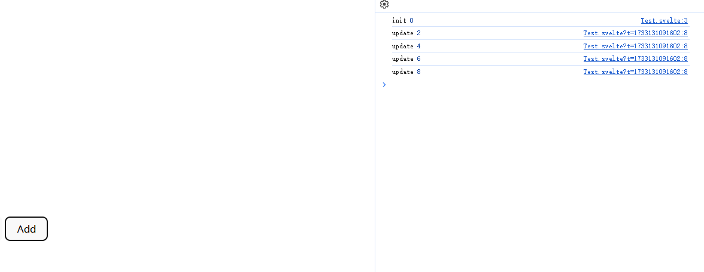

## Introduction of Svelte

`Svelte` 是一个在 web 中构建用户界面的框架。它使用编译器并使用 HTML，CSS 和 Javascript 来编写声明式组件.

> Svelte is a framework for building user interfaces on the web. It uses a compiler to turn declarative components written in HTML, CSS and JavaScript...

`.svelte`后缀的文件是用于构建 Svelte 应用的组件。与`.vue`文件类似，`.svelte`文件包括三部分：`HTML`, `style`, `script`, 其中 `style` 和 `script` 是可选的。

```javascript
// .svelte file

<script module lang="ts">
    // Script module
</script>

<script lang="ts">
    // Script logic
</script>

<style>
    // Style
</style>

```

## Rune(s)

`Runes` 是一个用于在**.svelte**文件中控制 Svelte 编译器的一种特殊符号。

```javascript
let message = $state("hello");
```

### $state

与 React 的 state 相似，`$state` 允许我们创建一个响应状态，让 UI 可以动态地响应数据变化。

```svelte

<script lang="ts">

let count = $state(1)
const onClick = () => count++

</script>

<button onClick={onClick}>
{ count }
</button>

```

如果声明的`stste`是一个数组或对象，state 则会返回一个`proxy`对象

```svelte

<script lang="ts">
    const obj = $state<{ test: number }>({ test: 1 })

    console.log(obj) // Proxy
</script>

<p>{ obj.test }</p> // 1

```


我们也可以使用`class`关键字来使用`$state`

```svelte
<script lang="ts">
  class TestClass {
    num: number = $state(0);
    text: string = $state("");
    constructor(text: string) {
      this.text = text;
    }

    public addCount() {
      this.num++;
    }
  }

  const test = new TestClass("Hello World");
</script>

<button onclick={() => test.addCount()}>Add Count</button>
<p>{test.text} {test.num}</p>
```

- `$state.raw`

如果我们不想在 Array 或 Object 中`深度监听`数据变化，我们可以用`$state.raw`方法声明变量。

```svelte

<script lang="ts">

let test = $state.raw({
    text: "Hello world"
})

test.text = "New Text"

setTimeout(() => {
    test = {
        text: "Text Changed"
    }
}, 2000)

</script>

<p>{test.text}</p>

```

这种方法可以`提高`在大型数组和对象中的`性能`，避免在这样的数据中进行过度的监听。

- `$state.snapshot`

在`$state`进行深度监听数据时，返回的是一个`Proxy`对象，如果我们想获取在某一个时间片段中获取该`Proxy`对象的静态数据，需要用到`$state.snapshot`方法。

```svelte
<script lang="ts">
    const test = $state({ a: 1, b: 2 })
    console.log(test); // Proxy
    console.log($state.snapshot(test)); // { a: 1, b: 2 }
</script>
```

### $derived

类似于 Vue 的`computed`和 React 的`useMemo`, `$derived`可以监听已有的 state 变化而返回经过开发者处理后的数据，例如

```svelte
<script lang="ts">
  let num = $state(1);
  let multiple = $derived(num * 2);
</script>

<button onclick={() => num++}>add</button>
<p>{num} {multiple}</p>
```

- `$derived.by`

`$derived` 可以捕捉到一些基本的数据类型的变化并返回，如果要进行复杂的数据处理，需要用到`$derived.by`方法

```svelte
<script lang="ts">
let arr = $state([1,2,3,4])
let total = $derived.by(() => arr.reduce((a, b) => a + b, 0))
</script>

<button onclick={() => arr.push(arr.length + 1)}>Push</button>
<p>{ arr.join(" + ") } = {total}</p>
```


### $effect

`$effect` 函数会追踪那些**state**和**derived**发生变化，然后重新执行对应的函数。（类似于 React 中的副作用函数 useEffect）
大多数`effects`都用于通过 Svelte 本身创建，例如 `<h1>{ title }</h1>`, 当 title 发生变化时，Svelte 内置的 effect 函数则会调用。
同时，我们也可以通过`$effect`来自定义 effect 函数。

```svelte
<script lang="ts">
  let testNum = $state(0)

  $effect(() => {
    console.log("state is changed: ", testNum)

  })

</script>

<button onclick={() => testNum++}>{ testNum }</button>

```


可以看到当点击按钮 state 发生变化后，先前声明的 effect 函数会进行调用。

需要注意的是，$effect 中只能监听函数内同步读取的依赖，异步读取的数据不会被追踪，例如 `await` 和 `setTimeout` 中的数据

```svelte
<script lang="ts">
  let testNum = $state(0)
  let testDerive = $state(0)

  $effect(() => {
    setTimeout(() => {
      // 依赖不会被追踪
      testDerive = testNum * 2
    }, 0)
  })

</script>

<button onclick={() => testNum++} >{testNum}</button>
<p>testDerive: {testDerive}</p>
```


- $effect.pre

顾名思义，`$effect.pre`会在 DOM 更新之前调用该 effect 函数。

- $effect.tracking

方法会返回一个`布尔值`, 用于查看当前组件是否存在追踪上下文

```svelte
<script lang="ts">
  console.log("Current component is tracking:", $effect.tracking()); // false

  $effect(() => {
    console.log("Current component is tracking:", $effect.tracking()) // true
  })
</script>

<p>in template: {$effect.tracking()}</p> <!-- false -->
```

- $effect.root

改方法会创建一个非追踪并且不会被自动清除的作用域，适用于手动控制内嵌`effect`函数，For example:

```svelte
<script lang="ts">
	let count = $state(0);

	const cleanup = $effect.root(() => {
		$effect(() => {
			console.log(count);
		});

		return () => {
			console.log('effect root cleanup');
		};
	});
</script>
```

### $props

- 与 `Vue` 和 `React` 类似，**$props** 用于获取传入组件的参数

```svelte
<script lang="ts">
  const { test }: { test: string } = $props()
</script>
  
<p>This is a props: { test }</p>
```

### $bindable

从`$props`中传入的数据，通常是从父组件到子组件单向的数据流。如果我们想创建一个从子组件往上流动的数据，则需要使用`$bindable`.

```svelte
<!-- child.svelte -->
<script lang="ts">
  let { test = $bindable() }: { test: string } = $props()
</script>
<input bind:value={test} />


<!-- Parent Component 父组件 -->

<script lang="ts">
  import Child from './child.svelte'
  let label = $state("Hello")
</script>

<Child bind:test={label} />
<p>{label}</p>
```

## $inspect 和 $inspect(...).with

- ⚠ 该方法仅在开发时使用

- 主要用于打印$state和$derived数据的变化，作用是当监听的数据发生变化时，将数据打印到控制台。

```svelte
<script lang="ts">
  let count = $state(0)
  let num = $derived(count * 2)

  $inspect(num)
</script>

<button onclick={() => count++} >Add</button>

```



- `$inspect(...).with` 则是用于自定义debug的方法

```svelte
<script lang="ts">
  let count = $state(0)
  let num = $derived(count * 2)

  $inspect(num).with((type, value) => {
    console.log("custom:", type, value)
  })
</script>

<button onclick={() => count++} >Add</button>

```


## $host

- 该rune为子组件提供了一个可以访问宿主元素并调度自定义事件


```svelte
<svelte:options customElement="my-test" />

<script lang="ts">
	function dispatch(type: string) {
		$host().dispatchEvent(new CustomEvent(type));
	}
</script>

<button onclick={() => dispatch('decrement')}>decrement</button>
<button onclick={() => dispatch('increment')}>increment</button>

<!-- 父组件 -->

<script lang="ts">
  import "./lib/Test.svelte";

  let count = $state(0);

</script>

<main>
  <div class="card">
    <my-test
      ondecrement={() => count -= 1}
      onincrement={() => count += 1}
    ></my-test>
    <p>count: {count}</p>
  </div>
</main>
```

需要注意的是:

- 要使用customElement需要在编译配置中加上`customElement:true`

- 子组件中的customElement命名必须带有`-`，例如`my-test`, `my-example`

```typescript

// vite.config.ts
export default defineConfig({
  plugins: [svelte({
    compilerOptions: {
      customElement: true
    }
  })],
})

```


