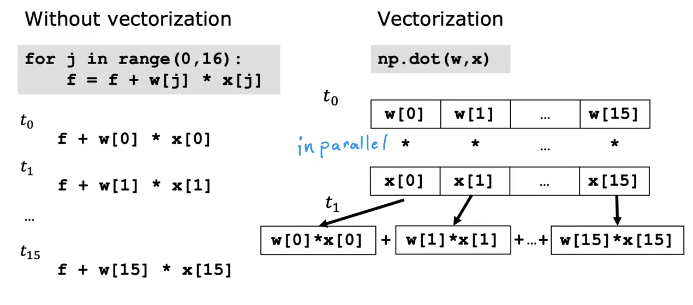

## Multiple Features

- Previously: f\<w, b\>(x) = wx + b

- Now: f\<w, b\>(x) = w1x1 + w2x2 + w3x3 + w4x4 + ... + wnxn + b (Multiple Linear Regression)

## Vectorization

> Using vectorization will both make your code shorter and also make it run more efficiently

### Vectorization how to work on our computer

### Gradient descent for multiple regression
