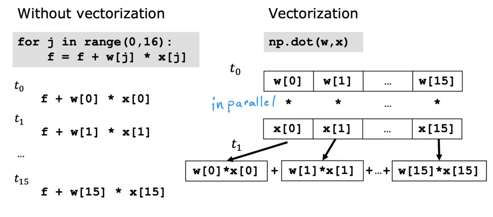

## Multiple Features (variables)

- Previously: f\<w, b\>(x) = wx + b

- Now: f\<w, b\>(x) = w1x1 + w2x2 + w3x3 + w4x4 + ... + wnxn + b (Multiple Linear Regression)

## Vectorization

> Using vectorization will both make your code shorter and also make it run more efficiently

### Vectorization how to work on our computer

### Gradient descent for multiple regression

if 300 <= x_1 <= 2000

x_1, scaled = x_1 / 2000 (max)

0.15 (300 / 2000) <= x_1, scaled <= 1 (2000 / 2000)

## Feature scaling

### Mean Normalization

if you want to calaulate the mean normalization. first of all, you have to calculate the average (x1 on your training set), which is called Mu_1.

x_1 = x_1 - Mu_1 / Max - Min

For example Mu_1 = 600, 300 <= x_1 <= 2000,
so -0.18 (300 - 600) / (2000 - 300) <= x_1 <= 0.82 (2000 - 600) / (2000 - 300)

### Z-scope Normalization

Starndard deviation

## Check Gridient Descent for Converging
