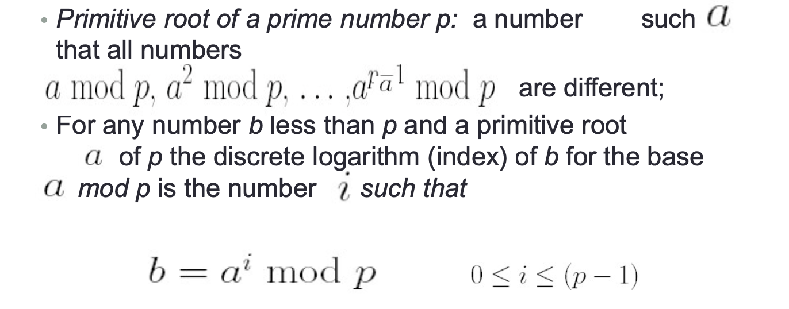
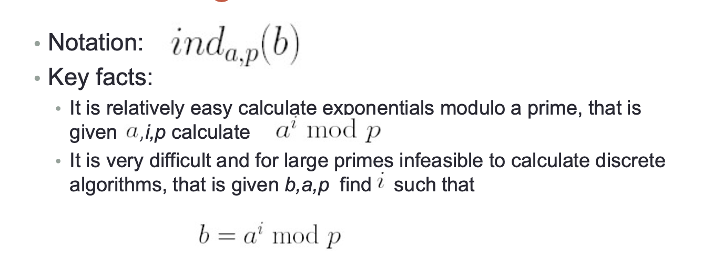
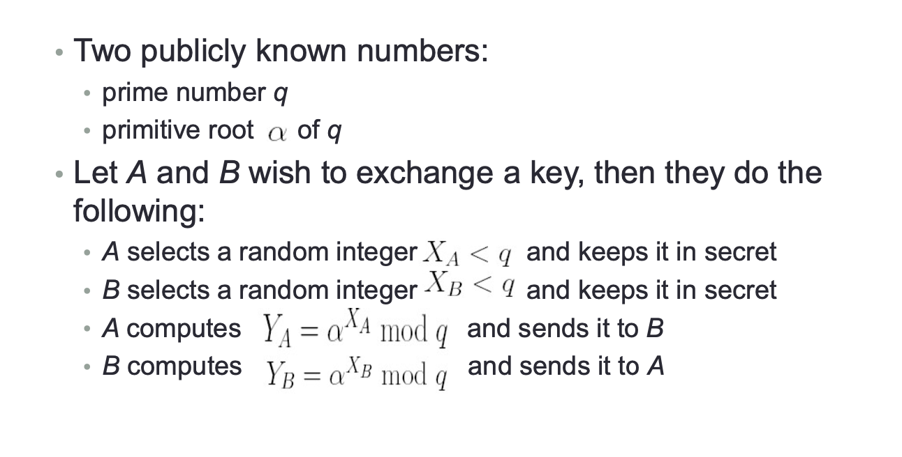
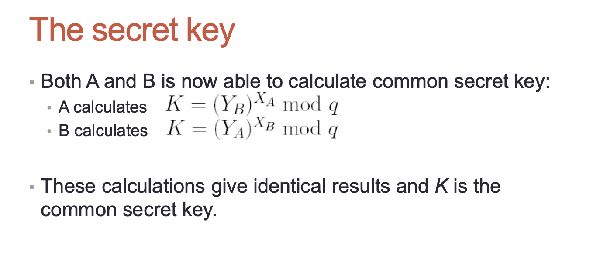
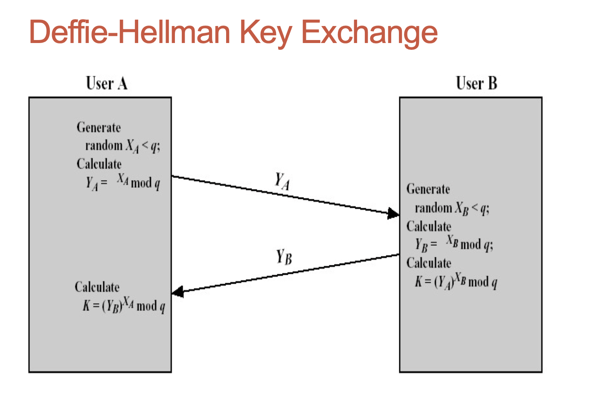
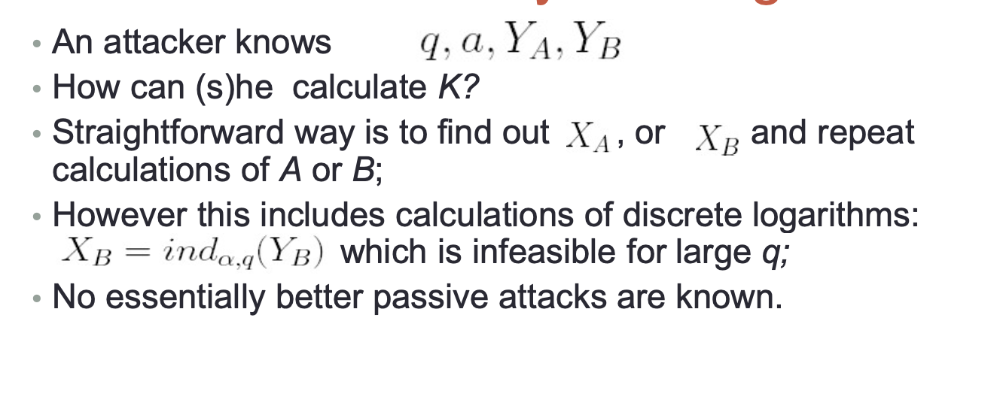
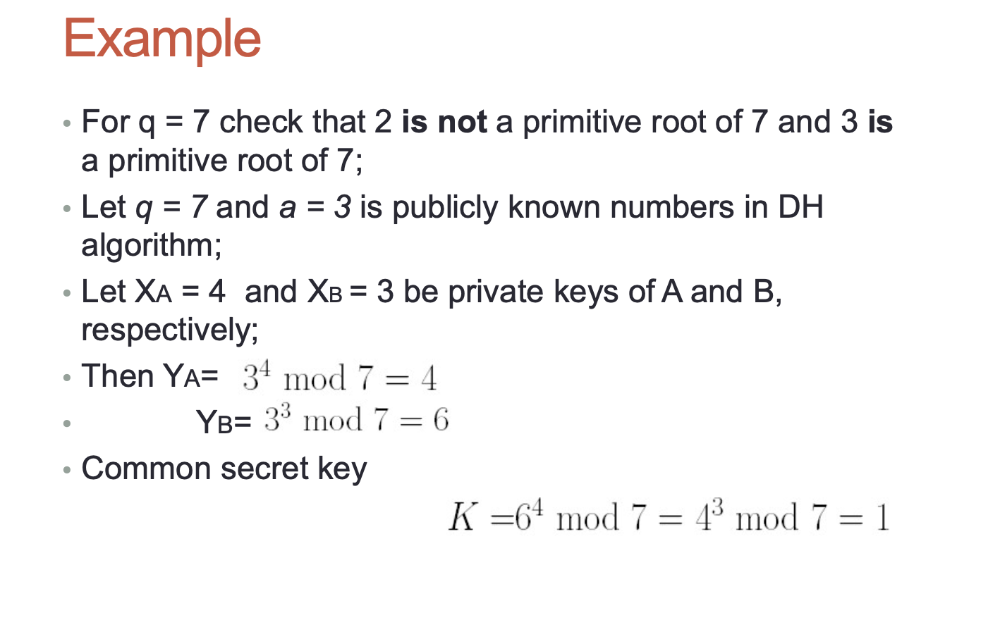

## Key Exchange

- We have seen already how public-key cryptography may be used for public key distribution;
- Public-key cryptography may be used also for key exchange:

  - Two parties (users) execute some algorithm (protocol) and get a common secret key;
  - The key may be used for subsequent encryption of messages;

- Most known algorithm for key exchange is Diffie-Hellman algorithm (1976);
- The purpose of the algorithm is exchange of a secret key (not encryption);
- DH algorithm is considered as a public-key algorithm because:
  - Users to generate the same secret key rely on publicly known information + some private information;
  - In principle, it is possible to generate a key knowing only public information, but it is computationally expensive;

## Discrete logarithms (离散数对)

- Security of DH algorithm relies upon difficulty of computing discrete logarithms;

## Diffie-Hellman key exchange

### How to break HD key exchange?

