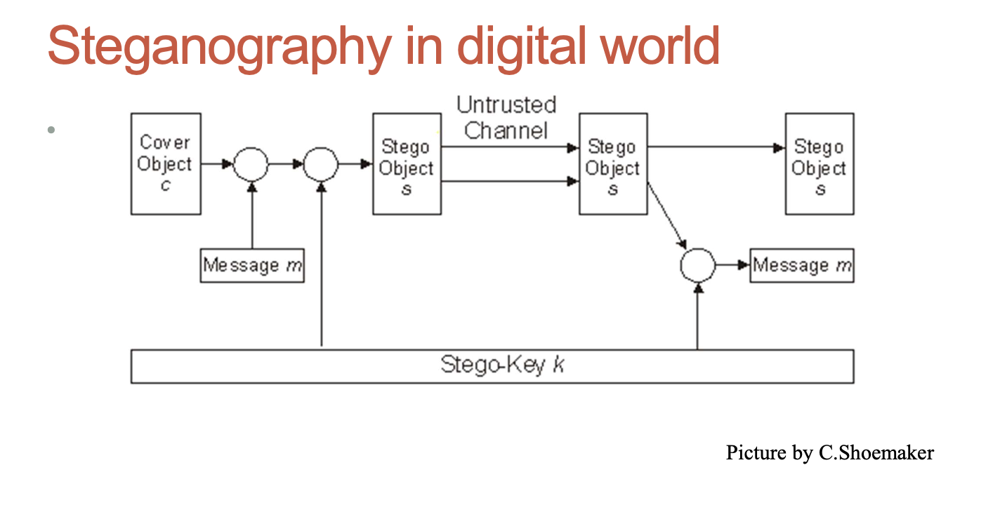

# Steganography

## What to protect

| Level | What to protect      | Method                         |
| ----- | -------------------- | ------------------------------ |
| 3     | Existence of message | Steganography                  |
| 2     | Metadata of message  | Privacy-enhancing technologies |
| 1     | Content of message   | Encryption                     |
| 0     | Nothing              | None                           |

## Steganography and information hiding

- Steganography, derived from “covered writing” in Greek
- It includes the methods of secure communications that conceal the very existence of the message

## Digital watermarking

- aim is to embed an amount of information that could not be removed or altered without making the cover object entirely unusable
- adds additional requirement of robustness as compared with steganography
- Can be used for copyright protection

## Texts as cover objects

- Apparently neutral's protest is thoroughly discounted
- and ignored. Isman hard hit. Blockade issue affects
- pretext for embargo on by products, ejecting suets
- and vegetable oils.

Taking the second letter in each word gives the message: _Pershing sails from NY June 1_

## Images as cover objects

- Least significant bits(LSB) used to store characteristics of particular pixels of an image (cover object) are modified to store a message
- Colours and lightness of pixels of obtained image may differ slightly from original cover image, but both images looks identically to human eye.
- Easy to implement, but not too robust methods
- Transformations of images may easily destroy the message (watermark)
