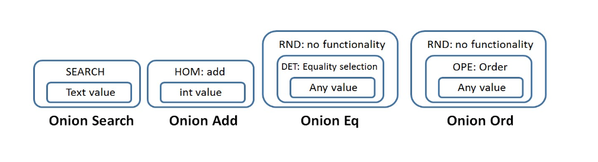

## Homomorphic encryption

> Encryption Enc is called homomorphic with respect to an operation \* if `Enc(x \_ y) = Enc(x) _ Enc(y)` That is given encrypted forms of x and y, in order to compute encrypted form of x\*y one does not need to decrypt Enc(x) and Enc(y)

### Partial vs Fully homomorphic schemes

- Partially homomorphic encryption: with respect just to one operation

- RSA (unpadded) is homomorphic with respect to multiplication

- Fully homomorphic schemes
  - With respect to multiplication and addition
  - Allow to perform arbitrary computations
  - Existence is by no means obvious

### Potential applications

- Computations on not entirely trusted services

  - Encrypt your computational task and send it to a remote server;
  - The server computes over encrypted data and returns an encrypted result;
  - Decrypt result;

- Pipeline processing without revealing intermediate data;

### CryptDB

- To query encrypted SQL database without decrypting;
- Selected fields can be encrypted;
- Low overhead: reducing throughput 15-25%;

### Onion-layered SQL-aware encryption

- All data in CrypDB can be encrypted using several layers of encryption;
  - Each layer may “release” some information about encrypted value
