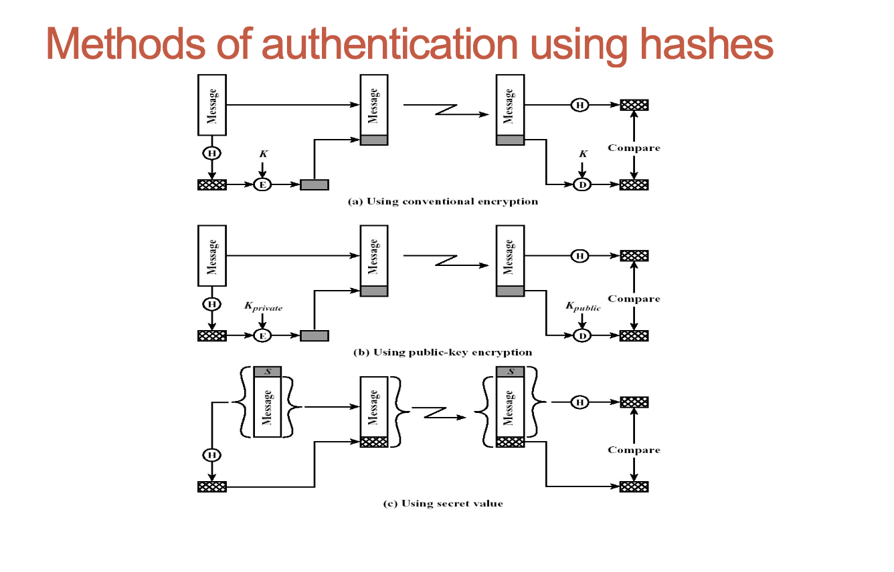
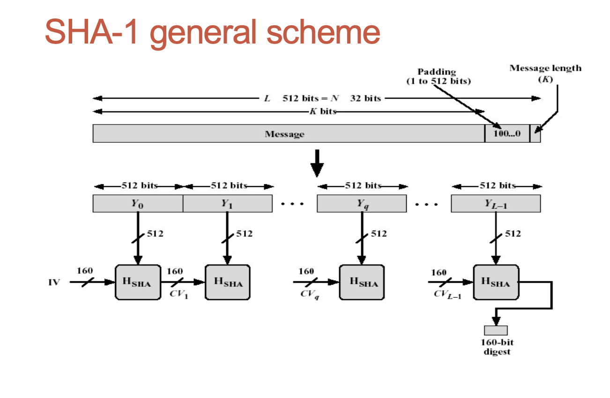

## Message authentication

- Message authentication is a procedure which verifies that received messages are authentic

### Aspects of message authentication

- We would like to ensure that
- The content of the message has not been changed;
- The source of the message is authentic;
- The message has not been delayed and replayed;

### Message authentication techniques

- Using conventional message encryption
- Without message encryption: Generation of a tag is a much more efficient procedure that encryption of the message.

### MAC(Message Authentication Code) algorithms

- The process of MAC generation is similar to the encryption;

- The difference is a MAC algorithm need not be reversible

- Actually, standard encryption algorithms can be used for MAC generation

### One-way Hash functions

- hash functions don’t use a secret key

- “One-way” in the name refers to the property of such functions: they are easy to compute, but their reverse functions are very difficult to compute.

### Hash function requirements

- To be suitable for message authentication, the hash functions must have ideally the following properties
  - H can be applied to a block of data of any size;
  - H produces a fixed-length output;
  - H(x) is easy to compute for any given x;
  - For any value h it is very difficult (infeasible) to compute x such that H(x)=h (one-way property);
  - For any given x, it is very difficult (infeasible) to find y (not equal to x) such that H(x) = H(y); (weak collision resistance);
  - It is very difficult (infeasible) to find any pair (x,y) such that H(x) = H(y); (strong collision resistance).

### Simple hash function

- Let the input be a sequence of n-bit blocks
- Then simple hash function does bit-by-bit exclusive-OR (XOR) of every block
- Simple hash function does not satisfy the weak (and strong) collision property;

### The SHA-1 Secure Hash Algorithm

- It has been used in the sample program illustrating password-based encryption (practical sessions);
- Takes as input a message with a maximum length
- less than 2 to power 64 bits and produces as output a 160-bit message digest;
- The input is processed in 512-bit blocks;
- Each bit of the output is computed using all bits of the input.

