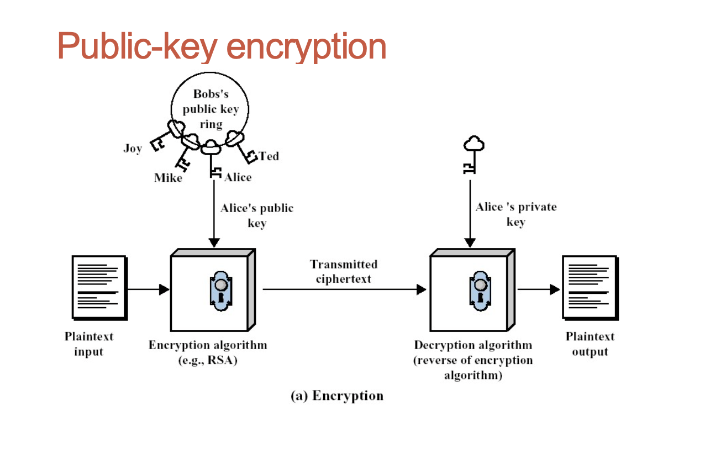
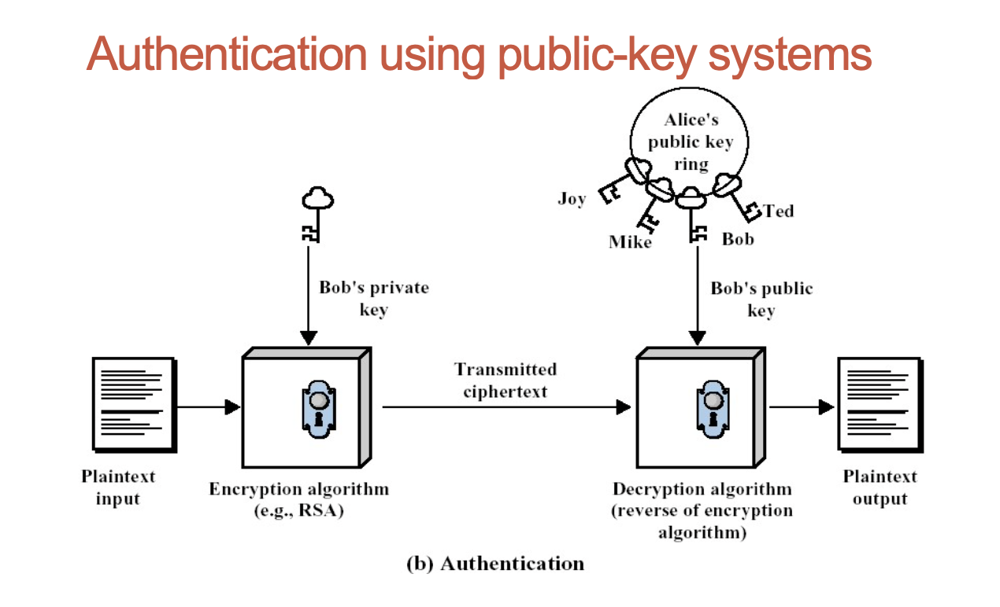
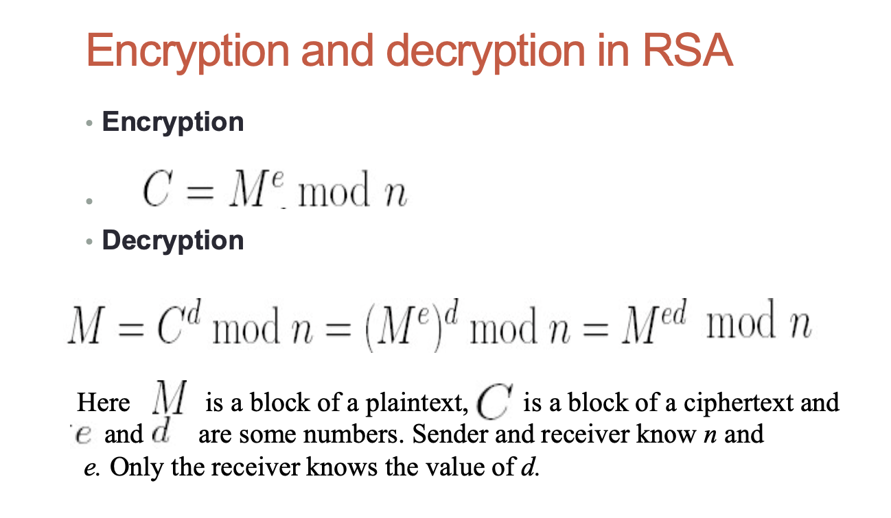
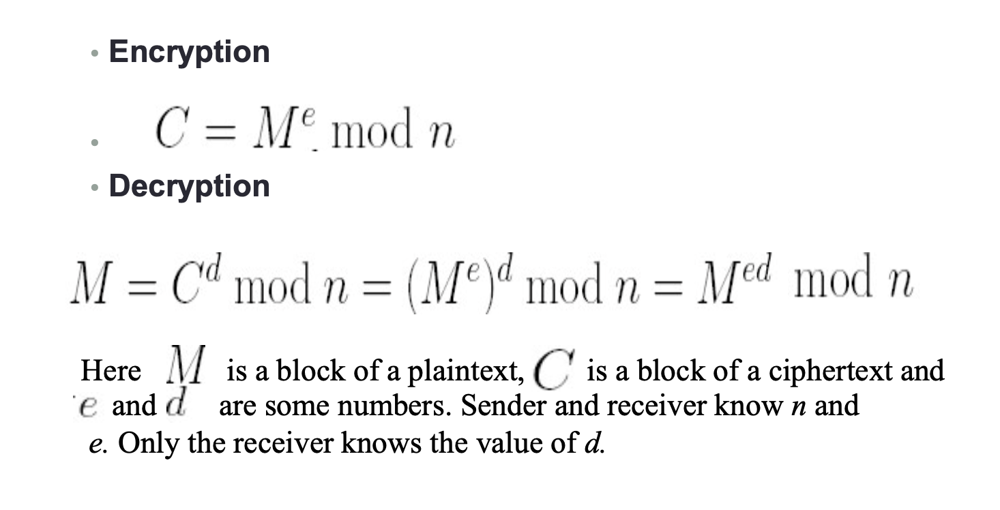
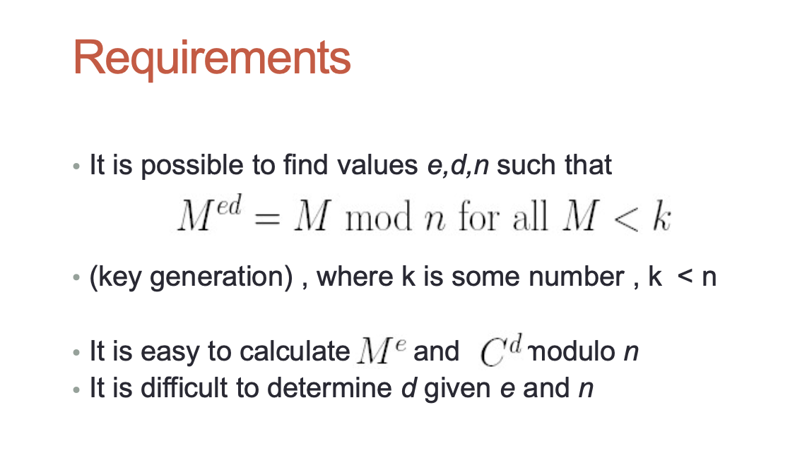
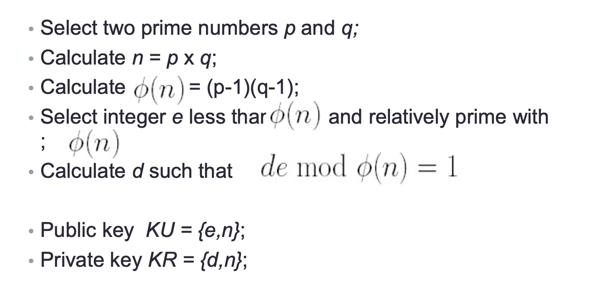
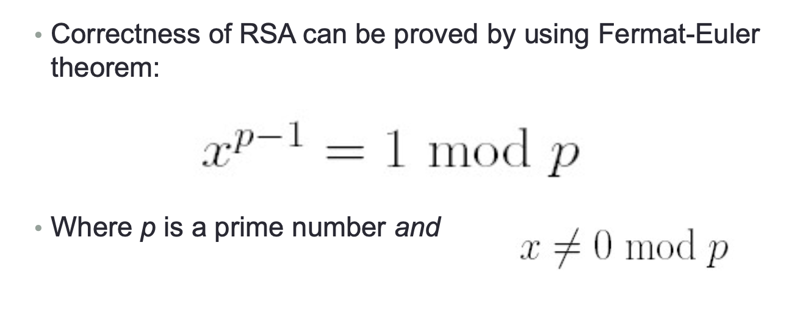
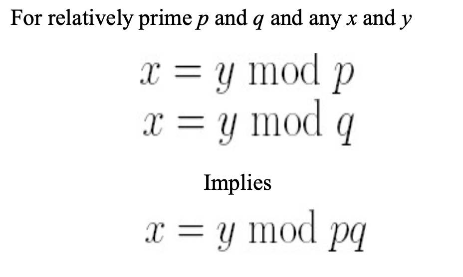

## Public-key, or asymmetric encryption

- Public-key encryption techniques. It is particular and most important kind of
- Asymmetric encryption (or asymmetric key encryption):
  - One key is used for encryption (usually publicly known, public key);
  - Another key is used for decryption (usually private, or secret key)

### Essential steps in communications using public-key encryption

- Each user generates a pair of keys;
- Each users makes one of the key publicly accessible
  (public key). The other key of the pair is kept private;
- If B wishes to send a private message to A, B encrypts
  the message using A’s public key;
- When A receives the message, A decrypts it using A’s private key. No other recipient can decrypt the message
  - nobody else knows A’s private key.

## Public-key encryption

- Advantages

  - All keys (public and private) are generated locally;
  - No need in distribution of the keys;
  - Moreover, each user can change his own pair of public/private key at any time;

- Disadvantages
  - It is more computationally expensive.

### Public-Key Cryptosystems

- Encryption/decryption: the sender encrypts a message with the recipient’s public key.
- Digital signature (authentication): the sender “signs” the message with its private key; a receiver can verify the identity of the sender using sender’s public key.
- Key exchange: both sender and receiver cooperate to exchange a (session) key.

- Diffie and Hellman conditions
  - "Easy part"
    - It is computationally easy for a party B to generate a pair (public key , private key).
    - It is computationally easy for a sender A, knowing the public key of B and the message M to generate a ciphertext:
    - It is computationally easy for the receiver B to decrypt the resulting ciphertext using his private key
  - Difficult part
    - It is computationally infeasible for anyone, knowing the public key, to determine the private key
  - Additional useful requirement (not always necessary)
    - Either of the two related keys can be used for encryption, with the other used for decryption.

### Public-key cryptography and number theory

- Many public-key cryptosystems use non-trivial number theory(非平凡数论？？？);

- Security of most known RSA public-key cryptosystem is based on the hardness of factoring big numbers (基于分解大数的难度);

- We will overview basic notions of divisors, prime numbers, modular arithmetic

### Divisors and prime numbers

- Divisors
  - Let a and b are integers and b is not equal to 0;
  - thenwesaybisadivisorofaif thereisanintegerm such that a = mb;
- Prime numbers(质数)
  - An integer p is a prime number if its only divisors are 1, - 1, p, -p

### gcd(最大公约数) and relatively prime numbers

- gcd(a,b) is a greatest common divisor of a and b
  - Examples: gcd(12, 15) = 3; gcd(49,14) = 7.
- a and b are relatively prime if gcd(a,b) = 1.
  - Example: gcd (9,14) = 1.

### Modular arithmetic（模运算）

- If a is an integer and n is a positive integer, we define a mod n to be the remainder when a is divided by n:
  - a = qn+r,
    - Hereqisaquotient andr=amodn
- If (amodn) = (bmodn)then a and b are congruent modulo n;
- It is easy to see,that (amodn) = (bmodn) iff n is a divisor of a-b.

### Modular arithmetic. Properties

- \[(amodn)+(bmodn)\] mod n = (a+b) mod n
- \[(amodn)–(bmodn)\] mod n = (a-b) mod n
- \[(amodn) x (bmodn)\] mod n= (axb) mod n
- Example: 3 mod 5 x 4 mod 5 = 12 mod 5 = 2 mod 5

## RSA algorithm

- One of the first, and probably best known public-key scheme;
- It was developed in 1977 by R.Rivest, A.Shamir and L. Adleman;
- RSA is a block cipher in which the plaintext and ciphertext are integers between 0 and n-1, where n is some number;
- Every integer can be represented, of course, as a sequence of bits;

### Private and Public keys in RSA

- Public key KU = {e,n};
- Private key KR = {d,n};
- Requirements:

  - It is possible to find values e,d,n such that
  - It is easy to calculate

- It is possible to find values e,d,n such that

- (key generation) , where k is some number , k < n

- It is easy to calculate and modulo n • It is difficult to determine d given e and n

### Key generation

### Fermat – Euler Theorem

### Chinese Remainder Theorem

- Select two prime numbers, p = 17, q = 11;
- Calculate n = pq = 187;
- Calculate = 16 x 10 = 160;
- Select e less than 160 and relatively prime with 160;
- Lete=7;
- Determinedsuchthat demod160=1andd<160.The correct value is d = 23, indeed 23 x 7 = 161 = 1 mod 160.
- Thus KU = {7,187} and KR = {23,187} in that case.

### Security of RSA

- Relies upon complexity of factoring problem:
- Nobody knows how to factor the big numbers in the reasonable time (say, in the time polynomial in the size of (binary representation of ) the number (unless you go to quantum computing!) ;
- On the other hand nobody has shown that the fast factoring is impossible;
