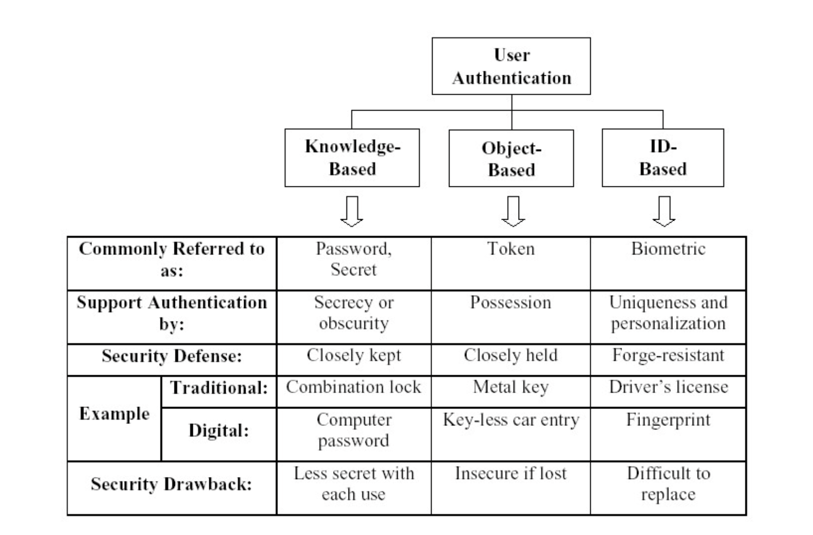
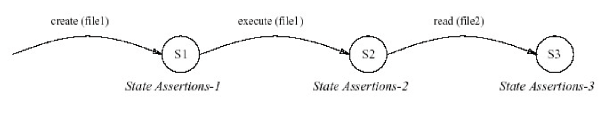

## Part 1 Identification And Authentication

Identification: Who are you? Associating an identity with a subject.
Authentication: Establishing the valid of something.
Authorisation: Associating rights or capabilities with a subject.

### Authentication

- Authentication is a process of verifing the identity of a user, device, or other entire computer system.
- Authentication is used for the purpose of performing trusted communications between parties for computing and telecommunications applications.
- Classfication:
  1. Machine by Machine
  2. Human by Machine
- Human vs Machine: Human is much less secure than machine authentication, but a good security guard can prove invaluable

- Password

  - Password: a word, or a phase, or a personal identification number to kept as a secure and is used for authentication.

  - Advantages:

    1. Easy to implement.

  - Disadvantages:

    1. An easy work is lack of secure, but an complex number is hard to remember.
    2. May be passed to other people.
    3. Can be guessed.

- Token:

  - Physical token is a physical device which perform or help authentication.
  - Token is based on what you have.

  - Disadvantages:

    1. Can be easy to copy.
    2. If the token is lost, the owner can not have an access.
    3. Anybody who has possession of the token can gain access

- Multi-factor authentication techniques

  - Purpose: To increase security. In some applications tokens are combined with other means of identification. Example: (PIN)

- New Type of Attack

  1. Cache attack: Based on attacker's ability to monitor cache access made by the victim in a shared physical system as in a virtualized environment or a type of cloud service.

  2. Timing attack: Based on measuring various computations take to perform.

  3. Power-monitoring attack: Attack that make use of varying power comsumption by the hardware during computation.

- Biometrics

  - A biometric is a feature measured from the human body that is distinguish enough to be used for user authentication. Example: Fingle print, retina scan.

  - Advantages:

    1. Cannot be copied, or stolen.
    2. Cannot be lost.

  - Disadvantages:

    1. High-Cost
    2. Complicated technology
    3. Specialize hardware

### Data aggregation Anonmity And Pseudoanonimity

- Terminology

  - Personal information: Information about a person
  - Private information: Personal information that is not generally know
  - GDPR: Unless a data subject has provided informed consent to data processing for one or more purposes, personal data may not be processed unless there is at least one legal basis to do so.
  - Personally identifitable information: Information from which a person identity can be derived.
  - Anonymized information: Information from which a person identity cannot be derived.
  - Aggregate information: Statistical information combined from many individuals to form a single recoed.

- Privacy threat on anonymized information

  1. Combining seemingly anonymous information one may reveal identity with high probablity.
  2. You actually ask for personally identifitable information, even though it looks as anonymized.

- Open Source Intelligence Gathering (OSINT)

  1. Broadcast message for a public audience
  2. Available to public request
  3. Available to subscription or purchase.
  4. Could be seen or heard by any casual observer
  5. Made available at a meeting open to the public
  6. Obtained by visiting any place or attending any event that is open to the public

- Source of personal and private information

  1. User-Privided Information.
  2. Information obtain by observation of users activities or trace their left.

- Anonymized in communications.

  - Purpose: To protect privace
  - Method: Third trusted party service

- Anonymizer

  - It can provide:

    1. It does not leave information about your request on the web-server when you request a web page.
    2. It may provide encryption of traffic between an user and itself.
    3. It can blocking and removing potential active privacy and security threats.

  - Advantages:

    1. Good protection and reasonable cost.
    2. Privacy protection is based on the trusted central proxy.

  - Disadvantages:
    1. It cannot protect inner attacks.

- Crows:

  - Principle: When the request submitted to the end server, it is submitted by a **random** of a crowd. Members of crowd cannot know the initiator because the just send post a message to the end server.

- Mix-Network:

  - Processes:

    1. The message will be sent through a sequence of mix nodes. The user encrypt message with Node p key.
    2. When the node receive a encrypt data, decrypt them, then use its key to encrypt the message and send to next node.
    3. Every node only knowns previous and next nodes in the route.

  - Advantages:

    1. Good protection.

  - Disadvantages:

    1. Very expensive than anonymized solution.

- Crowds vs Mix-Network

  1. An attacker can compromise anonymity of all users in crowds.

  2. Crowds does not provide anonymity against a global adversary able to observe all communications. But Mix-Network can provide anonymity in this scene.

  3. Crowds admit very efficient implementations because it have not encryption/decryption operations.

## Part 2 Monitoring And Intrusion Detection

### Audit AND Intrusion Detection

- Information of protection

  | Level | What to protect      | Method                       |
  | ----- | -------------------- | ---------------------------- |
  | 3     | Existance of message | Steganography                |
  | 2     | Metadata of message  | privacy-enhancing technology |
  | 1     | content of message   | encryption                   |
  | 0     | Nothing              | None                         |

- Anti-intruction methods

  - Prevention: To preclude, or seriously reduce likelihood of a particular attack.
  - Pre-emption: To strike against the threat before it could strike against us.
  - Deterrence: To persuade an attacker not to launch attack, or to stop ongoing attack.
  - Deflection: To trick away an intruder from where he could do some damage.
  - Detection: Aims to find intrusion attempt and launch countermeasures.
  - Countermeasures: To actively counter an intrusion.

- Intrusion detection is the most important of Anti-intruction methods.

- Elements of IDS

  - Audit collection: Collect data for intrusion detection.
  - Audit storage: Stores the data for furthe processing.
  - Processing: Based on collect data, algorithms are executed to find evidence of the suspicious behaviour.
  - Configuration data: Specify the way IDS works. (how to collect data, how to respond to detected attack)
  - Reference data: Information about bad/normal behaviour.
  - Active/Processing data: intermediate results, which should be stored during processing.
  - Alarm

- Types of IDS

  - Network-based IDS

    - Monitor network backbones.
    - Distribution among different nodes in the network.
    - Disadvantage: not easy to detect an attacker.
    - Disadvantage: may not be able analysis the traffic in large busy network.

  - Host-based IDS:

    - Operate on host.
    - defence and monitor the operating and file systems for sign of intrusion.
    - Usually monitor activities of higher level of details.

  - Application-based IDS: deal with the events appearing inside of a particular application.

- IDS Methods

  - Anomaly based intrusion detection （基于异常）

    - System reacts abnormal behavious. Behaviour profiles are used and system is able to learn what is a "normal" behaviour
    - Advantages:

      1. Possibility of detection of novel attacks（新颖的攻击） as intrusions.
      2. Less dependence of IDSs on operating environment.
      3. Ability to detect abuse of user privileges.

    - Disadvantages:

      1. A substantial false alarm rate.
      2. Requireing a constant update of the normal behaviour profile database.

  - Knowledge based detection

    - Systems tries to match the explicit policies/signatures with the data collected to find an evidence of the suspicious behaviour.
    - Advantages:

      1. Very low false alarm rate.
      2. Simple algorithms, easy implementation.

    - Disadvantages:

      1. Difficults in updating informations on new types of attacks.
      2. Unable to detect unknown attacks.

### Techniques of intrusion detection

- Statistical analysis

  - The user or system behaviour is measured by a number of variables over time.
  - The frequency of updating can vary from minutes to months.
  - The system stores mean values for each variable used for detecting exceeds that of a predefined Threshold.

- Neural networks and machine learning

  - Neural networks use their learning algorithms to learn about the relationship between input and output data.
  - Purpose: To learn the behaviour of actors in the system.
  - Advantages:

    1. A sinple way to express nonlinear relationships between variables.
    2. Learning about relationships automatically.

  - Disadvantages:

    1. It still a computationally intensive technique.

  - It can be used to predict behaviour of users and super-users.

- Rule based

  - Work on a previously defined set of rules describing an attack.
  - All security related events are translated in terms of if-then-else rules.
  - Inference engine maybe used to infer conclusions. ???

- State-transition analysis

  - An attack is described with a set of goals and transitions that must be achieved by an intruder to compromise a system.
  - Transitions are represents on state-transition diagrams.

    

- Immune system based techniques

  - The model consists two parts:

    1. Audit data representing the appropriate behaviour of services.
    2. knowledge base with all the known “good” sequences of system calls.

  - Description: Store patterns are used for monitoring of system calls to check whether the sequence generated is listed in the knowledge base. If not, an alarm is generated.

  - Advantages:

    1. Potentially very low false alarm rate if the knowledge based complete enough.
    2. Updating the knowledge base can be done on-line.

  - Disadvantages:

    1. If an attacker uses legitimate actions on the system to gain unauthorized access, no alarm is generate.
    2. Arguments of system calls are not taken into account.

- Signature based method

  - Example: `alert icmp $EXTERNAL_NET any -> $HOME_NET any (msg:"MISC large ICMP"; dsize: >800; reference:arachnids,246; classtype:bad-unknown; sid:499;)`

  - Advantages:

    1. Very low false alarm rate.
    2. Simple algorithm, easy implementation.

  - Disadvantages:

    1. Difficulties in updating information on new types of attacks.
    2. Unable to detect unknown attacks.

- User intention identification

  - This technique models normal behaviour of users by the set of high-level tasks they have to perform on the system.
  - These tasks are taken as series of actions, which in turn are matched to the appropriate audit data.
  - If mismatch is encountered, an alarm is produced.

- Data mining

  - Description: Set of techniques that use the process of extracting previously unknown information from large stores of data.

## Part 3 Protocol And Algorithms

### 1. Protocol Design

The main factors of protocol is:

- Syntax: To define the structure and format of the protocol
- Semantics: To define the meaning of data and ensure both parties know the meaning of each expression
- Timing: To establish the sending and receving data sequence of the protocol

### 2. Cryptography for secrecy for signing

Cryptography is a collect of mathmatical techniques for protecting information.

Type of cryptography:

1. Type of operations used:

   - Subsitution
   - Transpositions

2. The way in which plaintext is processed

   - Block cipher
   - Stream cipher

### 3. Symmetric key and asymmetric protocols

- Symmetric encryption: Encryption and Decryption are use a same secret key.
  Example: DES, AES, 3DES
- Asymmetric encryption: Encryption uses public key, while decryption uses pricate key.
  Example: RSA

### 4. 3DES and RSA

The process of Feistel cipher algorithm:

1. Choose 2 plaintext blocks (2w bits)
2. Divide 2w into 2 parts L_0, R_0
3. Two parts going through n rounds
4. Every round, function F applied to the right half, the result is XOR'ed with the left half of the data round.

DES (Data Encryption Standard):

1. Each block have 64 bits
2. Secret key have 56 bits
3. Number of round 16

3DES: Use DES for 3 times

C = E_k3[D_k2[E_k1[P]]]
P = D_k1[E_k2[D_k3[C]]]

AES (Advanced Encryption Standard):

1. Key size is 128, 192 or 256
2. Number of round is 10, 12, 14
3. Every block of 128 bits is presented as 4 by 4 array of bytes

### 5. Logical representation of protocols

- Security protocols: it is a set of rules that is in order to ensure achieving various security or privcy goals.

- The correctness of protocols depends on the assumption on capabilities of possible intruder.
- Assumptions are often left implicit(入侵者).

- Logical representation: Logical representation and analysis of the security protocols is a particular successful approach for the protocols verification.

- Protocol analysis using a logic
  - M. Burrows, M.Abadi, R. Needham (BAN Logic)
  - Suitable for formal analysis of authentication protocols.
- formula of BAN logic
  1. Believes: P is entitled to conclude that X is true, or P has a justification for X;
  2. Sees:
     The principal P receives a message containing X.
     P might need to perform decryption to extract X.
     X can be a statement or a simple item of data.
     P does not necessarily believes X.
  3. Controls: P has jurisdiction over X, or P is trusted as an authority on X
  4. Said: At some point in the past, P is known to have sent a message including X
  5. Fresh: X has not been sent earlier
- Example of formula of BAN logic

  1. If P believes that it shares a secret key K with Q, and if P receives
     a message containing X encrypted with K then P believes that Q once said X.

     > P believes P <-key-> Q, P sees {X}K ==> P believes (Q said X)

  2. If P believes that Q once said X, then P believes that Q once believed X (by main assumption). If additionally P believes X is fresh then P must believe that Q currently believes X.

     > P believes Fresh(X), P believes (Q saids X) ==> P believes (Q believes X)

  3. If P believes that Q has control over whether or not X true and if P believes that Q believes it to be true, then P must believe in it also. The reason is Q is an authority on the matter as far as P is concerned.
     > P believes (Q controls X), P believes (Q believes X) ==> P believes X

### Applications

Encryption:
Symmetric encryption: DES, 3DES, AES
Asymmetric encryption: RSA

RSA

- It is a block cipher in which the plaintext and ciphertext are integers between 1 and n - 1.
- based on hardness of factoring big numbers.
- Encryption: C = M^e mod n, in which M is plaintext, e is a random number, and n is a prime number
- Decreption: M = C^d mod n = (M^e)^d mod n = M^ed mod n
- Requirements:

  1. Easy to calculate.
  2. It is possible to find e, d and n.

- Key Generation

  1. Select **2** prime numbers `x`, `y` --------- (17, 11).
  2. Calculate `O(n)` = (x - 1)(y - 1) ---- (16 \* 10) = 160.
  3. Choose a prime number `e` that less than O(n) ---- 7.
  4. Calculate `d`, use de mod O(n) = 1 and d < O(n) ---- 7d mod 160 = 1, d = 23.
  5. Public Key = {e, n}, Private Key = {d, n}.

- Discussion

  - Advantages:
    1. High security.
    2. Public keys and private keys are published in a third trust service, so the key distribution is separately.
  - Disadvantage:
    1. It needs high computation computer.
    2. It cannot defence against quantum computation attacks.
    3. It can be brute force by a program as computers become more and more powerful.

- Diffie-Hellman key exchange

  - Purpose: The purpose of this algorithm is exchange of a secret key. And it rely on discrete logarithms.
  - It is considered as a public key algorithm because:
    1. That is rely on public information and some privacy information.

- Message authentication and hash function(消息认证)

  - Message authentication is a procedure which verifies that received messages are authentic.
  - Aspect of message authentication
    1. The content of the message has not been changed.
    2. The source of the message is authentic.
    3. The message has not been delayed and replayed.
  - Techniques:
    1. Using conventional message encryption.
    2. Without message encryption.
  - Message Authentication Code
    1. A and B have a same secret key K.
    2. A would send a message to B, then calculate a MAC(K, M) using secret key.
    3. A Send message and MAC to B

- One way Hash Functions
  Hash Function don't use secret key

  - Requirements:
    1. H can be applied to a block of data of any size.
    2. H has fixed-length output.
    3. H is easy to compute for any given message.
    4. For any value h is very difficult to compute x.
    5. For any given x, it is very difficult to find y, such that H(x) = H(y)
    6. It is very difficult to find any pair (x,y) such that H(x) = H(y);
  - SHA-1
    1. input processed in 512-bits block.
    2. output a 160 bits message diest.

- Identification
  - Associating an identity with a subject.

## Part 4 Advanced Crypto

### Homomorphic encryption

- Equation
  1. Operation \*, Enc(encryption): Enc(a \* b) = Enc(a) \* Enc(b)
- Partial Homomorphic encryption: just to one operation
- Fully Homomorphic scheme:
  1. Multiple operation and addition.
  2. Allow perform arbitary computations.
  3. Existence is by no means obvious???

### CryptDB

- To query encrypted SQL database without decrypting
- Low overhead.

### Zero - knowledge proofs

- 3-colorability

  1. Alice hides her solution, and allows Bob to choose any pair of vertices.
  2. Alice reshuffles actual colours, hides modified solution, then allows Bob to open any pair of vertices again.
  3. Repeat Step 2 until Bob convince.

- Requirements

  1. Completeness: Prover should be able to convince Verifier that he has true solution
  2. Soundness: It should be able to convince Verifier only in true solutions.
  3. Zero-knowledge(nedd): Verifier should not be able to learn anything but the Prover has a solution.

- Inactive and Non-inactive

  | Features ｜ Inactive ｜ Non-inactive |
  | ------------------------------------ | -------------------------------- | --------------------------------- |
  | Inactive                             | Need                             | No                                |
  | Efficient                            | Slow                             | Fast                              |
  | Security                             | High security                    | Low security                      |
  | Scene                                | Suitable for high security scene | Suitable for high efficient scene |

### Secure MPC(Multi Party Computations)

- The process of Yao's Protocol
  1. P1 has x, P2 has y. In which x and y are private value.
  2. P1 would like to use two random keys Kx and Ky calculate F(x, y), then tabulate in table T(Tx, y).
  3. P1 send T(Tx, y) to P2.
  4. P1 send random keys Kx and Ky to P2.

## Part 5 Legal And Social Issues

Rapid developments computer systems, networks and give rise for

- New threats for security and privacy
- New defensive measures;

### Legal

- Restriction on Cryptography

  1. Cryptography and Patent system
  2. Cryptography and Trade secret Law
  3. National and International regulations of cryptography
  4. Digital Rights management

- Patent system

  1. Early development of cryptographic protocols and systems was influenced by patent law;
  2. Many important techniques, including public key cryptography have been patented. including (Diffie-Hellman, RSA)
  3. In general, one of the results of the patent protection appeared to be reduced use of the invention.

- Trade secret Law

  1. Until recently many encryption algorithms were kept as proprietary, secret and protected by the trade secret provisions;
  2. The idea was that one could achieve additional security for the encrypted data by keeping the encryption algorithms themselves secret;
  3. There are still many patented algorithms and they are protected by law

- National and International regulations

  - National
    1. Cryptography can be used to hide criminal activities
    2. Strong cryptography can make difficult, or almost impossible to conduct search warrants by legal authorities;
  - International
    1. Strong cryptography can make impossible to decrypt correspondence by military, economical.

- Clipper chip

  - Escrowed Encryption Standard:

    1. A cheap tamper-proof chip,each with unique ID;
    2. A classified encryption algorithm;
    3. A back door is embedded and government has a copy of a key used in every such a chip, so when authorized, every encrypted message can be decrypted

  - Potential Problems with Clipper chip

    1. The potential for insider abuse;
    2. The creation of new vulnerabilities and targets for attack;
    3. The difficulties of properly authenticating requests for keys;
    4. The cost;

  - International agreements on Cryptograph

    1. Allows export of mass-market software;
    2. Allows export of all products that use encryption to protect intellectual property

  - Digital Rights Management

    1. criminalizes production and dissemination of technology for circumventing the control access for the copyrighted works

### OECD Guidelines

- the Organization for Economic Development and Cooperation adopted a set of privacy guidelines:

  1. Collection Limitation Principle: there should be limits to the collection of personal data, and any such data should be obtained by lawful and fair means;
  2. Data Quality Principle: personal data should be relevant to the purposes for which it is to be used, should be accurate, complete, and kept up to date.
  3. Purpose Specification Principle: the purposes for which personal data is collected should be specified not later that at the time of data collection and the subsequent use limited to the fulfilment of those purposes;
  4. Use Limitation Principle: Personal data should not be disclosed, made available, or otherwise used for purposes others that those specified in advance.
  5. Security Safeguards Principle: personal data should be protected by reasonable security safeguards again such risks as loss, unauthorized access, destruction.
  6. Openess Principle: there should be a general policy of openess about developments, practices and policies with respect to personal data.
  7. Individual Participation Principle:

     - To obtain the data from a data controller. Confirmation of whether or not the data controller has data relating to him;
     - To be given reasons if a request made specified as above is denied, and to be able to challenge such denial;
     - To challenge data relating to him and, if the challenge is successful to have the data erased, rectified, completed, or amended.

  8. Accountability principle: a data controller should be accountable for complying with measures which give effect to the principle stated
