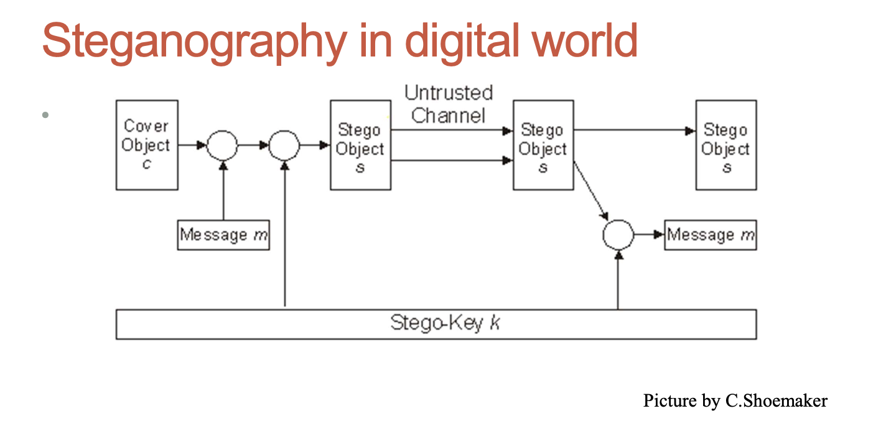

# Steganography

## What to protect

| Level | What to protect      | Method                         |
| ----- | -------------------- | ------------------------------ |
| 3     | Existence of message | Steganography                  |
| 2     | Metadata of message  | Privacy-enhancing technologies |
| 1     | Content of message   | Encryption                     |
| 0     | Nothing              | None                           |

## Steganography and information hiding

- Steganography, derived from “covered writing” in Greek
- It includes the methods of secure communications that conceal the very existence of the message

## Digital watermarking

- aim is to embed an amount of information that could not be removed or altered without making the cover object entirely unusable
- adds additional requirement of robustness as compared with steganography
- Can be used for copyright protection

## Texts as cover objects

- Apparently neutral's protest is thoroughly discounted
- and ignored. Isman hard hit. Blockade issue affects
- pretext for embargo on by products, ejecting suets
- and vegetable oils.

Taking the second letter in each word gives the message: _Pershing sails from NY June 1_

## ./images/images as cover objects

- Least significant bits(LSB) used to store characteristics of particular pixels of an ./images/image (cover object) are modified to store a message
- Colours and lightness of pixels of obtained ./images/image may differ slightly from original cover ./images/image, but both ./images/images looks identically to human eye.
- Easy to implement, but not too robust methods
- Transformations of ./images/images may easily destroy the message (watermark)

## Advantages and disadvantages of LSB

### Advantages of LSB

- easy to implement
- has high capacity

### Disadvantages of LSB

- is not robust
- message is easy to detect
  - A message insertion introduces distortion to the statistical properties of ./images/image which never naturally appear.

## Stochastic modulation method

- Simple variant:
  - Before embedding a message a randomly chosen pixels are altered by changing their intensities (= a number between 0 and 255) by +1 or –1;
- For a parameter p in [0;1] a pixel intensity is increased/decreased by 1 with probability p; it is left unchanged with probability 1-2p;
- Then LSB method is used
- Provide more protection against detection of the message

- Improved method (J.Fridrich, M.Goljan):
  - take a cover ./images/image and add a “noise” modulated by a message bits
  - “noise” actually means pseudo-noise here , that is a sequence of pseudo-random values, which can be generated deterministically given a secret initial value (key)
  - If initial value (key) is known then generation of pseudo- noise can be repeated (used for extraction of the message)

### Stochastic modulation

- Simple implementation;
- High capacity;
- Low embedding and extraction complexity
- Embedding noise can have arbitrary characteristics and may approximate the noise of a given device => high security

## Transform space algorithms

- Jsteg algorithm (D.Upham) uses specifics of JPEG ./images/image format
- For each colour component JPEG ./images/image format uses discrete cosine transform (DCT)
- JPEG: after quantization DCT coefficients are stored; • Jsteg algorithm:
  - Replace sequentially the least-significant bit of discrete cosine transform coefficients with the message data
- Gives better protection (as many others TS algorithms) against visual attacks

## Audio (video) files as cover objects

- LBS can be used, but it introduces a significant noise to audio data ;
- A message may be encoded in audio signal phase, replacing original phase with a reference phase representing a hidden message;more difficult to implement;
- Spread spectrum method: encoded data spread across the maximum range of frequencies; difficult to detect hidden message;
- Video objects (files, streams) can be used for hiding information as well;

## Network packets as cover objects

- Steganography within TCP/IP:
  - Insert data within TCP and IP protocol headers
  - IP identifier, TCP initial sequence number, least significant bit of TCP timestamp, IP flags.
  - Relatively easy to detect naive embedding by anomaly detection in TCP/IP fields
- One can prevent easy detection by taking into account the properties of concrete implementations of TCP/IP (Murdoch, Lewis, 2005)
- HTML steganography ( Iman Sedeeq, PhD project 2015- 2018)

## Redundancy

- Steganography is applicable to any data objects that contain redundancy;
- Redundancy is used to hide the presence of the embedded message
- On the other hand redundancy may be removed during data compression
- One may combine data compression and message embedding: MP3stego by F.Petitcolas
