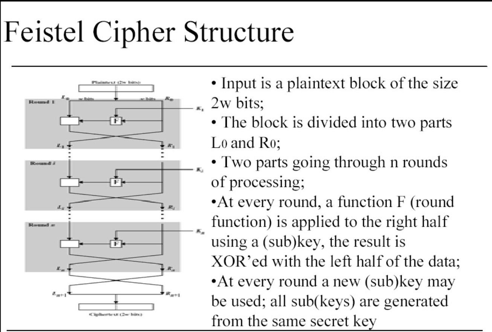
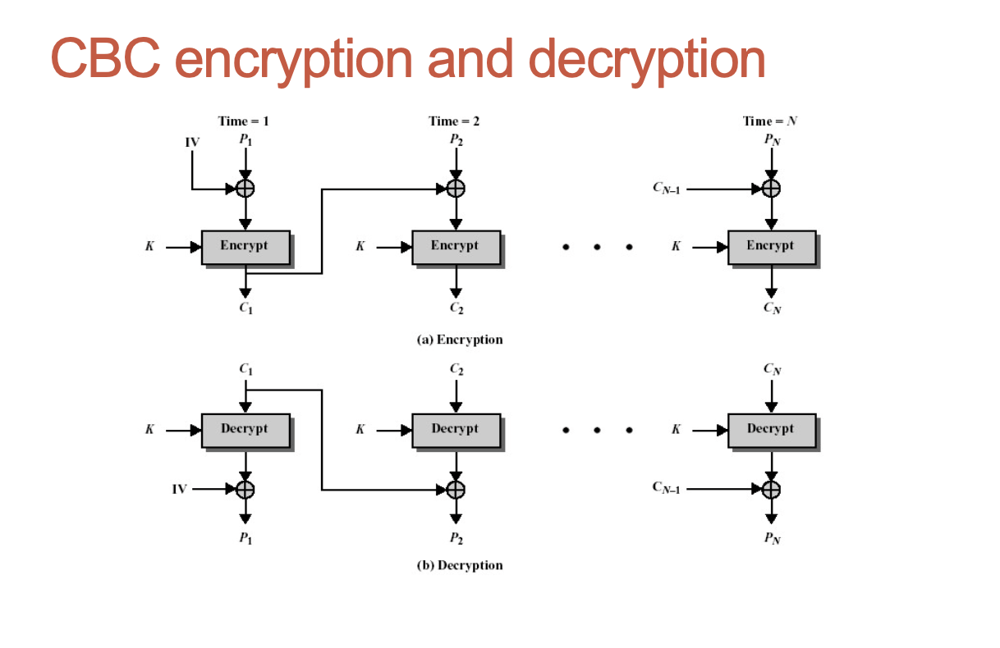
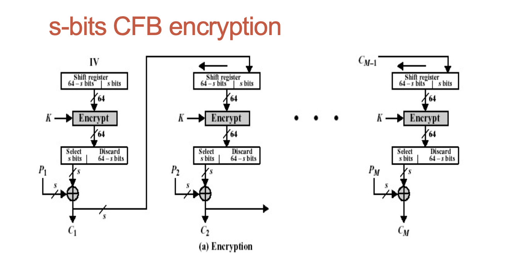
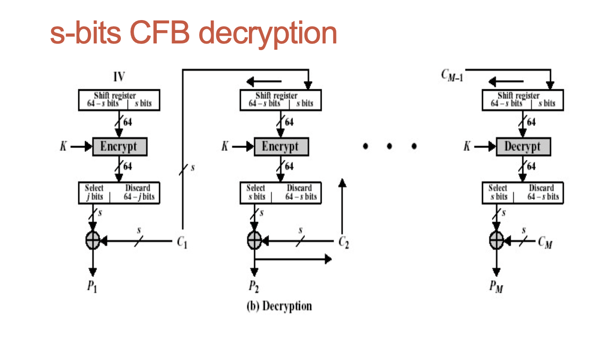
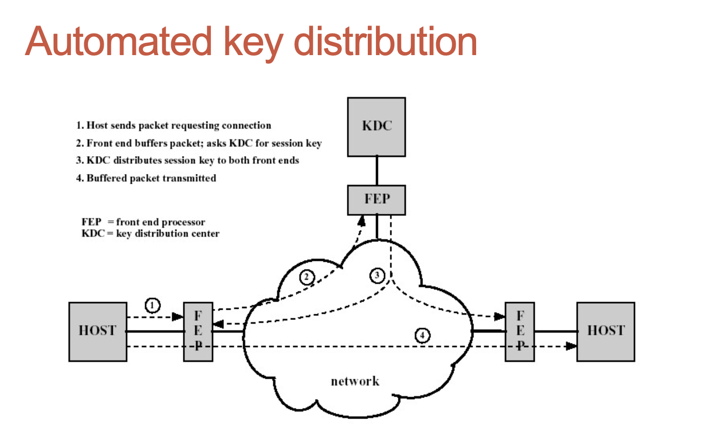

## Elements of Cryptography. Symmetric Encryption.

## Cryptography

- Cryptography is a collection of mathematical techniques for protecting information;

- Most important cryptographic technique is encryption/decryption

### Cryptography for information protection

| Level | What to protect      | Method                         |
| ----- | -------------------- | ------------------------------ |
| 3     | Existence of message | Steganography                  |
| 2     | Metadata of message  | Privacy-enhancing technologies |
| 1     | Content of message   | Encryption                     |
| 0     | Nothing              | None                           |

Encryption is important for all levels.

### Two categories of encryption algorithms

- Symmetric encryption (对称加密) (or symmetric key encryption):
  - to encrypt and decrypt a message the same key (a piece of information; sequence of bits) is used
- Asymmetric encryption (非对称加密) (or asymmetric key encryption):
  - One key is used for encryption (usually publicly known, public key);
  - Another key is used for decryption (usually private, or secret key)

### Components of Symmetric Encryption

- Plaintext
- Encryption algorithm
- Secret key
- Ciphertext (encrypted text) • Decryption algorithm

### Security of symmetric encryption

- security of symmetric encryption depends on

  - the secrecy of the key,
  - Not the secrecy of the algorithm

- Strong encryption algorithm:
  - The adversary (opponent) should be unable to decrypt encrypted text, even if he/she knows several pairs
    (plaintext, encrypted plaintext)
- Sender and receiver must have obtained copies of the secret key in a secure way and must keep the key secure

### Two more classifications of cryptosystems

- Type of operations used

  - Substitutions;
  - Transpositions;

- The way in which plaintext is processed
  - Block cipher: input block of elements (e.g. characters) is transformed to the output block at once;
  - Stream cipher: processes the input elements continuously, one element at a time.

// interleaving substitutions （交叉替换）

### Cryptanalysis and computationally secure schemes

- Cryptanalysis: The process of attempting to discover the plaintext or key;
- Depends very much on the information available;

- An encryption scheme is computationally secure if
  - The cost of breaking the scheme exceeds the value of the encrypted information;
  - The time required to break the scheme is more than lifetime of the information;

### Brute-Force Approach in Cryptanalysis

// brute-force （暴力破解）

- If nothing else helps and there is no weakness in the encryption algorithms, brute-force approach may be applied;
- Try every possible key until correct translation of the encrypted text into plaintext is obtained;
- Possible issue: how does cryptanalyst recognize correct plaintext? Imagine it has been compressed before encryption;
- Main issue: time

### Block vs stream ciphers

- The way in which plaintext is processed
  - Block cipher: input block of elements is transformed to the output block at once.
  - Stream cipher: processes the input elements continuously, one element at a time.

### Feistel cipher structure

- Most symmetric block encruption algorithms have a structure proposed by H.Feistel in 1973.
- The input is divided into the blocks of even numbers of elements.
- Then multiple stages of substitutions and transpositions is applied.
- Multiple keys are used at different rounds of the algorithm.

### Symmetric Encryption Algorithms

Most important symmetric block ciphers

- DES (Data Encryption Standard)
- 3DES (triple DES)
- AES (Advenced Encryption Standard)

## Advanced Encryption Standard

- Design uses theory of finite fields, a branch of algebra;
- Every block of 128 bits is presented as 4 by 4 array of bytes
- Key Expansion: Key -> Round keys

### Steps in AES processing

- Substituiton: each byte is replaced with another based on lookup table
- ShiftRows: each row is shifted cyclically certain amount of step
- MixColumns: mixing operation on the columns (defined in terms of computations in a finite field).
- AddRoundKey- each byte is combined with the round key

### Security of AES

- Considered secure for use for classified information, secret and top secret level;
- However, there are some concerns related to the algebraic foundations of algorithm – underlying algebraic structure might be used in the attacks in some clever way;
- The above is for Black Box setting; rather efficient Side Channels attacks have been discovered recently

## Block ciphers modes

Block ciphers may be used in different modes. Most common modes are:

- Electronic Codebook Mode (ECB)
- Cipher Block Chaining (CBC)
- Cipher Feedback Mode (CFB)

### Electronic Codebook Mode (ECB)

- Simple mode: each block, say of size 64 bits is encrypted with the same key;
- For a given block of the plaintext and a given key the result of encryption is unique;
- If a block of plaintext is repeated several times, the result of encryption contains several copies of the same ciphertext;
- So, the encryption of the lengthy (regular) messages might be insecure.

### Cipher Block Chaining Mode (CBC)

- CBC mode fixes abovementioned disadvantage of ECB mode: here the same blocks of plaintext may produce different blocks of ciphertext;
- Simple idea: before encryption a block of the plaintext is XOR’ed with the result of encryption of the previous block;
- For the first block encryption some initialisation vector (IV) is used;
- It is better to keep both a key and IV secret.

### Cipher Feedback Mode (CFB)

- CFB mode may be used to transform a block cipher to the stream cipher;
- It has a parameter s (the size of transmission unit); if 8-bit characters are used as transmission unit, then s = 8;
- Shift register of the size equal to the size of the block of the block cipher is used (typically it is 64 bits);
- Again, an initialisation vector is needed.

## Key distribution

- From requirements for symmetric encryption:

- “Sender and receiver must have obtained copies of the
  secret key in a secure way and must keep the key secure”

- Important issue: how to distribute secret keys?

### Manual delivery

For two parties A and B:

- A key could be created by A and delivered physically to B (or vice versa);
- A key could be created by the third trusted party C and delivered physically to A and B;
- Difficult to use in wide area distributed systems, when dynamic connections are needed.

### Further techniques

- If A and B have used recently a secret key, one of them could create a new secret key and send it to the partner using old key;
- Potential problem: once an attacker learned one key, he can disclose all keys afterwards
- There is a third trusted party C connected by encrypted channels with both A and B. Then C creates a key and distributes it among A and B using encrypted channels;

