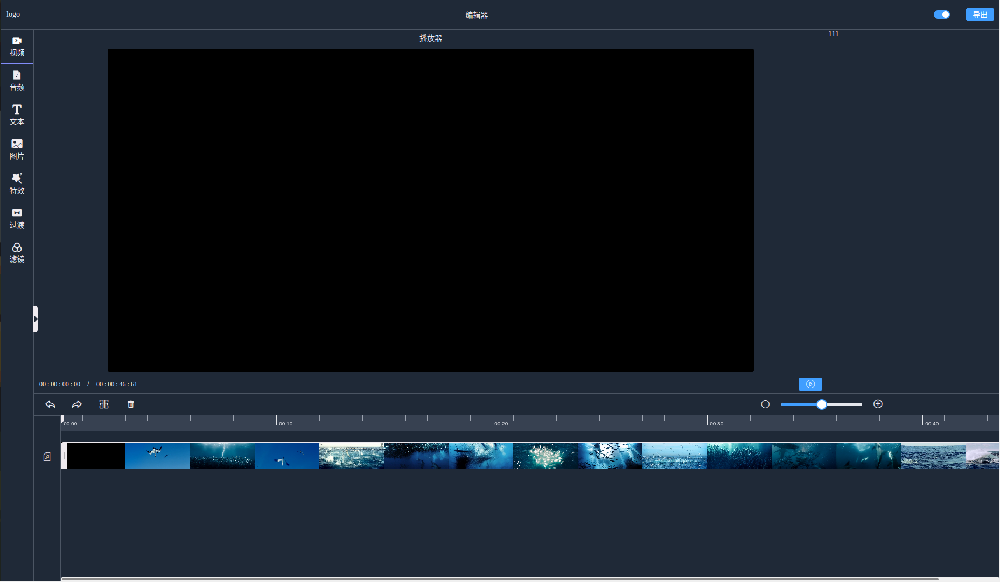

# Video Editor Development TODO List

1. Schedule 1 (2025/01/13 - 2025/01/31)

   - ☑️ Decode and remux .h264 file

   - ☑️ Decode and remux .mp4 file

   - ☑️ mux .mp4 file

   - ☑️ Control the mux file parameters. (Width, Height, Frame rate, Bit rate)

   - Video Editor UI

     - ☑️ Video Track

     - ☑️ Audio Track

2. Schedule 2 (2025/02/13 - 2025/02/28)

   - 🔲 Improve trach handler's available click area

   - 🔲 Play time scheduling.

   - 🔲 Improve track thumbnails.

   - 🔲 Generate mp4 files. (!milestone)

   - 🔲 Add Video Items.
